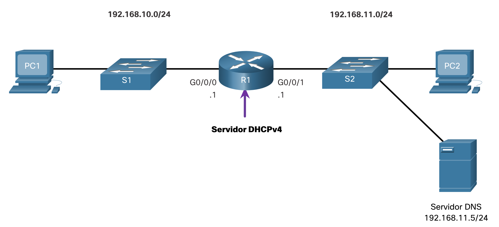
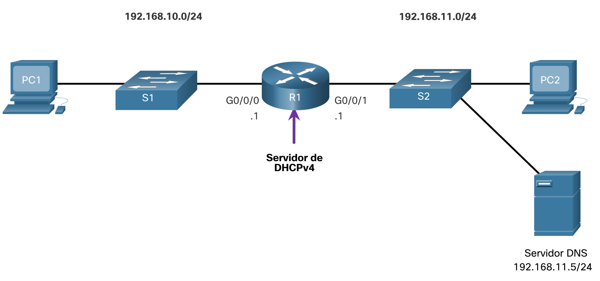

# Configure un servidor DHCPv4 del IOS de Cisco

# Servidor Cisco IOS DHCPv4
Ahora usted tiene una comprensión básica de cómo funciona DHCPv4 y cómo puede hacer su trabajo un poco más fácil. Si no tiene un servidor DHCPv4 independiente, este tema le mostrará cómo configurar un router Cisco IOS para que actúe como uno. Un router Cisco que ejecuta el software IOS de Cisco puede configurarse para que funcione como servidor de DHCPv4. El servidor de DHCPv4 que utiliza IOS de Cisco asigna y administra direcciones IPv4 de conjuntos de direcciones especificados dentro del router para los clientes DHCPv4.



## Pasos para configurar un servidor DHCPv4 del IOS de Cisco
<br><br>

Utilice los siguientes pasos para configurar un servidor DHCPv4 del IOS de Cisco:

- **Paso 1.** Excluir direcciones IPv4
- **Paso 2.** Defina un nombre de grupo DHCPv4.
- **Paso 3.** Configure el grupo DHCPv4.

### Paso 1. Excluir direcciones IPv4

El router que funciona como servidor de DHCPv4 asigna todas las direcciones IPv4 en un conjunto de direcciones DHCPv4, a menos que esté configurado para excluir direcciones específicas. Generalmente, algunas direcciones IPv4 de un conjunto se asignan a dispositivos de red que requieren asignaciones de direcciones estáticas. Por lo tanto, estas direcciones IPv4 no deben asignarse a otros dispositivos. La sintaxis del comando para excluir direcciones IPv4 es la siguiente:
<br><br>
`Router(config)# ip dhcp excluded-address low-address [high-address]`

Se puede excluir una única dirección o un rango de direcciones especificando la dirección más baja y la dirección más alta del rango. Las direcciones excluidas deben incluir las direcciones asignadas a los routers, a los servidores, a las impresoras y a los demás dispositivos que se configuraron o se configurarán manualmente. También puede introducir el comando varias veces.

### Paso 2. Defina un nombre de grupo DHCPv4

La configuración de un servidor de DHCPv4 implica definir un conjunto de direcciones que se deben asignar.
<br><br>
Como se muestra en el ejemplo, el ip dhcp pool comando _`pool-name`_crea un conjunto con el nombre especificado y coloca al router en el modo de configuración de DHCPv4, que se identifica con el indicador `Router(dhcp-config)#`.
<br><br>
La sintaxis del comando para definir el grupo es la siguiente:

```bash
Router(config)# ip dhcp pool pool-name
Router(dhcp-config)# 
Paso 3. Configure el grupo DHCPv4
```
La tabla indica las tareas para finalizar la configuración del pool de DHCPv4.
<br><br>
El conjunto de direcciones y el router de gateway predeterminado deben estar configurados. Use la network instrucción para definir el rango de direcciones disponibles. Use el comando `default-router`  para definir el router de gateway predeterminado. Normalmente, el gateway es la interfaz LAN del router más cercano a los dispositivos clientes. Se requiere un gateway, pero se pueden indicar hasta ocho direcciones si hay varios gateways.
<br><br>
Otros comandos del pool de DHCPv4 son optativos. Por ejemplo, la dirección IPv4 del servidor DNS que está disponible para un cliente DHCPv4 se configura mediante el comando `dns-server`. El comando domain-name se utiliza para definir el nombre de dominio. La duración del arrendamiento de DHCPv4 puede modificarse mediante el comando lease. El valor de arrendamiento predeterminado es un día. El comando netbios-name-server se utiliza para definir el servidor WINS con NetBIOS.

|Tarea	|Comando de IOS|
|--|--|
|Definir el conjunto de direcciones.	|`network network-number [mask | / prefix-length]`
|Definir el router o gateway predeterminado.|`default-router address [ address2….address8]`
|Definir un servidor DNS.	|`dns-server address [ address2…address8]`
|Definir el nombre de dominio.	|`domain-name domain`
|Definir la duración de la concesión DHCP.	|`lease {days [hours [ minutes]] | infinite}`
|Definir el servidor WINS con NetBIOS.	|`netbios-name-server address [ address2…address8]`


**Nota:** Microsoft recomienda no implementar WINS, en su lugar configurar DNS para la resolución de |nombres de Windows y retirar WINS.

## Ejemplo de configuración
La topología para el ejemplo de configuración se muestra en la figura.

El ejemplo muestra la configuración para convertir a R1 en un servidor DHCPv4 para la LAN 192.168.10.0/24.

```bash
R1(config)# ip dhcp excluded-address 192.168.10.1 192.168.10.9
R1(config)# ip dhcp excluded-address 192.168.10.254
R1(config)# ip dhcp pool LAN-POOL-1
R1(dhcp-config)# network 192.168.10.0 255.255.255.0
R1(dhcp-config)# default-router 192.168.10.1
R1(dhcp-config)# dns-server 192.168.11.5
R1(dhcp-config)# domain-name example.com
R1(dhcp-config)# end
R1#
```

### Comandos de verificación DHCPv4
Utilice los comandos de la tabla para verificar que el servidor DHCPv4 del IOS de Cisco esté funcionando.

|Comando	|Descripción
|--|--
|`show running-config | section dhcp`|Muestra los comandos DHCPv4 configurados en el router.
|`show ip dhcp binding`|Muestra una lista de todos los enlaces de direcciones IPv4 a direcciones MAC proporcionados por el servicio DHCPv4.
|`show ip dhcp server statistics`|Muestra información de conteo con respecto a la cantidad de mensajes DHCPv4 que han sido enviados y recibidos.


