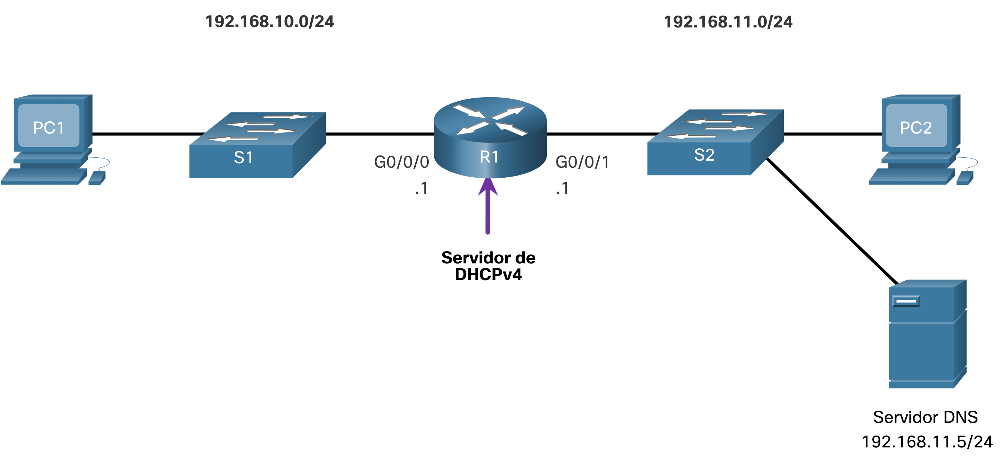
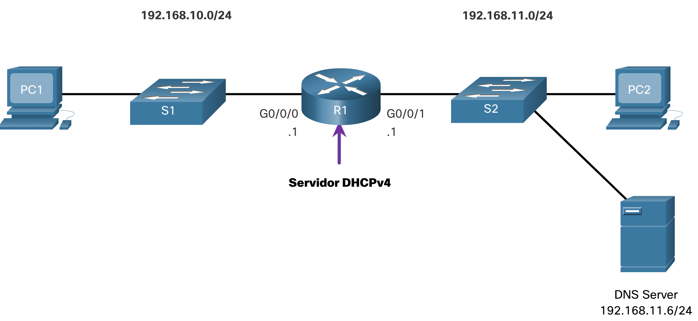
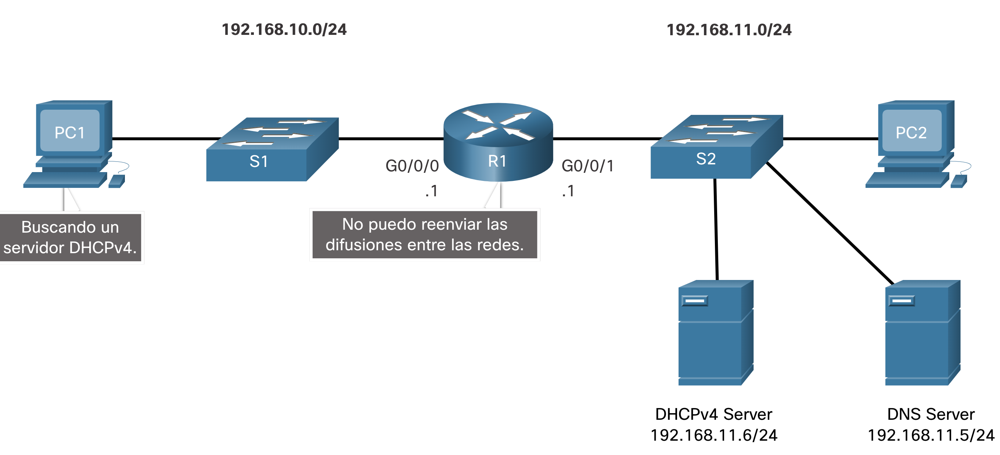

# Configure un servidor DHCPv4 del IOS de Cisco

# Servidor Cisco IOS DHCPv4
Ahora usted tiene una comprensión básica de cómo funciona DHCPv4 y cómo puede hacer su trabajo un poco más fácil. Si no tiene un servidor DHCPv4 independiente, este tema le mostrará cómo configurar un router Cisco IOS para que actúe como uno. Un router Cisco que ejecuta el software IOS de Cisco puede configurarse para que funcione como servidor de DHCPv4. El servidor de DHCPv4 que utiliza IOS de Cisco asigna y administra direcciones IPv4 de conjuntos de direcciones especificados dentro del router para los clientes DHCPv4.


## Pasos para configurar un servidor DHCPv4 del IOS de Cisco
<br><br>

Utilice los siguientes pasos para configurar un servidor DHCPv4 del IOS de Cisco:

- **Paso 1.** Excluir direcciones IPv4
- **Paso 2.** Defina un nombre de grupo DHCPv4.
- **Paso 3.** Configure el grupo DHCPv4.

### Paso 1. Excluir direcciones IPv4

El router que funciona como servidor de DHCPv4 asigna todas las direcciones IPv4 en un conjunto de direcciones DHCPv4, a menos que esté configurado para excluir direcciones específicas. Generalmente, algunas direcciones IPv4 de un conjunto se asignan a dispositivos de red que requieren asignaciones de direcciones estáticas. Por lo tanto, estas direcciones IPv4 no deben asignarse a otros dispositivos. La sintaxis del comando para excluir direcciones IPv4 es la siguiente:
<br><br>
`Router(config)# ip dhcp excluded-address low-address [high-address]`

Se puede excluir una única dirección o un rango de direcciones especificando la dirección más baja y la dirección más alta del rango. Las direcciones excluidas deben incluir las direcciones asignadas a los routers, a los servidores, a las impresoras y a los demás dispositivos que se configuraron o se configurarán manualmente. También puede introducir el comando varias veces.

### Paso 2. Defina un nombre de grupo DHCPv4

La configuración de un servidor de DHCPv4 implica definir un conjunto de direcciones que se deben asignar.
<br><br>
Como se muestra en el ejemplo, el ip dhcp pool comando _`pool-name`_crea un conjunto con el nombre especificado y coloca al router en el modo de configuración de DHCPv4, que se identifica con el indicador `Router(dhcp-config)#`.
<br><br>
La sintaxis del comando para definir el grupo es la siguiente:

```bash
Router(config)# ip dhcp pool pool-name
Router(dhcp-config)# 
Paso 3. Configure el grupo DHCPv4
```
La tabla indica las tareas para finalizar la configuración del pool de DHCPv4.
<br><br>
El conjunto de direcciones y el router de gateway predeterminado deben estar configurados. Use la network instrucción para definir el rango de direcciones disponibles. Use el comando `default-router`  para definir el router de gateway predeterminado. Normalmente, el gateway es la interfaz LAN del router más cercano a los dispositivos clientes. Se requiere un gateway, pero se pueden indicar hasta ocho direcciones si hay varios gateways.
<br><br>
Otros comandos del pool de DHCPv4 son optativos. Por ejemplo, la dirección IPv4 del servidor DNS que está disponible para un cliente DHCPv4 se configura mediante el comando `dns-server`. El comando domain-name se utiliza para definir el nombre de dominio. La duración del arrendamiento de DHCPv4 puede modificarse mediante el comando lease. El valor de arrendamiento predeterminado es un día. El comando netbios-name-server se utiliza para definir el servidor WINS con NetBIOS.

|Tarea	|Comando de IOS|
|--|--|
|Definir el conjunto de direcciones.	|`network network-number [mask | / prefix-length]`
|Definir el router o gateway predeterminado.|`default-router address [ address2….address8]`
|Definir un servidor DNS.	|`dns-server address [ address2…address8]`
|Definir el nombre de dominio.	|`domain-name domain`
|Definir la duración de la concesión DHCP.	|`lease {days [hours [ minutes]] | infinite}`
|Definir el servidor WINS con NetBIOS.	|`netbios-name-server address [ address2…address8]`


**Nota:** Microsoft recomienda no implementar WINS, en su lugar configurar DNS para la resolución de |nombres de Windows y retirar WINS.

## Ejemplo de configuración
La topología para el ejemplo de configuración se muestra en la figura.

El ejemplo muestra la configuración para convertir a R1 en un servidor DHCPv4 para la LAN 192.168.10.0/24.

```bash
R1(config)# ip dhcp excluded-address 192.168.10.1 192.168.10.9
R1(config)# ip dhcp excluded-address 192.168.10.254
R1(config)# ip dhcp pool LAN-POOL-1
R1(dhcp-config)# network 192.168.10.0 255.255.255.0
R1(dhcp-config)# default-router 192.168.10.1
R1(dhcp-config)# dns-server 192.168.11.5
R1(dhcp-config)# domain-name example.com
R1(dhcp-config)# end
R1#
```

### Comandos de verificación DHCPv4
Utilice los comandos de la tabla para verificar que el servidor DHCPv4 del IOS de Cisco esté funcionando.

|Comando	|Descripción
|--|--
|`show running-config | section dhcp`|Muestra los comandos DHCPv4 configurados en el router.
|`show ip dhcp binding`|Muestra una lista de todos los enlaces de direcciones IPv4 a direcciones MAC proporcionados por el servicio DHCPv4.
|`show ip dhcp server statistics`|Muestra información de conteo con respecto a la cantidad de mensajes DHCPv4 que han sido enviados y recibidos.

### Verifique que DHCPv4 esté operando
La topología que se muestra en la figura es usada en el resultado de ejemplo. En este ejemplo, se configuró el R1 para que proporcione servicios DHCPv4. Dado que la PC1 no se encendió, no tiene una dirección IP.

La topología de red muestra un router, que funciona como un servidor DHCPv4, conectando dos LAN juntas. A la izquierda está la red 192.168.10.0/24 que consiste en el host PC1 conectado al switch S1 que está conectado al router R1 en G0/0/0 con una dirección de .1. On the right is network 192.168.11.0/24 consisting of host PC2 and a DNS server at address 192.168.11.5/24 connected to switch S2 which is connected to R1 at G0/0/1 with an address of .1.



1. Verificar la configuración DHCPv4

Como se muestra en el ejemplo, el resultado del comando show running-config | section dhcp muestran los comandos de DHCPv4 configurados en el R1. El | section parámetro muestra solo los comandos asociados a la configuración DHCPv4.

```bash
R1# show running-config | section dhcp
ip dhcp excluded-address 192.168.10.1 192.168.10.9
ip dhcp excluded-address 192.168.10.254
ip dhcp pool LAN-POOL-1
 network 192.168.10.0 255.255.255.0
 default-router 192.168.10.1
 dns-server 192.168.11.5
 domain-name ejemplo.com
```
2. Verificar las asignaciones de DHCP

Como se muestra en el ejemplo, se puede verificar el funcionamiento de DHCPv4 mediante el comando show ip dhcp binding. Este comando muestra una lista de todas las vinculaciones de la dirección IPv4 con la dirección MAC que fueron proporcionadas por el servicio DHCPv4.

```bash
R1# show ip dhcp binding
Bindings from all pools not associated with VRF:
IP address Client-ID/ Lease expiration Type State Interface
                Hardware address/
                Nombre de usuario
192.168.10.10 0100.5056.b3ed.d8 15 sep 2019 8:42 AM Active GigabiteThernet0/0/0
```

3. Verificar estadísticas DHCPv4

La salida de la show ip dhcp server statistics se utiliza para verificar que los mensajes están siendo recibidos o enviados por el router. Este comando muestra información de conteo con respecto a la cantidad de mensajes DHCPv4 que se enviaron y recibieron.

```bash
R1# show ip dhcp server statistics
Memory usage 19465
Address pools 1
Database agents 0
Automatic bindings 2
Manual bindings 0
Expired bindings 0
Malformed messages 0
Secure arp entries 0
Renew messages 0
Workspace timeouts 0
Static routes 0
Relay bindings 0
Relay bindings active 0
Relay bindings terminated 0
Relay bindings selecting 0
Message Received
BOOTREQUEST 0
DHCPDISCOVER 4
DHCPREQUEST 2
DHCPDECLINE 0
DHCPRELEASE 0
DHCPINFORM 0
```

4. Verificar el direccionamiento IPv4 recibido del cliente DHCPv4

El comando ipconfig /all cuando se emite en la PC1, muestra los parámetros TCP/IP, como se muestra en el ejemplo. Dado que la PC1 se conectó al segmento de red 192.168.10.0/24, recibió automáticamente un sufijo DNS, una dirección IPv4, una máscara de subred, un gateway predeterminado y una dirección del servidor DNS de ese pool. No se requiere ninguna configuración de interfaz del router específica de DHCP. Si una computadora está conectada a un segmento de red que tiene un pool de DHCPv4 disponible, la computadora puede obtener una dirección IPv4 del pool adecuado de manera automática.

```bash
C:\Users\Student> ipconfig /all
Configuración IP de Windows
   Host Name . . . . . . . . . . . .: ciscolab
   Primary Dns Suffix . . . . . . . :
   Node Type . . . . . . . . . . . . : Hybrid
   IP Routing Enabled. . . . . . . . : No
   WINS Proxy Enabled. . . . . . . . : No
Ethernet adapter Ethernet0:
   Connection-specific DNS Suffix . : example.com
   Description . . . . . . . . . . . : Realtek PCIe GBE Family Controller
   Physical Address. . . . . . . . . : 00-05-9A-3C-7A-00
   DHCP Enabled. . . . . . . . . . . : Yes
   Autoconfiguration Enabled . . . . : Yes
   Dirección IPv4. . . . . . . . . . . : 192.168.10.10
   Subnet Mask . . . . . . . . . . . : 255.255.255.0
   Lease Obtained . . . . . . . . . : Saturday, September 14, 2019 8:42:22AM
   Lease Expires . . . . . . . . . : Saturday, September 14, 2019 8:42:22AM
   Gateway predeterminado. . . . . . . . . : 192.168.10.1
   DHCP Server . . . . . . . .. . .  : 192.168.10.1
   Servidores DNS. . . . . . . .. . .  : 192.168.11.5
```

### Verificador de sintaxis - Configuración de DHCPv4
En esta actividad del Verificador de sintaxis, usted configurará R1 para que sea el servidor DHCPv4 para la red 192.168.11.0/24.

La topología de red muestra un router, que funciona como un servidor DHCPv4, conectando dos LAN juntas. A la izquierda está la red 192.168.10.0/24 que consiste en el host PC1 conectado al conmutador S1 que está conectado al router R1 en G0/0/0 con una dirección de .1. A la derecha está la red 192.168.11.0/24 que consiste en el host PC2 y un servidor DNS en la dirección 192.168.11.5/24 conectado al switch S2 que está conectado a R1 en G0/0/1 con una dirección de .1.


### Desactive el servidor DHCPv4 del IOS de Cisco
El servicio DHCPv4 está habilitado de manera predeterminada. Para desabilitar el servicio, use el comando no service dhcp del modo de configuración global. Use el comando del modo service dhcp de configuración global para volver a habilitar el proceso del servidor DHCPv4, como se muestra en el ejemplo. Si los parámetros no se configuran, habilitar el servicio no tiene ningún efecto.

Nota: Si se borra los enlaces DHCP o se detiene y reinicia el servicio DHCP, se pueden asignar temporalmente direcciones IP duplicadas en la red.

```bash
R1(config)# no service dhcp
R1(config)# service dhcp
R1(config)# 
```

### Retransmisión DHCPv4
En una red jerárquica compleja, los servidores empresariales suelen estar ubicados en una central. Estos servidores pueden proporcionar servicios DHCP, DNS, TFTP y FTP para la red. Generalmente, los clientes de red no se encuentran en la misma subred que esos servidores. Para ubicar los servidores y recibir servicios, los clientes con frecuencia utilizan mensajes de difusión.

En la figura, la PC1 intenta adquirir una dirección IPv4 de un servidor de DHCPv4 mediante un mensaje de difusión. En esta situación, el router R1 no está configurado como servidor de DHCPv4 y no reenvía el mensaje de difusión. Dado que el servidor de DHCPv4 está ubicado en una red diferente, la PC1 no puede recibir una dirección IP mediante DHCP. R1 debe configurarse para retransmitir mensajes DHCPv4 al servidor DHCPv4.


1. ipconfig /release

PC1 es una computadora con Windows. El administrador de red libera toda la información de direccionamiento IPv4 actual mediante el comando ipconfig /release. Observe que se libera la dirección IPv4 y ninguna dirección aparece.

```bash
C:\Users\Student> ipconfig /release
Configuración IP de Windows
Ethernet adapter Ethernet0:
   Sufijo de conexión específica DNS. :
   Default Gateway . . . . . . . . . :  
```

2. ipconfig /renew

A continuación, el administrador de red intenta renovar la información de direccionamiento IPv4 con el comando ipconfig /renew. Este comando hace que la PC1 transmita por difusión un mensaje DHCPDISCOVER. En el resultado se muestra que la PC1 no puede ubicar el servidor de DHCPv4. Dado que los routers no reenvían mensajes de difusión, la solicitud no es correcta.

El administrador de red podría agregar servidores DHCPv4 en R1 para todas las subredes. Sin embargo, esto crearía costos adicionales y gastos administrativos.

```bash
C:\Users\Student> ipconfig /renew
Configuración IP de Windows
Error al renovar la interfaz Ethernet0: no se puede conectar al servidor DHCP. Expiró la solicitud.
```

3. ip helper-address

Una mejor solución es configurar R1 con el comando ip helper-address address interface configuration. Esto hará que R1 retransmita transmisiones DHCPv4 al servidor DHCPv4. Como se muestra en el ejemplo, la interfaz en R1 que recibe la difusión desde PC1 está configurada para retransmitir la dirección DHCPv4 al servidor DHCPv4 en 192.168.11.6.

```bash
R1(config)# interface g0/0/0
R1(config-if)# ip helper-address 192.168.11.6
R1(config-if)# finalizar
R1#
```

4. show ip interface

Cuando se configura el R1 como agente de retransmisión DHCPv4, acepta solicitudes de difusión para el servicio DHCPv4 y, a continuación, reenvía dichas solicitudes en forma de unidifusión a la dirección IPv4 192.168.11.6. El administrador de red puede utilizar el comando show ip interface para verificar la configuración.

```bash
R1# show ip interface g0/0/0
GigabitEthernet0/0/0 is up, line protocol is up
  Internet address is 192.168.10.1/24
  Broadcast address is 255.255.255.255
  Address determined by setup command
  MTU is 1500 bytes
  Helper address is 192.168.11.6
(resultado omitido)
```

5. ipconfig /all

Como se muestra en la salida, PC1 ahora puede adquirir una dirección IPv4 del servidor DHCPv4 como se ha verificado con el ipconfig /all comando .

```bash
C:\Users\Student> ipconfig /all
Configuración IP de Windows
  
Ethernet adapter Ethernet0:
   Connection-specific DNS Suffix . : example.com
   IPv4 Address. . . . . . . . . . . : 192.168.10.10
   Subnet Mask . . . . . . . . . . . : 255.255.255.0
   Default Gateway . . . . . . . . . : 192.168.10.1
```

### Otras transmisiones de servicio retransmitidas
DHCPv4 no es el único servicio que puede configurarse para que retransmita el router. De manera predeterminada, el ip helper-address comando reenvia los siguientes ocho servidcios UDP:

- Port 37: Tiempo
- Port 49: TACACS
- Port 53: Envenenamiento
- Port 67: DHCP/BOOTP server
- Port 68: DHCP/BOOTP client
- Port 69: TFTP
- Port 137: Servicio de nombre NetBIOS
- Port 138: Servicio de datagrama NetBIOS

### Packet Tracer - Configurar DHCPv4
En esta actividad de Packet Tracer, completará los siguientes objetivos:

- Parte 1: Configurar un router como servidor de DHCP
- Parte 2: Configurar la retransmisión de DHCP
- Parte 3: Configurar un router como cliente DHCP
- Parte 4: Verificar la conectividad y DHCP


- Descargar la guia de laboratorio de CISCO [`Click HERE`](./labs/-packet-tracer---configure-dhcpv4_es-XL.pdf).
- Para descargar el laboratorio de Packet tracer [`Click HERE`](./labs/-packet-tracer---configure-dhcpv4_es-XL.pkt).
