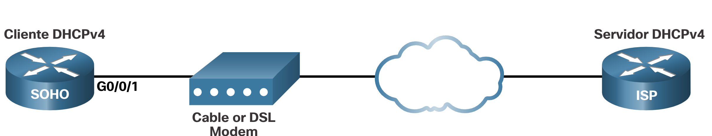
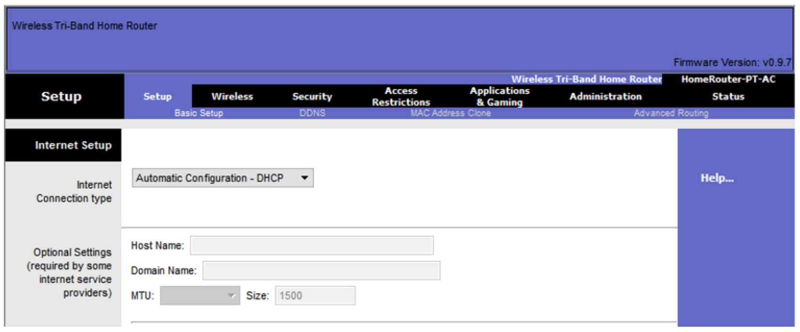
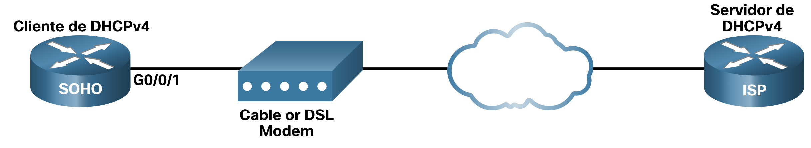

# Configurar un router como cliente DHCPv4

## Cisco Router como cliente DHCPv4
Hay escenarios en los que puede tener acceso a un servidor DHCP a través de su ISP. En estos casos, puede configurar un router Cisco IOS como cliente DHCPv4. En esta guía se explicará ese proceso.

En ocasiones, los routers Cisco en oficinas pequeñas y oficinas domésticas (SOHO) y en los sitios de sucursales deben configurarse como clientes DHCPv4 de manera similar a los equipos cliente. El método específico utilizado depende del ISP. Sin embargo, en su configuración más simple, se utiliza la interfaz Ethernet para conectarse a un cable módem o a un módem DSL.

Para configurar una interfaz Ethernet como cliente DHCP, utilice el ip address dhcp comando del modo de configuración de interfaz.

En la figura, suponga que un ISP ha sido configurado para proporcionar a clientes seleccionados direcciones IP del rango de red 209.165.201.0/27 después de que la interfaz G0/0/1 es configurada con el comando ip address dhcp.



### Ejemplo de configuración
Para configurar una interfaz Ethernet como cliente DHCP, utilice el ip address dhcp comando del modo de configuración de interfaz, como se muestra en el ejemplo. Esta configuración supone que el ISP se ha configurado para proporcionar a los clientes seleccionados información de direcciones IPv4.
```bash
SOHO(config)# interface G0/0/1
SOHO(config-if)# ip address dhcp
SOHO(config-if)# no shutdown
Sep 12 10:01:25.773: %DHCP-6-ADDRESS_ASSIGN: Interface GigabitEthernet0/0/1 assigned DHCP address 209.165.201.12, mask 255.255.255.224, hostname SOHO
```
El comando show ip interface g0/0/1 confirma que la interfaz está activa y que la dirección fue asignada por un servidor DHCPv4.

```bash
SOHO# show ip interface g0/0/1
GigabitEthernet0/0/1 is up, line protocol is up
  Internet address is 209.165.201.12/27
  Broadcast address is 255.255.255.255
  Address determined by DHCP
(output omitted)
```

### Enrutador doméstico como cliente DHCPv4
Los routers de los hogares se configuran para recibir información de asignación de dirección IPv4 automáticamente desde el ISP. Esto es para que los clientes puedan configurar fácilmente el enrutador y conectarse a Internet.

Por ejemplo, en la ilustración se muestra la página de configuración de WAN predeterminada para un router inalámbrico de Packet Tracer. Observe que el tipo de conexión a Internet está establecido como Automatic Configuration - DHCP. Se utiliza esta selección cuando el router se conecta a un cable módem o DSL y actúa como cliente DHCPv4 y solicita una dirección IPv4 del ISP.

Varios fabricantes de enrutadores domésticos tendrán una configuración similar.


### Varios fabricantes de enrutadores domésticos tendrán una configuración similar.

Verificador de sintaxis: configuración de un router como cliente DHCPv4
En esta actividad del Comprobador de sintaxis, configurará un router Cisco como cliente DHCP
