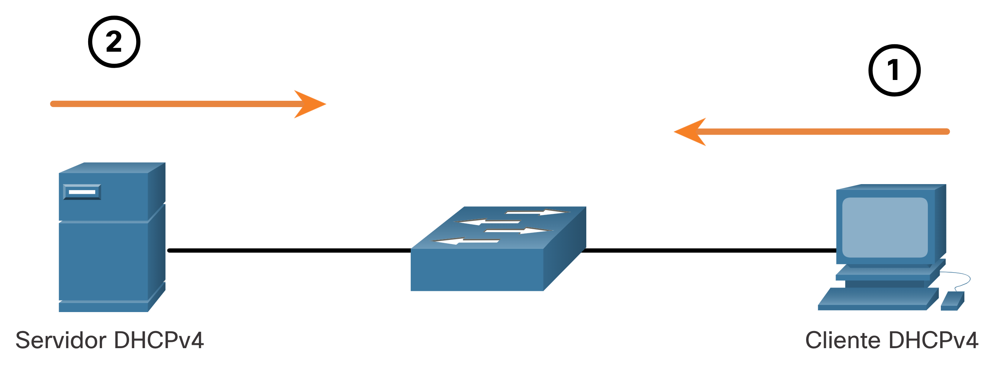
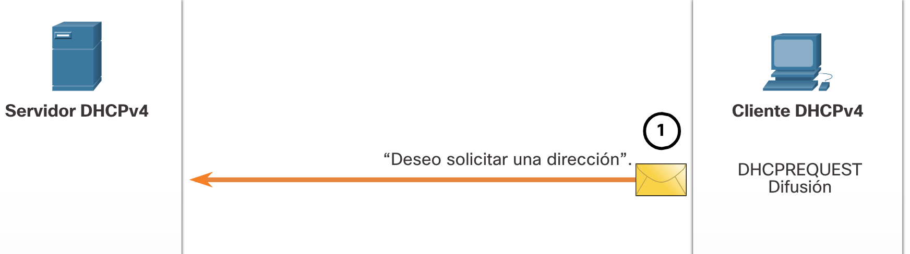
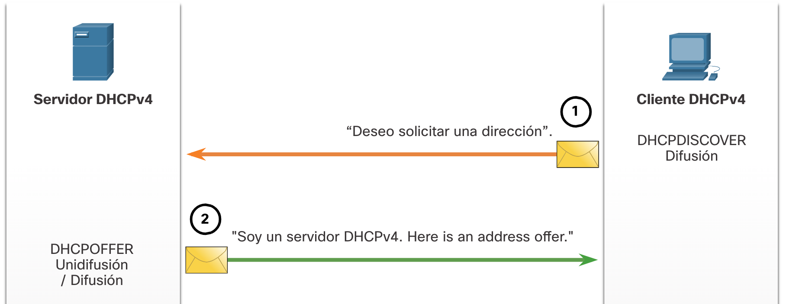
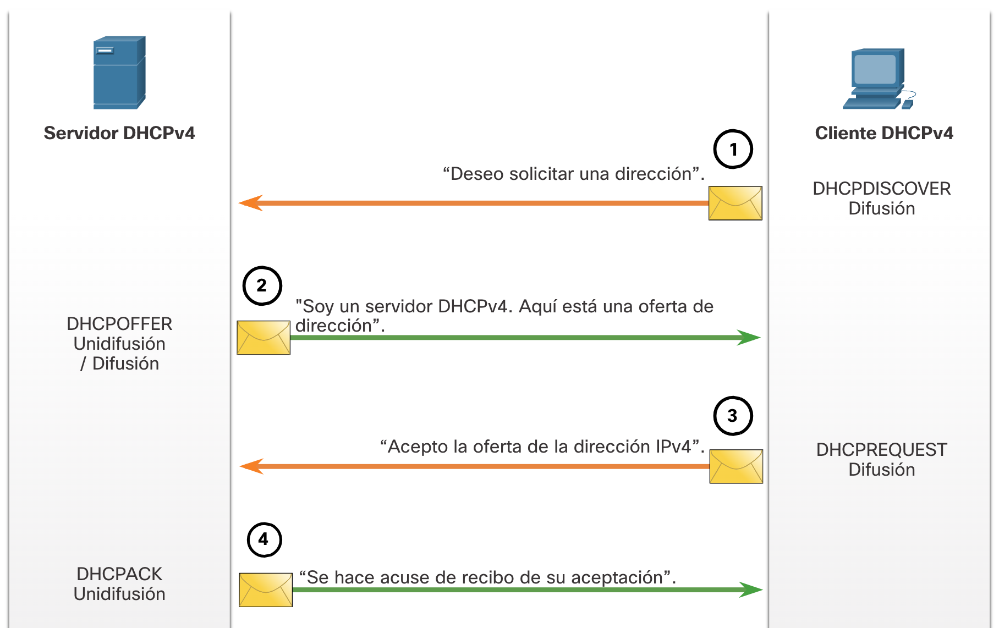

# DHCPv4

##  Servidor y cliente DHCPv4
  
Dynamic Host Configuration Protocol v4 (DHCPv4) asigna direcciones IPv4 y otra información de configuración de red dinámicamente. Dado que los clientes de escritorio suelen componer gran parte de los nodos de red, DHCPv4 es una herramienta extremadamente útil para los administradores de red y que ahorra mucho tiempo.
  
Un servidor de DHCPv4 dedicado es escalable y relativamente fácil de administrar. Sin embargo, en una sucursal pequeña o ubicación SOHO, se puede configurar un router Cisco para proporcionar servicios DHCPv4 sin necesidad de un servidor dedicado. El software Cisco IOS admite un servidor DHCPv4 con funciones completas opcional.
  
El servidor DHCPv4 asigna dinámicamente, o arrienda, una dirección IPv4 de un conjunto de direcciones durante un período limitado elegido por el servidor o hasta que el cliente ya no necesite la dirección.
  
Los clientes arriendan la información del servidor durante un período definido administrativamente. Los administradores configuran los servidores de DHCPv4 para establecer los arrendamientos, a fin de que caduquen a distintos intervalos. El arrendamiento típicamente dura de 24 horas a una semana o más. Cuando caduca el arrendamiento, el cliente debe solicitar otra dirección, aunque generalmente se le vuelve a asignar la misma.
  

### Funcionamiento de DHCPv4
DHCPv4 funciona en un modo cliente/servidor. Cuando un cliente se comunica con un servidor de DHCPv4, el servidor asigna o arrienda una dirección IPv4 a ese cliente. El cliente se conecta a la red con esa dirección IPv4 arrendada hasta que caduque el arrendamiento. El cliente debe ponerse en contacto con el servidor de DHCP periódicamente para extender el arrendamiento. Este mecanismo de arrendamiento asegura que los clientes que se trasladan o se desconectan no mantengan las direcciones que ya no necesitan. Cuando caduca un arrendamiento, el servidor de DHCP devuelve la dirección al conjunto, donde se puede volver a asignar según sea necesario.

## Pasos para obtener un arrendamiento
Cuando el cliente arranca (o quiere unirse a una red), comienza un proceso de cuatro pasos para obtener un arrendamiento:

- Detección de DHCP (DHCPDISCOVER)
- Oferta de DHCP (DHCPOFFER)
- Solicitud de DHCP (DHCPREQUEST)
- Acuse de recibo de DHCP (DHCPACK)

1. Paso 1. Detección DHCP (DHCPDISCOVER)

El cliente inicia el proceso con un mensaje de difusión DHCPDISCOVER con su propia dirección MAC para detectar los servidores de DHCPv4 disponibles. Dado que el cliente no tiene información de IPv4 válida durante el arranque, utiliza direcciones de difusión de capa 2 y de capa 3 para comunicarse con el servidor. El próposito del mensaje DHCPDISCOVER es encontrar los servidores de DHCPv4 en la red.

2. Paso 2. Ofrecimiento de DHCP (DHCPOFFER)

Cuando el servidor de DHCPv4 recibe un mensaje DHCPDISCOVER, reserva una dirección IPv4 disponible para arrendar al cliente. El servidor también crea una entrada ARP que consta de la dirección MAC del cliente que realiza la solicitud y la dirección IPv4 arrendada del cliente. El servidor de DHCPv4 envía el mensaje DHCPOFFER asignado al cliente que realiza la solicitud.

3. Paso 3. Solicitud de DHCP (DHCPREQUEST)

Cuando el cliente recibe el mensaje DHCPOFFER proveniente del servidor, envía un mensaje DHCPREQUEST. Este mensaje se utiliza tanto para el origen como para la renovación del arrendamiento. Cuando se utiliza para el origen del arrendamiento, el mensaje DHCPREQUEST sirve como notificación de aceptación vinculante al servidor seleccionado para los parámetros que ofreció y como un rechazo implícito a cualquier otro servidor que pudiera haber proporcionado una oferta vinculante al cliente.

Muchas redes empresariales utilizan varios servidores de DHCPv4. El mensaje DHCPREQUEST se envía en forma de difusión para informarle a este servidor de DHCPv4 y a cualquier otro servidor de DHCPv4 acerca de la oferta aceptada.

4. Paso 4. Confirmación de DHCP (DHCPACK)

Al recibir el mensaje DHCPREQUEST, el servidor verifica la información del arrendamiento con un ping ICMP a esa dirección para asegurarse de que no esté en uso, crea una nueva entrada ARP para el arrendamiento del cliente y responde con un mensaje DHCPACK. El mensaje DHCPACK es un duplicado del mensaje DHCPOFFER, a excepción de un cambio en el campo de tipo de mensaje. Cuando el cliente recibe el mensaje DHCPACK, registra la información de configuración y realiza una búsqueda de ARP para la dirección asignada. Si no hay respuesta al ARP, el cliente sabe que la dirección IPv4 es válida y comienza a utilizarla como propia.

