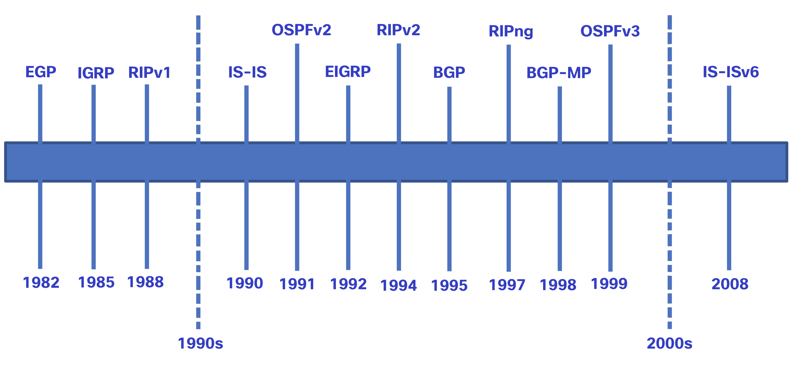

# Enrutamiento estático y dinámico

## ¿Estático o dinámico?
  
En el tema anterior se discutieron las formas en que un router crea su tabla de enrutamiento. Por lo tanto, ahora sabe que el enrutamiento, como el direccionamiento IP, puede ser estático o dinámico. ¿Debería usar enrutamiento estático o dinámico? ¡La respuesta es ambas cosas! El routing estático y el routing dinámico no son mutuamente excluyentes. En cambio, la mayoría de las redes utilizan una combinación de protocolos de routing dinámico y rutas estáticas.

### Rutas Estáticas
  
Las rutas estáticas se utilizan comúnmente en los siguientes escenarios:
  
- Como ruta predeterminada de reenvío de paquetes a un proveedor de servicios
Para rutas fuera del dominio de enrutamiento y no aprendidas por el protocolo de enrutamiento dinámico
Cuando el administrador de red desea definir explícitamente la ruta de acceso para una red específica
Para el enrutamiento entre redes de código auxiliar
Las rutas estáticas son útiles para redes más pequeñas con solo una ruta hacia una red externa. También proporcionan seguridad en una red más grande para ciertos tipos de tráfico o enlaces a otras redes que necesitan más control.
  

### Protocolos de enrutamiento dinámico
  
Los protocolos de enrutamiento dinámico ayudan al administrador de red a administrar el proceso riguroso y lento de configuración y mantenimiento de rutas estáticas. Los protocolos de enrutamiento dinámico se implementan en cualquier tipo de red que consta de más de unos pocos enrutadores. Los protocolos de enrutamiento dinámico son escalables y determinan automáticamente las mejores rutas si se produce un cambio en la topología.
  
Los protocolos de enrutamiento dinámico se utilizan comúnmente en los siguientes escenarios:

- En redes que consisten en más de unos pocos routers
- Cuando un cambio en la topología de red requiere que la red determine automáticamente otra ruta
- Escalabilidad A medida que la red crece, el protocolo de enrutamiento dinámico aprende automáticamente sobre cualquier red nueva.
  
La tabla muestra una comparación de algunas de las diferencias entre el enrutamiento dinámico y estático.
  
|Característica	|Routing dinámico	|Routing estático|
|--|--|--|
|Complejidad de la configuración	|Independiente del tamaño de la red	|Aumentos en el tamaño de la red
|Cambios de topología	|Se adapta automáticamente a los cambios de topología	|Se requiere intervención del administrador|
|Escalabilidad	|Adecuado para topologías complejas	|Adecuado para topologías simples|
|Seguridad	|La seguridad debe estar configurada	|La seguridad es inherente|
|Uso de recursos	|Usa CPU, memoria, ancho de banda de enlaces	|No se necesitan recursos adicionales
| Predictibilidad de Ruta	|La ruta depende de la topología y el protocolo de enrutamiento utilizados	|Definido explícitamente por el administrador|

# Evolución del protocolo de routing dinámico

Los protocolos de enrutamiento dinámico se utilizan en el ámbito de las redes desde finales de la década de los ochenta. Uno de los primeros protocolos de enrutamiento fue RIP. RIPv1 se lanzó en 1988, pero ya en 1969 se utilizaban algunos de los algoritmos básicos en dicho protocolo en la Advanced Research Projects Agency Network (ARPANET).
  
A medida que las redes evolucionaron y se volvieron más complejas, surgieron nuevos protocolos de enrutamiento. El protocolo RIP se actualizó a RIPv2 para hacer lugar al crecimiento en el entorno de red. Sin embargo, RIPv2 aún no se escala a las implementaciones de red de mayor tamaño de la actualidad. Con el objetivo de satisfacer las necesidades de las redes más grandes, se desarrollaron dos protocolos de enrutamiento: el protocolo OSPF (abrir primero la ruta más corta) y sistema intermedio a sistema intermedio (IS-IS). Cisco desarrolló el protocolo de enrutamiento de gateway interior (IGRP) e IGRP mejorado (EIGRP), que también tiene buena escalabilidad en implementaciones de redes más grandes.
  
Asimismo, surgió la necesidad de conectar distintos dominios de enrutamiento de diferentes organizacions y proporcionar enrutamiento entre ellas. En la actualidad, se utiliza el protocolo de gateway fronterizo (BGP) entre proveedores de servicios de Internet (ISP). El protocolo BGP también se utiliza entre los ISP y sus clientes privados más grandes para intercambiar información de enrutamiento.
  
En la figura se muestra la línea cronológica de la introducción de los diversos protocolos.

  

  
A fin de admitir la comunicación basada en IPv6, se desarrollaron versiones más nuevas de los protocolos de routing IP, como se muestra en la fila de IPv6 en la tabla.
  
La tabla clasifica los protocolos de enrutamiento actuales. Los protocolos de puerta de enlace interior (IGP) son protocolos de enrutamiento utilizados para intercambiar información de enrutamiento dentro de un dominio de enrutamiento administrado por una sola organización. Sólo hay un EGP y es BGP. BGP se utiliza para intercambiar información de enrutamiento entre diferentes organizaciones, conocidos como sistemas autónomos (AS). Los ISP utilizan BGP para enrutar paquetes a través de Internet. Los protocolos de enrutamiento vectorial de distancia, estado de vínculo y vector de ruta se refieren al tipo de algoritmo de enrutamiento utilizado para determinar la mejor ruta.
  
| | Protocolos de gateway interior	|Protocolos de gateway exterior|
|--|--|--|
| | Vector distancia	|Estado de enlace	|Vector ruta|
|IPv4	|RIPv2	|EIGRP	|OSPFv2	|Sistema intermedio a sistema intermedio (IS-IS)	|BGP-4|
|IPv6	|RIPng	|EIGRP para IPv6	|OSPFv3	|IS-IS para IPv6	|BGP-MP|

# Conceptos de Protocolos de routing dinámico
Un protocolo de routing es un conjunto de procesos, algoritmos y mensajes que se usan para intercambiar información de routing y completar la tabla de routing con la elección de los mejores caminos que realiza el protocolo. El objetivo de los protocolos de routing dinámico incluye lo siguiente:
  
- Detectar redes remotas
- - Mantener la información de routing actualizada
- Elección de la mejor ruta hacia las redes de destino
- Poder encontrar un mejor camino nuevo si la ruta actual deja de estar disponible
  
Los componentes principales de los protocolos de routing dinámico incluyen los siguientes:
  

- **Estructuras de datos** - por lo general, los protocolos de routing utilizan tablas o bases de datos para sus operaciones. Esta información se guarda en la RAM.
- **Mensajes del protocolo de routing** - los protocolos de routing usan varios tipos de mensajes para descubrir routers vecinos, intercambiar información de routing y realizar otras tareas para descubrir la red y conservar información precisa acerca de ella.
- **Algoritmo** - un algoritmo es una lista finita de pasos que se usan para llevar a cabo una tarea. Los protocolos de routing usan algoritmos para facilitar información de routing y para determinar el mejor camino.
  

<video width="320" height="240" controls>
  <source src="./routing/video/routing_dinamic.mp4" type="video/mp4">
  Tu navegador no soporta el elemento de video.
</video>

Estos protocolos permiten a los routers compartir información en forma dinámica sobre redes remotas y ofrecer esta información automáticamente en sus propias tablas de routing. Haga clic en Reproducir el video sobre este proceso.

## El mejor camino
  
Antes de ofrecer una ruta a una red remota a la tabla de enrutamiento, el protocolo de enrutamiento dinámico debe determinar la mejor ruta a esa red. La determinación de la mejor ruta implica la evaluación de varias rutas hacia la misma red de destino y la selección de la ruta óptima o la más corta para llegar a esa red. Cuando existen varias rutas hacia la misma red, cada ruta utiliza una interfaz de salida diferente en el router para llegar a esa red.
  
El mejor camino es elegido por un protocolo de enrutamiento en función del valor o la métrica que usa para determinar la distancia para llegar a esa red. Una métrica es un valor cuantitativo que se utiliza para medir la distancia que existe hasta una red determinada. El mejor camino a una red es la ruta con la métrica más baja.
  
Los protocolos de enrutamiento dinámico generalmente usan sus propias reglas y métricas para construir y actualizar las tablas de enrutamiento. El algoritmo de enrutamiento genera un valor, o una métrica, para cada ruta a través de la red. Las métricas se pueden calcular sobre la base de una sola característica o de varias características de una ruta. Algunos protocolos de enrutamiento pueden basar la elección de la ruta en varias métricas, combinándolas en un único valor métrico.
  
En la siguiente tabla se enumeran los protocolos dinámicos comunes y sus métricas.

|Protocolo de enrutamiento	|Métrica|
|--|--|
|Protocolo de información de enrutamiento (RIP, Routing Information Protocol)	|La métrica es «recuento de saltos». Cada router a lo largo de una ruta agrega un salto al recuento de saltos.
Se permite un máximo de 15 saltos.|
|Abrir primero la ruta más corta (OSPF)	|La métrica es «costo», que es la basada en la Basado en el ancho de banda acumulado de origen a destino A los enlaces más rápidos se les asignan costos más bajos en comparación con los más lentos (mayor costo).|
|Protocolo de routing de gateway interno mejorado (EIGRP)	|Calcula una métrica basada en el ancho de banda más lento y el retardo anormales. También podría incluir carga y fiabilidad en la métrica cálculo.|

En la animación de la ilustración, se destaca cómo la ruta puede ser diferente según la métrica que se utiliza. Si falla la mejor ruta, el protocolo de enrutamiento dinámico seleccionará automáticamente una nueva mejor ruta si existe

<video width="320" height="240" controls>
  <source src="./routing/video/Mejor_Camino.mp4" type="video/mp4">
  Tu navegador no soporta el elemento de video.
</video>

## Balance de carga
  
¿Qué sucede si una tabla de routing tiene dos o más rutas con métricas idénticas hacia la misma red de destino?
  
Cuando un router tiene dos o más rutas hacia un destino con métrica del mismo costo, el router reenvía los paquetes usando ambas rutas por igual. Esto se denomina “balanceo de carga de mismo costo”. La tabla de routing contiene la única red de destino pero tiene varias interfaces de salida, una para cada ruta de mismo costo. El router reenvía los paquetes utilizando las distintas interfaces de salida que se indican en la tabla de routing.
  
Si está configurado correctamente, el balanceo de carga puede aumentar la efectividad y el rendimiento de la red.
  
Equilibrio de carga de igual costo se implementa automáticamente mediante protocolos de enrutamiento dinámico. Se habilita con rutas estáticas cuando hay varias rutas estáticas a la misma red de destino utilizando diferentes enrutadores de siguiente salto.
  
**Nota:** Solo EIGRP admite el balanceo de carga con distinto costo.
  
En el video se proporciona un ejemplo de balanceo de carga de mismo costo.

<video width="320" height="240" controls>
  <source src="./routing/video/balance_de_carga.mov" type="video/quicktime">
  Tu navegador no soporta el elemento de video.
</video>

