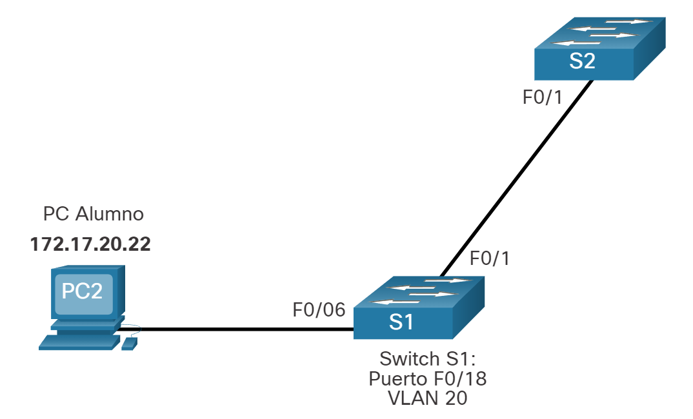

# Configuración de VLAN

## Rangos de VLAN en los switches Catalyst
Crear VLAN, como la mayoría de los demás aspectos de la red, es cuestión de introducir los comandos apropiados. En este tema se detalla cómo configurar y verificar diferentes tipos de VLAN.

Los distintos switches Cisco Catalyst admiten diversas cantidades de VLAN. La cantidad de VLAN que admiten es suficiente para satisfacer las necesidades de la mayoría de las organizaciones. Por ejemplo, los switches de las series Catalyst 2960 y 3560 admiten más de 4000 VLAN. Las VLAN de rango normal en estos switches se numeran del 1 al 1005, y las VLAN de rango extendido se numeran del 1006 al 4094. En la ilustración, se muestran las VLAN disponibles en un switch Catalyst 2960 que ejecuta IOS de Cisco, versión 15.x.

```powershell
Switch# show vlan brief

VLAN Name              Status   Ports
---- ----------------- -------  --------------------
1    default           active   Fa0/1, Fa0/2, Fa0/3, Fa0/4
                                Fa0/5, Fa0/6, Fa0/7, Fa0/8
                                Fa0/9, Fa0/10, Fa0/11, Fa0/12
                                Fa0/13, Fa0/14, Fa0/15, Fa0/16
                                Fa0/17, Fa0/18, Fa0/19, Fa0/20
                                Fa0/21, Fa0/22, Fa0/23, Fa0/24
                                Gi0/1, Gi0/2
1002 fddi-default                     act/unsup
1003 token-ring-default               act/unsup
1004 fddinet-default                  act/unsup
1005 trnet-default                    act/unsup
```


### Rango Normal VLANs

Las siguientes son las características de las VLAN de rango normal:
</br></br>
Se utiliza en redes de pequeños y medianos negocios y empresas.
Se identifica mediante una ID de VLAN entre 1 y 1005.
Las ID de 1002 a 1005 se reservan para las VLAN de Token Ring e interfaz de datos distribuidos por fibra óptica (FDDI).
Las ID 1 y 1002 a 1005 se crean automáticamente y no se pueden eliminar.
Las configuraciones se almacenan en un archivo de base de datos de VLAN llamado vlan.dat, que se guarda en la memoria flash.
Cuando se configura, el protocolo de enlace troncal VLAN (VTP) ayuda a sincronizar la base de datos VLAN entre conmutadores.

### Rango Extendido VLANs

Las siguientes son las características de las VLAN de rango extendido:
</br></br>
Los proveedores de servicios los* utilizan para dar servicio a varios clientes y por las empresas globales lo suficientemente grandes como para necesitar identificadores de VLAN de rango extendido.
</br></br>

Se identifican mediante una ID de VLAN entre 1006 y 4094.
Las configuraciones se guardan en el archivo de configuración en ejecución.
Admiten menos características de VLAN que las VLAN de rango normal.
Requiere la configuración del modo transparente VTP para admitir VLAN de rango extendido.
Nota: Nota: la cantidad máxima de VLAN disponibles en los switches Catalyst es 4096, ya que el campo ID de VLAN tiene 12 bits en el encabezado IEEE 802.1Q.

## Comandos de creación de VLAN
Al configurar redes VLAN de rango normal, los detalles de configuración se almacenan en la memoria flash del switch en un archivo denominado vlan.dat. La memoria flash es persistente y no requiere el copy running-config startup-config comando. Sin embargo, debido a que en los switches Cisco se suelen configurar otros detalles al mismo tiempo que se crean las VLAN, es aconsejable guardar los cambios a la configuración en ejecución en la configuración de inicio.
</br></br>
En la figura 1, se muestra la sintaxis del comando de IOS de Cisco que se utiliza para agregar una VLAN a un switch y asignarle un nombre. Se recomienda asignarle un nombre a cada VLAN en la configuración de un switch.


|Tarea	|Comando de IOS|
|--|--|
|Ingresa al modo de configuración global.|	`Switch# configure terminal`|
|Cree una VLAN con un número de ID válido.|`Switch(config)# vlan vlan-id` |
|Especificar un nombre único para identificar la VLAN.|	`Switch(config-vlan)# name vlan-name`|
|Vuelva al modo EXEC privilegiado.	|`Switch(config-vlan)# end`|


## Ejemplo de creación de VLAN
En el ejemplo de topología, la computadora del estudiante (PC2) todavía no se asoció a ninguna VLAN, pero tiene la dirección IP 172.17.20.22, que pertenece a la VLAN 20.


En la figura, se muestra cómo se configura la VLAN para estudiantes (VLAN 20) en el switch S1.
```powershell
S1# configure terminal
S1(config)# vlan 20
S1(config-vlan)# name student
S1(config-vlan)# end
```
**Nota**: Además de introducir una única ID de VLAN, se puede introducir una serie de ID de VLAN separadas por comas o un rango de ID de VLAN separado por guiones usando el **vlan** comando` vlan-id` . Por ejemplo, al introducir el comando de configuración **vlan 100,102,105-107** global se crearían las VLAN 100, 102, 105, 106 y 107.

### Comandos de asignación de puertos VLAN
Después de crear una VLAN, el siguiente paso es asignar puertos a la VLAN.
</br></br>
En la figura se muestra la sintaxis para definir un puerto como puerto de acceso y asignarlo a una VLAN. EL switchport mode access comando es optativo, pero se aconseja como práctica recomendada de seguridad. Con este comando, la interfaz cambia al modo de acceso permanente.

|Tarea|	Comando de IOS|
|--|--|
|Ingrese al modo de configuración global.|`Switch# configure terminal`|
|Ingrese el modo de configuración de interfaz.	|`Switch(config)# interface interface-id`|
|Establezca el puerto en modo de acceso.	|`Switch(config-if)# switchport mode access`|
|Asigne el puerto a una VLAN.	|`Switch(config-if)# switchport access vlan vlan-id`|
|Vuelva al modo EXEC privilegiado.	|`Switch(config-if)# end`|


### Ejemplo de asignación de puerto VLAN
En la figura, el puerto F0/6 en el conmutador S1 se configura como un puerto de acceso y se asigna a la VLAN 20. Cualquier dispositivo conectado a ese puerto está asociado con la VLAN 20. Por lo tanto, en nuestro ejemplo, PC2 está en la VLAN 20.



El ejemplo muestra la configuración de S1 para asignar F0/6 a VLAN 20.
```shell
S1# configure terminal
S1(config)# interface fa0/6
S1(config-if)# switchport mode access
S1(config-if)# switchport access vlan 20
S1(config-if)# end
```

Las VLAN se configuran en el puerto del switch y no en el terminal. La PC2 se configura con una dirección IPv4 y una máscara de subred asociadas a la VLAN, que se configura en el puerto de switch. En este ejemplo, es la VLAN 20. Cuando se configura la VLAN 20 en otros switches, el administrador de red debe configurar las otras computadoras de alumnos para que estén en la misma subred que la PC2 (172.17.20.0/24).

### VLAN de voz, datos
Un puerto de acceso puede pertenecer a sólo una VLAN a la vez. Sin embargo, un puerto también se puede asociar a una VLAN de voz. Por ejemplo, un puerto conectado a un teléfono IP y un dispositivo final se asociaría con dos VLAN: una para voz y otra para datos.
</br></br>
Consulte la topología en la figura. En este ejemplo, la PC5 está conectada con el teléfono IP de Cisco, que a su vez está conectado a la interfaz FastEthernet 0/18 en S3. Para implementar esta configuración, se crean una VLAN de datos y una VLAN de voz.


### Ejemplo de VLAN de voz y datos
Utilice el comando switchport voice vlan vlan-id interface configuration para asignar una VLAN de voz a un puerto.

Las redes LAN que admiten tráfico de voz por lo general también tienen la Calidad de Servicio (QoS) habilitada. El tráfico de voz debe etiquetarse como confiable apenas ingrese en la red. Use el mls qos trust [cos | device cisco-phone | dscp | ip-precedence] comando de configuración para establecer el estado confiable de una interfaz, y para indicar qué campos del paquete se usan para clasificar el tráfico.

La configuración en el ejemplo crea las dos VLAN (es decir, VLAN 20 y VLAN 150), y a continuación, asigna la interfaz F0/18 de S3 como un puerto de switch en VLAN 20. También asigna el tráfico de voz en VLAN 150 y permite la clasificación de QoS basada en la Clase de Servicio (CoS) asignado por el teléfono IP.

```shell
S3(config)# vlan 20
S3(config-vlan)# name student
S3(config-vlan)# vlan 150
S3(config-vlan)# name VOICE
S3(config-vlan)# exit
S3(config)# interface fa0/18
S3(config-if)# switchport mode access
S3(config-if)# switchport access vlan 20
S3(config-if)# mls qos trust cos
S3(config-if)# switchport voice vlan 150
S3(config-if)# end
S3#
```

**Nota**: La implementación de QoS no está contemplada en este curso.

El comando `switchport access vlan` fuerza la creación de una VLAN si es que aún no existe en el switch. Por ejemplo, la VLAN 30 no está presente en la salida del comando `show vlan brief` del switch. Si se introduce el comando `switchport access vlan 30` en cualquier interfaz sin configuración previa, el switch muestra lo siguiente:

`% Access VLAN does not exist. Creating vlan 30 `


### Verificar la información de la VLAN
Una vez que se configura una VLAN, se puede validar la configuración con los comandos show de IOS de Cisco
</br></br>
El comando `show vlan` muestra la lista de todas las VLAN configuradas. El comando `show vlan` también se puede utilizar con opciones. La sintaxis completa es `show vlan [brief | id vlan-id | name vlan-name | summary]`.
</br></br>
En la tabla se describen las opciones de show vlan comando.

|Tarea	|Opción de comando|
|--|--|
|Muestra el nombre de VLAN, el estado y sus puertos una VLAN por linea.	|`brief`|
|Muestra información sobre el número de ID de VLAN identificado. Para vlan-id, the range is 1 to 4094.	|`id vlan-id`|
|Muestra información sobre el número de ID de VLAN identificado. El vlan-name es una cadena ASCII de 1 a 32 caracteres.|`name vlan-name`|
|Mostrar el resumen de información de la VLAN.	|`summary`|
</br></br>

El comando `show vlan summary` muestra la lista de todas las VLAN configuradas.

```powershell
S1# show vlan summary
Number of existing VLANs              : 7
Number of existing VTP VLANs          : 7
Number of existing extended VLANS     : 0
``` 

Otros comandos útiles son el comando show interfaces interface-id switchport y el comando show interfaces vlan vlan-id. Por ejemplo, el show interfaces fa0/18 switchport comando se puede utilizar para confirmar que el puerto FastEthernet 0/18 se ha asignado correctamente a las VLAN de datos y voz.

```shell
S1# show interfaces fa0/18 switchport
Name: Fa0/18
Switchport: Enabled
Administrative Mode: static access
Operational Mode: static access
Administrative Trunking Encapsulation: dot1q
Operational Trunking Encapsulation: native
Negotiation of Trunking: Off
Access Mode VLAN: 20 (student) 
Trunking Native Mode VLAN: 1 (default)
Voice VLAN: 150
Administrative private-vlan host-association: none
(Output omitted)
```


### Cambio de pertenencia de puertos de una VLAN
Existen varias maneras de cambiar la pertenencia de puertos de una VLAN.
</br></br>
Si el puerto de acceso del switch se ha asignado incorrectamente a una VLAN, simplemente vuelva a ingresar el comando switchport access vlan vlan-id interface configuration con el ID de VLAN correcto. Por ejemplo, suponga que Fa0/18 se configuró incorrectamente para estar en la VLAN 1 predeterminada en lugar de la VLAN 20. Para cambiar el puerto a VLAN 20, simplemente ingrese switchport access vlan 20.
</br></br>
Para volver a cambiar la pertenencia de un puerto a la VLAN 1 predeterminada, utilice el comando no switchport access vlan interface configuration mode como se muestra.
</br></br>
En la salida, por ejemplo, Fa0/18 está configurado para estar en la VLAN 1 predeterminada, tal como lo confirma el show vlan brief comando.

```powershell
S1(config)# interface fa0/18
S1(config-if)# no switchport access vlan
S1(config-if)# end
S1#
S1# show vlan brief
VLAN Name                 Status    Ports
---- ------------------ --------- -------------------------------
1    default            active    Fa0/1, Fa0/2, Fa0/3, Fa0/4
                                  Fa0/5, Fa0/6, Fa0/7, Fa0/8
                                  Fa0/9, Fa0/10, Fa0/11, Fa0/12
                                  Fa0/13, Fa0/14, Fa0/15, Fa0/16
                                  Fa0/17, Fa0/18, Fa0/19, Fa0/20
                                  Fa0/21, Fa0/22, Fa0/23, Fa0/24
                                  Gi0/1, Gi0/2
20   student            active    
1002 fddi-default       act/unsup 
1003 token-ring-default act/unsup 
1004 fddinet-default    act/unsup 
1005 trnet-default      act/unsup
```

Nota que la VLAN 20 sigue activa, aunque no tenga puertos asignados.

La show interfaces f0/18 switchport salida también se puede utilizar para verificar que la VLAN de acceso para la interfaz F0/18 se ha restablecido a la VLAN 1 como se muestra en la salida.

```powershell
S1# show interfaces fa0/18 switchport
Name: Fa0/18
Switchport: Enabled
Administrative Mode: static access
Operational Mode: static access
Administrative Trunking Encapsulation: negotiate
Operational Trunking Encapsulation: native
Negotiation of Trunking: Off
Access Mode VLAN: 1 (default)
Trunking Native Mode VLAN: 1 (default)
```


### Eliminar las VLAN
El comando de modo de configuración global `no vlan vlan-id` se usa para remover una VLAN desde el archivo del switch vlan.dat.
</br></br>
**Precaución**: Antes de borrar una VLAN, reasigne todos los puertos miembros a una VLAN distinta. Los puertos que no se trasladen a una VLAN activa no se podrán comunicar con otros hosts una vez que se elimine la VLAN y hasta que se asignen a una VLAN activa.
</br></br>
Se puede eliminar el archivo vlan.dat en su totalidad con el comando `delete flash:vlan.dat delete flash:vlan.dat` del modo EXEC con privilegios. Se puede utilizar la versión abreviada del comando (`delete vlan.dat`) si no se trasladó el archivo vlan.dat de su ubicación predeterminada. Después de emitir este comando y de volver a cargar el switch, las VLAN configuradas anteriormente ya no están presentes. Esto vuelve al switch a la condición predeterminada de fábrica con respecto a la configuración de VLAN.
</br></br>
**Nota**: Para restaurar un conmutador Catalyst a su condición predeterminada de fábrica, desconecte todos los cables excepto la consola y el cable de alimentación del conmutador. A continuación, introduzca el comando de modo EXEC erase startup-config privilegiado seguido del comando `delete vlan.dat`.
