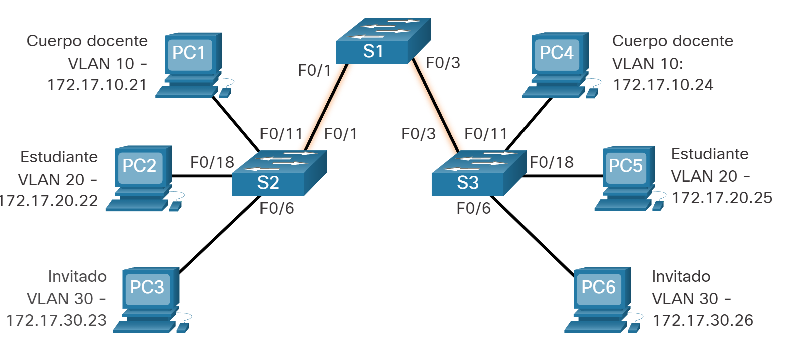
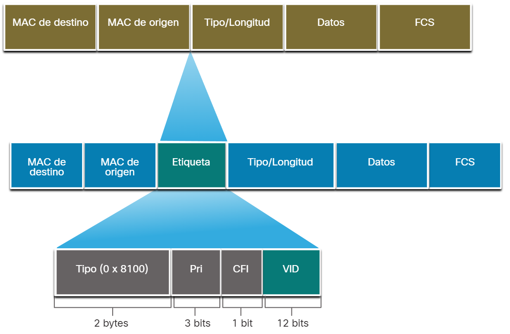
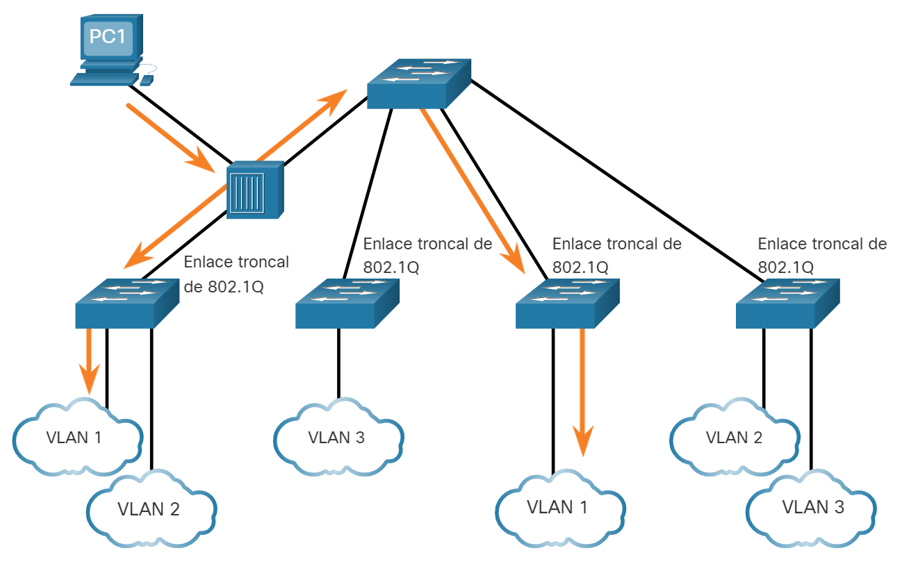
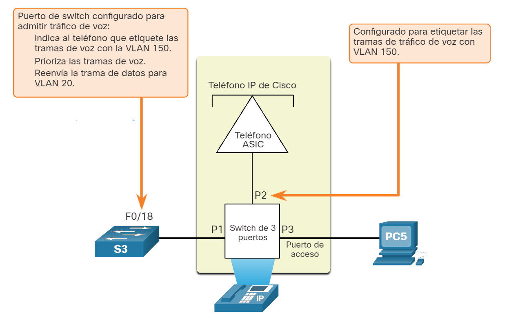
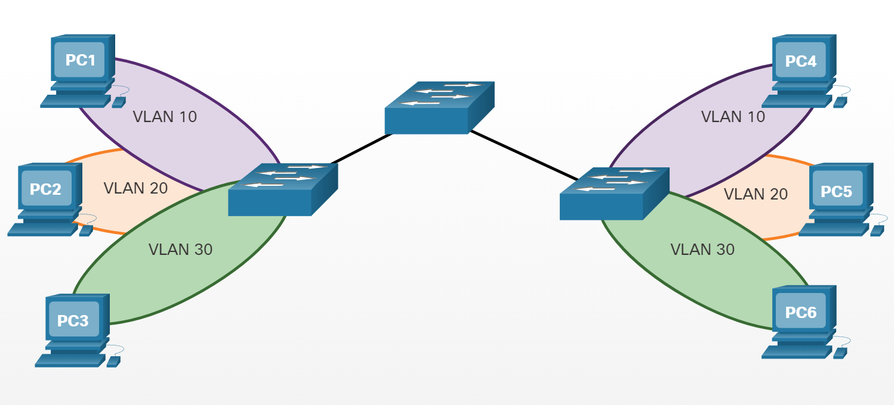
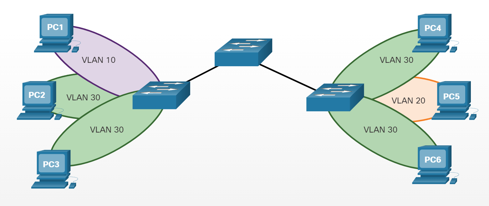
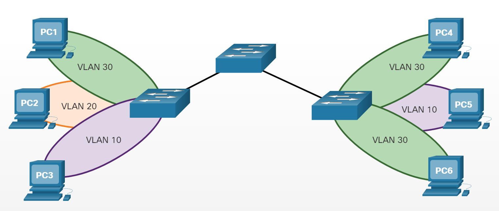

# Redes VLAN en un entorno conmutado múltiple

## Definición de troncos de VLAN
</br></br>
Las VLAN no serían muy útiles sin los enlaces troncales de VLAN. Los troncos de VLAN permiten que todo el tráfico de VLAN se propague entre conmutadores. Esto permite que los dispositivos conectados a diferentes switches pero en la misma VLAN se comuniquen sin pasar por un router.
</br></br>
Un enlace troncal es un enlace punto a punto entre dos dispositivos de red que lleva más de una VLAN. Un enlace troncal de VLAN amplía las VLAN a través de toda la red. Cisco admite IEEE 802.1Q para coordinar enlaces troncales en las interfaces Fast Ethernet, Gigabit Ethernet y 10-Gigabit Ethernet.
</br></br>
Un enlace troncal no pertenece a una VLAN específica. Es más bien un conducto para las VLAN entre los switches y los routers. También se puede utilizar un enlace troncal entre un dispositivo de red y un servidor u otro dispositivo que cuente con una NIC con capacidad 802.1Q. En los switches Cisco Catalyst, se admiten todas las VLAN en un puerto de enlace troncal de manera predeterminada.
</br></br>
En la figura, los enlaces entre los switches S1 y S2, y S1 y S3 se configuraron para transmitir el tráfico proveniente de las VLAN 10, 20, 30 y 99 a través de la red. Esta red no podría funcionar sin los enlaces troncales de VLAN.
</br></br>



## Redes sin VLAN
</br></br>
En condiciones normales de funcionamiento, cuando un switch recibe una trama de difusión en uno de sus puertos, reenvía la trama por todos los demás puertos, excepto el puerto por donde recibió la difusión. En la animación de la figura se configuró toda la red en la misma subred (172.17.40.0/24), y no se configuró ninguna VLAN. Como consecuencia, cuando la computadora del cuerpo docente (PC1) envía una trama de difusión, el switch S2 envía dicha trama de difusión por todos sus puertos. Finalmente, toda la red recibe la difusión porque la red es un dominio de difusión.
</br></br>


<div id="network2">
    <canvas id="networkCanvas2"></canvas>
    <div id="trunkInfo2" />
    <div class="controls">
        <button id="playPauseButton2">▶️</button>
        <input type="range" id="progressBar2" value="0" max="100">
    </div>
</div>


## Red con VLAN
</br></br>
Haga clic en Reproducir en la animación para ver que la misma red se ha segmentado utilizando dos VLAN. Los dispositivos del cuerpo docente se asignaron a la VLAN 10, y los dispositivos de los estudiantes se asignaron a la VLAN 20. Cuando se envía una trama de difusión desde la computadora del cuerpo docente, la PC1, al switch S2, el switch reenvía esa trama de difusión solo a los puertos de switch configurados para admitir la VLAN 10.
</br></br>
<div id="network1">
        <canvas id="networkCanvas1"></canvas>
        <div id="trunkInfo1" class="trunk-info">Enlaces troncales de VLAN configurados para admitir las VLAN 10 y 20.</div>
        <div id="defInfo" class="def-info">La PC1 envia una difusión de capa 2 local. los swithes reenvian la trama de la difusión solamente a los puertos
        <div class="controls">
            <button id="playPauseButton1">▶️</button>
            <input type="range" id="progressBar1" value="0" max="100">
        </div>
    </div>
</br></br>


Los puertos que componen la conexión entre los switches S2 y S1 (puertos F0/1), y entre el S1 y el S3 (puertos F0/3) son enlaces troncales y se configuraron para admitir todas las VLAN en la red.
</br></br>
Cuando el S1 recibe la trama de difusión en el puerto F0/1, reenvía la trama de difusión por el único puerto configurado para admitir la VLAN 10, que es el puerto F0/3. Cuando el S3 recibe la trama de difusión en el puerto F0/3, reenvía la trama de difusión por el único puerto configurado para admitir la VLAN 10, que es el puerto F0/11. La trama de difusión llega a la única otra computadora de la red configurada en la VLAN 10, que es la computadora PC4 del cuerpo docente.
</br></br>
Cuando se implementan las VLAN en un switch, la transmisión del tráfico de unidifusión, multidifusión y difusión desde un host en una VLAN en particular se limita a los dispositivos presentes en esa VLAN.

 </br></br>
## Identificación de VLAN con etiqueta
</br></br>
El encabezado de trama Ethernet estándar no contiene información sobre la VLAN a la que pertenece la trama. Por lo tanto, cuando las tramas de Ethernet se ubican en un enlace troncal, se necesita agregar información sobre las VLAN a las que pertenecen. Este proceso, denominado “etiquetado”, se logra mediante el uso del encabezado IEEE 802.1Q, especificado en el estándar IEEE 802.1Q. El encabezado 802.1Q incluye una etiqueta de 4 bytes insertada en el encabezado de la trama de Ethernet original que especifica la VLAN a la que pertenece la trama.
</br></br>
Cuando el switch recibe una trama en un puerto configurado en modo de acceso y asignado a una VLAN, el switch coloca una etiqueta VLAN en el encabezado de la trama, vuelve a calcular la Secuencia de Verificación de Tramas (FCS) y envía la trama etiquetada por un puerto de enlace troncal.

### Detalles del campo VLAN Tag

Como se muestra en la figura el campo de etiqueta de la VLAN consta de un campo de tipo, un campo de prioridad, un campo de identificador de formato canónico y un campo de ID de la VLAN:
</br></br>
- **Tipo** - Un valor de 2 bytes denominado “ID de Protocolo de Etiqueta” (TPID). Para Ethernet, este valor se establece en 0x8100 hexadecimal.
Prioridad de usuario - Es un valor de 3 bits que admite la implementación de nivel o de servicio.
Identificador de Formato Canónico (CFI) - Es un identificador de 1 bit que habilita las tramas Token Ring que se van a transportar a través de los enlaces Ethernet.
</br></br>

**VLAN ID (VID)** - Es un número de identificación de VLAN de 12 bits que admite hasta 4096 ID de VLAN.
Una vez que el switch introduce los campos tipo y de información de control de etiquetas, vuelve a calcular los valores de la FCS e inserta la nueva FCS en la trama.




## VLAN nativas y etiquetado de 802.1Q

El estándar IEEE 802.1Q especifica una VLAN nativa para los enlaces troncal, que por defecto es VLAN 1. Cuando un marco sin etiqueta llega a un puerto troncal, se asigna a la VLAN nativa. Las tramas de administración que se envían entre conmutadores es un ejemplo de tráfico que normalmente no se etiqueta. Si el vínculo entre dos switches es un tronco, el switch envía el tráfico sin etiqueta en la VLAN nativa.
### Marcos etiquetados en la VLAN nativa

Algunos dispositivos que admiten los enlaces troncales agregan una etiqueta VLAN al tráfico de las VLAN nativas. El tráfico de control que se envía por la VLAN nativa no se debe etiquetar. Si un puerto de enlace troncal 802.1Q recibe una trama etiquetada con la misma ID de VLAN que la VLAN nativa, descarta la trama. Por consiguiente, al configurar un puerto de un switch Cisco, configure los dispositivos de modo que no envíen tramas etiquetadas por la VLAN nativa. Los dispositivos de otros proveedores que admiten tramas etiquetadas en la VLAN nativa incluyen: teléfonos IP, servidores, routers y switches que no pertenecen a a Cisco.

### Marcos sin etiquetas en la VLAN nativa

Cuando un puerto de enlace troncal de un switch Cisco recibe tramas sin etiquetar (poco usuales en las redes bien diseñadas), envía esas tramas a la VLAN nativa. Si no hay dispositivos asociados a la VLAN nativa (lo que es usual) y no existen otros puertos de enlace troncal (es usual), se descarta la trama. La VLAN nativa predeterminada es la VLAN 1. Al configurar un puerto de enlace troncal 802.1Q, se asigna el valor de la ID de VLAN nativa a la ID de VLAN de puerto (PVID) predeterminada. Todo el tráfico sin etiquetar entrante o saliente del puerto 802.1Q se reenvía según el valor de la PVID. Por ejemplo, si se configura la VLAN 99 como VLAN nativa, la PVID es 99, y todo el tráfico sin etiquetar se reenvía a la VLAN 99. Si no se volvió a configurar la VLAN nativa, el valor de la PVID se establece en VLAN 1.

En la ilustración, la PC1 está conectada a un enlace troncal 802.1Q mediante un hub.

</br></br>
La PC1 envía el tráfico sin etiquetar, que los switches asocian a la VLAN nativa configurada en los puertos de enlace troncal y que reenvían según corresponda. El tráfico etiquetado del enlace troncal que recibe la PC1 se descarta. Esta situación refleja un diseño de red deficiente por varios motivos: utiliza un hub, tiene un host conectado a un enlace troncal y esto implica que los switches tengan puertos de acceso asignados a la VLAN nativa. También ilustra la motivación de la especificación IEEE 802.1Q para que las VLAN nativas sean un medio de manejo de entornos antiguos.


## Etiquetado de VLAN de voz
Se necesita una red VLAN de voz separada para admitir VoIP. Esto permite aplicar políticas de calidad de servicio (QoS) y seguridad al tráfico de voz.

Un teléfono IP de Cisco se conecta directamente a un puerto del switch. Un host IP puede conectarse al teléfono IP para obtener conectividad de red también. Un puerto de acceso que conecta un teléfono IP de Cisco puede configurarse para utilizar dos VLAN separadas: Una VLAN es para el tráfico de voz y la otra es una VLAN de datos para admitir el tráfico de host. El enlace entre el switch y el teléfono IP funciona como un enlace troncal para transportar tanto el tráfico de la VLAN de voz como el tráfico de la VLAN de datos.
</br></br>
- Específicamente, el teléfono IP Cisco contiene un switch 10/100 de tres puertos integrado. Los puertos proporcionan conexiones dedicadas para estos dispositivos:
    - El puerto 1 se conecta al switch o a otro dispositivo VoIP.
    - El puerto 2 es una interfaz interna 10/100 que envía el tráfico del teléfono IP.
    - El puerto 3 (puerto de acceso) se conecta a una PC u otro dispositivo.
</br></br>
El puerto de acceso del switch envía paquetes CDP que indican al teléfono IP conectado que envíe tráfico de voz de una de las tres maneras. El método utilizado varía según el tipo de tráfico:
</br></br>
- El tráfico VLAN de voz debe etiquetarse con un valor de prioridad CoS de Capa 2 adecuado.
- En una VLAN de acceso con una etiqueta de valor de prioridad de CoS de capa 2
- En una VLAN de acceso sin etiqueta (sin valor de prioridad de CoS de capa 2)
- En la figura, la computadora del estudiante PC5 está conectada a un teléfono IP de Cisco, y el teléfono está conectado al switch S3. La VLAN 150 está diseñada para transportar tráfico de voz, mientras que la PC5 está en la VLAN 20, que se usa para los datos de los estudiantes.
</br></br>




## Ejemplo de verificación de VLAN de voz
Se muestra la salida de ejemplo para el show interface fa0/18 switchport comando. El análisis de los comandos de voz de Cisco IOS excede el ámbito de este curso, pero las áreas resaltadas en el resultado de ejemplo muestran que la interfaz F0/18 se configuró con una VLAN configurada para datos (VLAN 20) y una VLAN configurada para voz (VLAN 150).

```shell
S1# show interfaces fa0/18 switchport  
Name: Fa0/18
Switchport: Enabled
Administrative Mode: static access
Operational Mode: static access
Administrative Trunking Encapsulation: negotiate
Operational Trunking Encapsulation: native
Negotiation of Trunking: Off
Access Mode VLAN: 20 (student) 
Trunking Native Mode VLAN: 1 (default)
Administrative Native VLAN tagging: enabled
Voice VLAN: 150 (voice) 
```


### Preguntas



La PC1 envía una trama de difusión ARP. ¿Qué PC recibirá el marco de difusión ARP?
</br></br>

- [ ] PC2
- [ ] PC3
- [ ] PC4
- [ ] PC5
- [ ] PC6
</br></br>



La PC1 envía una trama de difusión ARP. ¿Qué PC recibirá el marco de difusión ARP?
</br></br>

- [ ] PC1
- [ ] PC3
- [ ] PC4
- [ ] PC5
- [ ] PC6
</br></br>



La PC3 envía una trama de difusión ARP. ¿Qué PC recibirá el marco de difusión ARP?
</br></br>

- [ ] PC1
- [ ] PC2
- [ ] PC4
- [ ] PC5
- [ ] PC6

