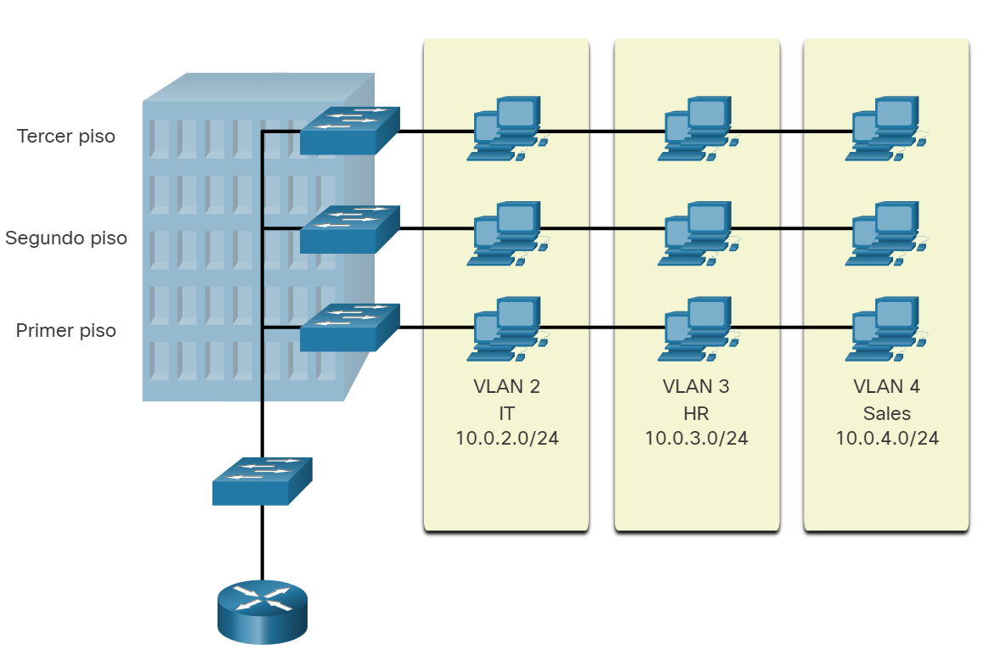

# VLANs

## Definiciones de VLAN
  

Organizar una red en subredes más pequeñas puede hacer que sea más fácil de gestionar. Dentro de una red conmutada, las VLAN proporcionan segmentación y flexibilidad organizativa. Un grupo de dispositivos dentro de una VLAN se comunica como si estuvieran en la misma conexión, ya que las VLAN se basan en conexiones lógicas en lugar de físicas.

  
Como se muestra en la imagen, las VLAN en una red conmutada permiten a los usuarios de varios departamentos (por ejemplo, TI, recursos humanos y ventas) conectarse a la misma red, sin importar el switch físico que se utilice o la ubicación en una LAN del campus.
  
Las VLAN permiten al administrador dividir las redes en segmentos basados en factores como la función, el equipo del proyecto o la aplicación, sin importar la ubicación física del usuario o del dispositivo. Cada VLAN se considera una red lógica diferente. Los dispositivos dentro de una VLAN funcionan como si estuvieran en su propia red independiente, aunque compartan la misma infraestructura con otras VLAN. Cualquier puerto de switch puede pertenecer a una VLAN.
  
Los paquetes de unidifusión, difusión y multidifusión se reenvían solamente a terminales dentro de la VLAN donde los paquetes son de origen. Los paquetes destinados a dispositivos que no pertenecen a la VLAN se deben reenviar a través de un dispositivo que admita el enrutamiento.
  
Varias subredes IP pueden existir en una red conmutada, sin el uso de varias VLAN. Sin embargo, los dispositivos estarán en el mismo dominio de difusión de capa 2. Esto significa que todas las difusiones de capa 2, tales como una solicitud de ARP, serán recibidas por todos los dispositivos de la red conmutada, incluso por aquellos que no se quiere que reciban la difusión.
  
Una VLAN crea un dominio de difusión lógico que puede abarcar varios segmentos LAN físicos. Las VLAN mejoran el rendimiento de la red mediante la división de grandes dominios de difusión en otros más pequeños. Si un dispositivo en una VLAN envía una trama de Ethernet de difusión, todos los dispositivos en la VLAN reciben la trama, pero los dispositivos en otras VLAN no la reciben.

Mediante las VLAN, los administradores de red pueden implementar políticas de acceso y seguridad de acuerdo con grupos específicos de usuarios. Cada puerto de switch se puede asignar a una sola VLAN (a excepción de un puerto conectado a un teléfono IP o a otro switch).

## Ventajas de un diseño de VLAN
  
Cada VLAN en una red conmutada corresponde a una red IP. Por lo tanto, el diseño de VLAN debe tener en cuenta la implementación de un esquema de direccionamiento de red jerárquico. El direccionamiento jerárquico de la red significa que los números de red IP se aplican a los segmentos de red o a las VLAN de manera ordenada, lo que permite que la red se tome en cuenta como conjunto. Los bloques de direcciones de red contiguas se reservan para los dispositivos en un área específica de la red y se configuran en estos, como se muestra en la ilustración.
  

  
En la tabla se enumeran las ventajas de diseñar una red con VLAN.
  

|Ventaja	|Descripción|
|-----|-----|
| Dominios de difusión más pequeños	 | Dividir una red en VLAN reduce el número de dispositivos en el broadcast domain. En la figura, hay seis computadoras en la red, pero solo tres dominios de difusión (es decir, Facultad, Estudiante e Invitado).|
|Seguridad mejorada	| Sólo los usuarios de la misma VLAN pueden comunicarse juntos. En la figura, el tráfico de red de profesores en la VLAN 10 es completamente separados y protegidos de los usuarios en otras VLAN.|
|Mejora la eficiencia del departamento de IT.	|Las VLAN simplifican la administración de la red porque los usuarios con una red similar se pueden configurar en la misma VLAN.Las VLAN se pueden nombrar para facilitar su identificación.En la figura, VLAN 10 fue nombrado «Facultad», VLAN 20 «Estudiante», y VLAN 30 «Invitado. »|
|Reducción de costos	| Las VLAN reducen la necesidad de realizar costosas actualizaciones de red y utilizan el ancho de banda existente y enlaces ascendentes de manera más eficiente, lo que resulta en costos Ahorro| 
|Mejor rendimiento|	Los dominios de difusión más pequeños reducen el tráfico innecesario en la red y mejorar el rendimiento.|
|dministración más simple de proyectos y aplicaciones	| Las VLAN agregan usuarios y dispositivos de red para admitir empresas o necesidades geográficas.Tener funciones separadas hace que administrar un proyecto o trabajar con un aplicación especializada más fácil; un ejemplo de tal aplicación es una plataforma de desarrollo de e-learning para profesores.|

## Tipos de VLAN
  
Las VLAN se utilizan por diferentes razones en las redes modernas. Algunos tipos de VLAN se definen según las clases de tráfico. Otros tipos de VLAN se definen según la función específica que cumplen.

1. VLAN Predeterminada
     
La VLAN predeterminada para los switches Cisco es la VLAN 1. Por lo tanto, todos los puertos del switch están en VLAN 1 a menos que esté configurado explícitamente para estar en otra VLAN. Todo el tráfico de control de capa 2 se asocia a la VLAN 1 de manera predeterminada.
  
Entre los datos importantes que hay que recordar acerca de la VLAN 1 se incluyen los siguientes:
  
    - Todos los puertos se asignan a la VLAN 1 de manera predeterminada.
    - De manera predeterminada, la VLAN nativa es la VLAN 1.
    - De manera predeterminada, la VLAN de administración es la VLAN 1.
    - No es posible eliminar ni cambiar el nombre de VLAN 1.
  
Por ejemplo, en la **show vlan brief** ilustración, todos los puertos están asignados a la VLAN 1 predeterminada. No hay ninguna VLAN nativa asignada explícitamente ni otras VLAN activas; por lo tanto, la VLAN nativa de la red que se diseñó es la VLAN de administración. Esto se considera un riesgo de seguridad.
     
2. VLAN de datos
Las VLAN de datos son VLAN configuradas para separar el tráfico generado por el usuario. Las VLAN de datos se usan para dividir la red en grupos de usuarios o dispositivos. Una red moderna tendría muchas VLAN de datos en función de los requisitos organizativos. Tenga en cuenta que no se debe permitir el tráfico de administración de voz y red en las VLAN de datos.
  
3. VLAN nativa
El tráfico de usuario de una VLAN debe etiquetarse con su ID de VLAN cuando se envía a otro switch. Los puertos troncal se utilizan entre conmutadores para admitir la transmisión de tráfico etiquetado. Específicamente, un puerto troncal 802.1Q inserta una etiqueta de 4 bytes en el encabezado de trama Ethernet para identificar la VLAN a la que pertenece la trama.
  
Es posible que un switch también tenga que enviar tráfico sin etiqueta a través de un enlace troncal. El tráfico sin etiquetas es generado por un switch y también puede provenir de dispositivos heredados. El puerto de enlace troncal 802.1Q coloca el tráfico sin etiquetar en la VLAN nativa. La VLAN nativa en un switch Cisco es VLAN 1 (es decir, VLAN predeterminada).
  
Se recomienda configurar la VLAN nativa como VLAN sin utilizar, independiente de la VLAN 1 y de otras VLAN. De hecho, es común utilizar una VLAN fija para que funcione como VLAN nativa para todos los puertos de enlace troncal en el dominio conmutado.
  
4. VLAN de administración
  
Una VLAN de administración es una VLAN de datos configurada específicamente para el tráfico de administración de red, incluyendo SSH, Telnet, HTTPS, HHTP y SNMP. De forma predeterminada, la VLAN 1 se configura como la VLAN de administración en un conmutador de capa 2.
  
5. VLAN de voz
  
Se necesita una VLAN separada para admitir la tecnología de voz sobre IP (VoIP). Para el tráfico de VoIP, se necesita lo siguiente:
  
Ancho de banda garantizado para asegurar la calidad de la voz
Prioridad de la transmisión sobre los tipos de tráfico de la red
Capacidad para ser enrutado en áreas congestionadas de la red
Una demora inferior a 150 ms a través de la red
Para cumplir estos requerimientos, se debe diseñar la red completa para que admita VoIP.
  
En la figura, la VLAN 150 se diseña para enviar tráfico de voz. La computadora del estudiante PC5 está conectada al teléfono IP de Cisco y el teléfono está conectado al switch S3. La PC5 está en la VLAN 20 que se utiliza para los datos de los estudiantes.
