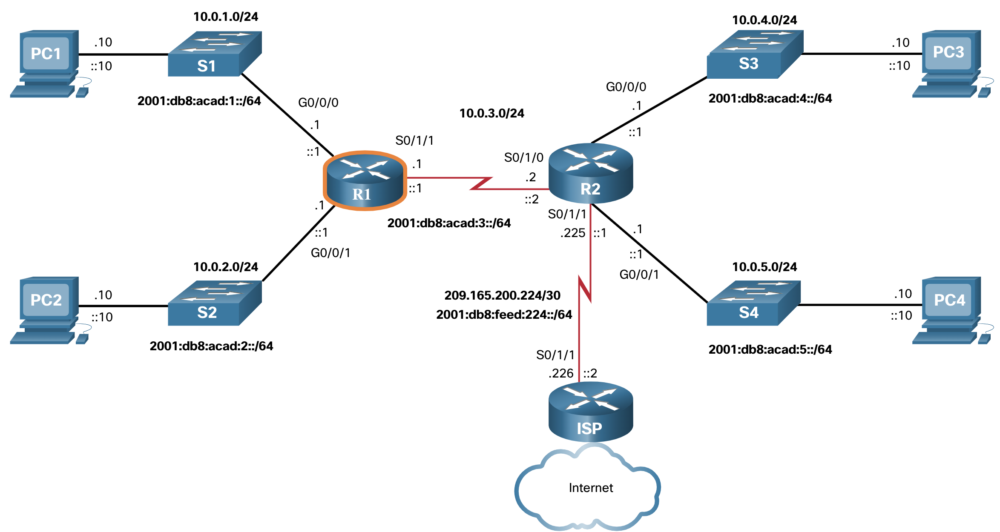
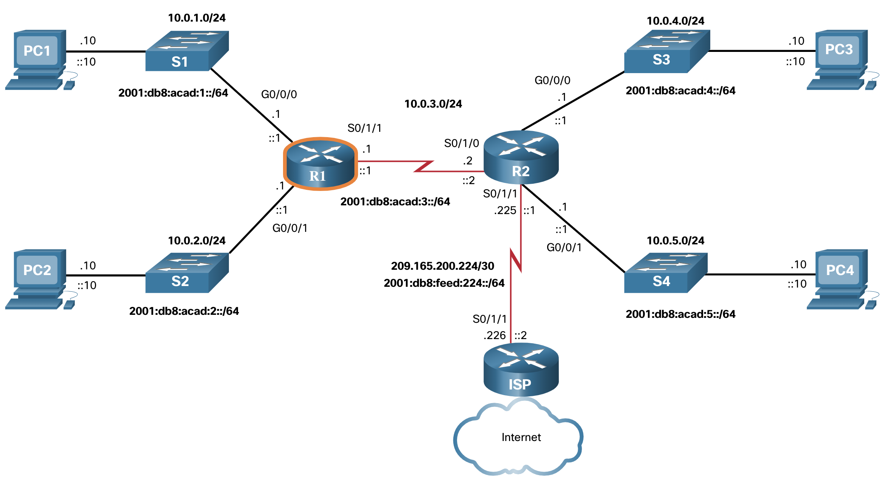

# Configuración básica de un router

## Topología
Un router utiliza una tabla de enrutamiento para determinar a dónde enviar los paquetes. Pero antes de sumergirse en los detalles de la tabla de enrutamiento IP, este tema revisa las tareas básicas de configuración y verificación del enrutador. También completarás una actividad de Rastreador de paquetes para actualizar tus habilidades.

La topología de la figura se utilizará para los ejemplos de configuración y verificación. También se usará en el siguiente tema para discutir la tabla de enrutamiento IP.



### Comandos de Configuración
Los siguientes ejemplos muestran la configuración completa de R1.

```bash
Router> enable
Router# configure terminal
Enter configuration commands, one per line. End with CNTL/Z.
Router(config)# hostname R1
R1(config)# enable secret class 
R1(config)# line console 0  
R1(config-line)# logging synchronous
R1(config-line)# password cisco 
R1(config-line)# login 
R1(config-line)# exit 
R1(config)# line vty 0 4 
R1(config-line)# password cisco 
R1(config-line)# login 
R1(config-line)# transport input ssh telnet 
R1(config-line)# exit 
R1(config)# service password-encryption 
R1(config)# banner motd #
Enter TEXT message. End with a new line and the #
***********************************************
WARNING: Unauthorized access is prohibited!
***********************************************
#
R1(config)# ipv6 unicast-routing
R1(config)# interface gigabitethernet 0/0/0
R1(config-if)# description Link to LAN 1
R1(config-if)# ip address 10.0.1.1 255.255.255.0 
R1(config-if)# ipv6 address 2001:db8:acad:1::1/64 
R1(config-if)# ipv6 address fe80::1:a link-local
R1(config-if)# no shutdown
R1(config-if)# exit
R1(config)# interface gigabitethernet 0/0/1
R1(config-if)# description Link to LAN 2
R1(config-if)# ip address 10.0.2.1 255.255.255.0 
R1(config-if)# ipv6 address 2001:db8:acad:2::1/64 
R1(config-if)# ipv6 address fe80::1:b link-local
R1(config-if)# no shutdown
R1(config-if)# exit
R1(config)# interface serial 0/1/1
R1(config-if)# description Link to R2
R1(config-if)# ip address 10.0.3.1 255.255.255.0 
R1(config-if)# ipv6 address 2001:db8:acad:3::1/64 
R1(config-if)# ipv6 address fe80::1:c link-local
R1(config-if)# no shutdown
R1(config-if)# exit
R1# copy running-config startup-config 
Destination filename [startup-config]? 
Building configuration...
[OK]
R1#
```

### Comandos de verificación
Algunos comandos de verificación comunes incluyen los siguientes:

- `show ip interface brief`
- `show running-config interface interface-type number`
- `show interfaces`
- `show ip interface`
- `show ip route`
- `ping`

En cada caso, ip reemplace ipv6 por la versión IPv6 del comando. La figura muestra de nuevo la topología para facilitar la referencia.


### 1. `show ip interface brief`

```bash
R1# show ip interface brief
Interface IP-Address OK? Method Status Protocol
GigabiteThernet0/0/0 10.0.1.1 Sí manual arriba
GigabiteThernet0/0/1 10.0.2.1 Sí manual arriba
Serial0/1/0 unassigned YES unset administratively down down
Serial0/1/1 10.0.3.1 SÍ manual arriba
GigabitEthernet0 unassigned YES unset down down
R1#
```

### 2. `show ipv6 interface brief`

```bash
R1# show ipv6 interface brief
GigabitEthernet0/0/0 [up/up]
    FE80: :1:A
    2001:DB8:ACAD:1::1
GigabitEthernet0/0/1 [up/up]
    FE80: :1:B
    2001:DB8:ACAD:2::1
Serial0/1/0 [administratively down/down]
    no asignado
Serial0/1/1 [up/up]
    FE80: :1:C
    2001:DB8:ACAD:3: :1
GigabiteThernet0 [abajo/abajo]
    no asignado
R1#
```

### 3. `show running-config interface`
```bash
R1# show running-config interface gigabitethernet 0/0/0
Building configuration...
Current configuration : 189 bytes
!
interfaz GigabiteThernet0/0/0
 description Link to LAN 1
 ip address 10.0.1.1 255.255.255.0
 automatización de negociación
 dirección ipv6 FE80: :1:Un enlace local
 ipv6 address 2001:DB8:ACAD:1::1/64
finalizar
R1#
```
### 4. `show interfaces`

```bash
R1# show interfaces gigabitEthernet 0/0/0
GigabitEthernet0/0/0 is up, line protocol is up
  El hardware es ISR4321-2x1GE, la dirección es a0e0.af0d.e140 (bia a0e0.af0d.e140)
  Internet address is 10.0.1.1/24
  MTU 1500 bytes, BW 100000 Kbit/sec, DLY 100 usec,
     reliability 255/255, txload 1/255, rxload 1/255
  Encapsulation ARPA, loopback not set
  Keepalive not supported
  Full Duplex, 100Mbps, link type is auto, media type is RJ45
  output flow-control is off, input flow-control is off
  ARP type: ARPA, ARP Timeout 04:00:00
  Last input 00:00:00, output 00:00:06, output hang never
  Last clearing of "show interface" counters never
  Input queue: 0/375/0/0 (size/max/drops/flushes); Total output drops: 0
  Queueing strategy: fifo
  Output queue: 0/40 (size/max)
  5 minute input rate 2000 bits/sec, 1 packets/sec
  5 minute output rate 0 bits/sec, 0 packets/sec
     57793 packets input, 10528767 bytes, 0 no buffer
     Received 19711 broadcasts (0 IP multicasts)
     0 runts, 0 giants, 0 throttles
     0 input errors, 0 CRC, 0 frame, 0 overrun, 0 ignored
     0 watchdog, 36766 multicast, 0 pause input
     10350 packets output, 1280030 bytes, 0 underruns
     0 output errors, 0 collisions, 1 interface resets
     0 unknown protocol drops
     0 babbles, 0 late collision, 0 deferred
     0 lost carrier, 0 no carrier, 0 pause output
     0 output buffer failures, 0 output buffers swapped out
R1# 
```

### 5. `show ip interface`
```bash
R1# show ip interface gigabitethernet 0/0/0
GigabitEthernet0/0/0 is up, line protocol is up
  Internet address is 10.0.1.1/24
  Broadcast address is 255.255.255.255
  Address determined by setup command
  MTU is 1500 bytes
  Helper address is not set
  Directed broadcast forwarding is disabled
  Multicast reserved groups joined: 224.0.0.5 224.0.0.6
  Outgoing Common access list is not set
  Outgoing access list is not set
  Inbound Common access list is not set
  Inbound access list is not set
  El ARP del proxy está habilitado
  El Proxy local ARP esta desabilitado
  Security level is default
  Split horizon is enabled
  ICMP redirects are always sent
  ICMP unreachables are always sent
  ICMP mask replies are never sent
  IP fast switching is enabled
  IP Flow switching is disabled
  IP CEF switching is enabled
  IP CEF switching turbo vector
  Vector turbo IP nulo
  Topologías de enrutamiento de unidifusión asociadas:
        Topología «base», estado de operación es UP
  IP multicast fast switching is enabled
  IP multicast distributed fast switching is disabled
  IP route-cache flags are Fast, CEF
  Router Discovery is disabled
  IP output packet accounting is disabled
  IP access violation accounting is disabled
  TCP/IP header compression is disabled
  RTP/IP header compression is disabled
  Las respuestas de nombre de proxy de sondeo están deshabilitadas
  Policy routing is disabled
  Network address translation is disabled
  BGP Policy Mapping is disabled
  Características de entrada: MCI Check
  IPv4 WCCP Redirect outbound is disabled
  IPv4 WCCP Redirect inbound is disabled
  IPv4 WCCP Redirect exclude is disabled
R1#
```

### 6. `show ipv6 interface`

```bash
R1# show ipv6 interface gigabitethernet 0/0/0
GigabitEthernet0/0/0 is up, line protocol is up
  IPv6 is enabled, link-local address is FE80::1:A
  No Virtual link-local address(es):
  Global unicast address(es):
    2001:DB8:ACAD:1: :1, la subred es 2001:DB8:ACAD:1: :/64
  Joined group address(es):
    FF02::1
    FF02::2
    FF02::5
    FF02::6
    FF02::1:FF00:1
    FF02: :1:FF01:A
  MTU is 1500 bytes
  ICMP error messages limited to one every 100 milliseconds
  ICMP redirects are enabled
  ICMP unreachables are sent
  ND DAD is enabled, number of DAD attempts: 1
  ND reachable time is 30000 milliseconds (using 30000)
  ND advertised reachable time is 0 (unspecified)
  ND advertised retransmit interval is 0 (unspecified)
  ND router advertisements are sent every 200 seconds
  ND router advertisements live for 1800 seconds
  ND advertised default router preference is Medium
  Hosts use stateless autoconfig for addresses.
R1#
```
### 7. `show ip route`

```bash
R1# show ip route
Codes: L - local, C - connected, S - static, R - RIP, M - mobile, B - BGP
(Output omitted)
Gateway of last resort is not set
      10.0.0.0/8 is variably subnetted, 6 subnets, 2 masks
C 10.0.1.0/24 está conectado directamente, GigabiteThernet0/0/0
L 10.0.1.1/32 está conectado directamente, GigabiteThernet0/0/0
C 10.0.2.0/24 está conectado directamente, GigabiteThernet0/0/1
L 10.0.2.1/32 está conectado directamente, GigabiteThernet0/0/1
C 10.0.3.0/24 está conectado directamente, Serial0/1/1
L 10.0.3.1/32 está conectado directamente, Serial0/1/1
R1#
```


### 8. `show ipv6 route`

```bash
R1# show ipv6 route
IPv6 Routing Table - default - 5 entries
Codes: C - Connected, L - Local, S - Static, U - Per-user Static route
(Output omitted)
C 2001:DB8:ACAD:1::/64 [0/0]
     a través de GigabiteThernet0/0/0, conectado directamente
L 2001:DB8:ACAD:1::1/128 [0/0]
     a través de GigabiteThernet0/0/0, recibir
C 2001:DB8:ACAD:2::/64 [0/0]
     a través de GigabiteThernet0/0/1, conectado directamente
L 2001:DB8:ACAD:2::1/128 [0/0]
     a través de GigabiteThernet0/0/1, reciba
C 2001:DB8:ACAD:3: :/64 [0/0]
     via Serial0/1/1, directly connected
L 2001:DB8:ACAD:3: :1/128 [0/0]
     via Serial0/1/1, receive
L FF00::/8 [0/0]
     via Null0, receive
R1#
```

### 9. `ping``

El siguiente **ping** resultado asume que la interfaz S0/1/0 en R2 está configurada y activa.
```bash
R1# ping 10.0.3.2
Escriba la secuencia de escape para interrumpir la acción.
Sending 5, 100-byte ICMP Echos to 10.0.3.2, timeout is 2 seconds:
!!!!!
Success rate is 100 percent (5/5), round-trip min/avg/max = 2/2/2 ms
R1# ping 2001:db8:acad:3::2
Type escape sequence to abort.
Sending 5, 100-byte ICMP Echos to 2001:DB8:ACAD:3::2, timeout is 2 seconds:
!!!!!
Success
```

### Salida del comando de filtro
Otra característica muy útil que mejora la experiencia del usuario en la interfaz de línea de comandos (CLI)es el filtrado de los resultados del comando show show. Los comandos de filtrado se pueden utilizar para mostrar secciones específicas de los resultados. Para habilitar el comando de filtrado, ingrese una barra vertical partida (|) después del comando show y luego ingrese un parámetro de filtrado y una expresión de filtrado.

Los parámetros de filtrado que se pueden configurar después de la barra vertical incluyen lo siguiente:

- `section` - muestra la sección completa que comienza con la expresión de filtrado.
- `include` - incluye todas las líneas de resultados que coinciden con la expresión de filtrado.
- `exclude` - excluye todas las líneas de resultados que coinciden con la expresión de filtrado.
- `begin` - muestra todas las líneas de resultados desde determinado punto, comenzando por la línea que coincide con la expresión de filtra
**Nota:** Los filtros de salida se pueden usar en combinación con cualquier comando show.

La figura muestra de nuevo la topología para su conveniencia



Estos ejemplos demuestran algunos de los usos más comunes de los parámetros de filtrado.

```bash
R1# show running-config | section line vty
line vty 0 4
 password 7 121A0C0411044C
 login
 transport input telnet ssh
R1#
R1# show ipv6 interface brief | include up
GigabitEthernet0/0/0   [up/up]
GigabitEthernet0/0/1   [up/up]
Serial0/1/1            [up/up]
R1#
R1# show ip interface brief | exclude unassigned
Interface              IP-Address      OK? Method Status                Protocol
GigabitEthernet0/0/0   192.168.10.1    YES manual up                    up
GigabitEthernet0/0/1   192.168.11.1    YES manual up                    up
Serial0/1/1            209.165.200.225 YES manual up                    up
R1#
R1# show ip route | begin Gateway
Gateway of last resort is not set
      192.168.10.0/24 is variably subnetted, 2 subnets, 2 masks
C        192.168.10.0/24 is directly connected, GigabitEthernet0/0/0
L        192.168.10.1/32 is directly connected, GigabitEthernet0/0/0
      192.168.11.0/24 is variably subnetted, 2 subnets, 2 masks
C        192.168.11.0/24 is directly connected, GigabitEthernet0/0/1
L        192.168.11.1/32 is directly connected, GigabitEthernet0/0/1
      209.165.200.0/24 is variably subnetted, 2 subnets, 2 masks
C        209.165.200.224/30 is directly connected, Serial0/1/1
L        209.165.200.225/32 is directly connected, Serial0/1/1
R1#
```

### Packet Tracer - Revisión básica de la configuración del router

Los routers R1 y R2 tienen dos LAN cada uno. R1 ya está configurado. Su tarea es configurar el direccionamiento adecuado para R2 y verificar la conectividad entre las LAN.

- [Configuración basica de un Router](./labs/-packet-tracer---configure-dhcpv4_es-XL.pdf)
- [Lab Packet Tracer - Configuración basica de un Router](./labs/-packet-tracer---configure-dhcpv4_es-XL.pka)