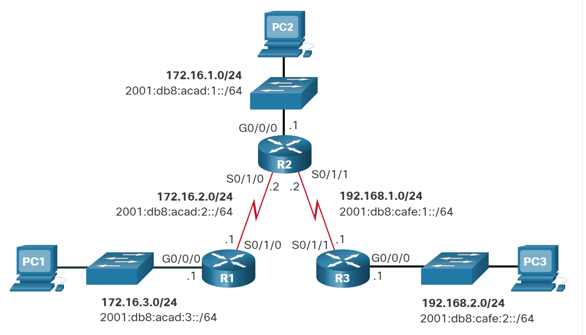
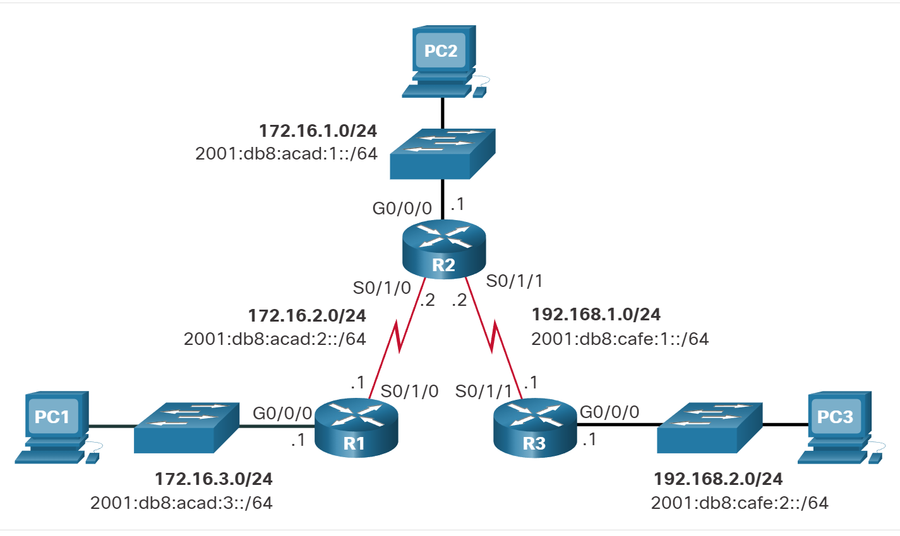
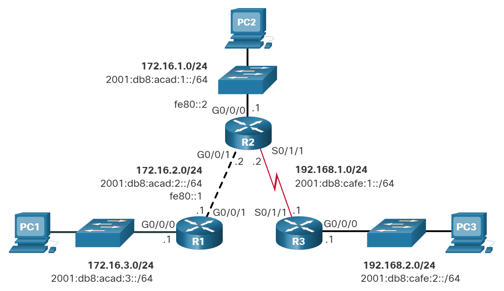
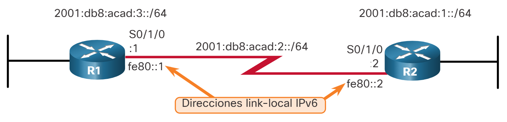
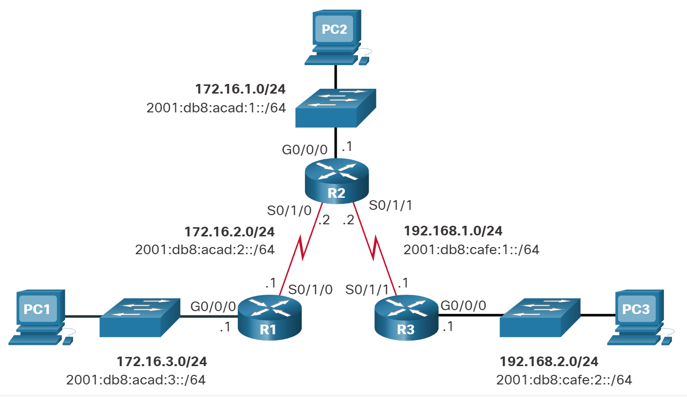
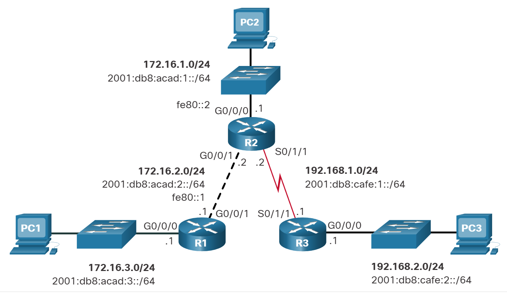

# Rutas IP estáticas

## Ruta estática IPv4 de siguiente salto
<br/><br/>
Los comandos para configurar rutas estáticas estándar varían ligeramente entre IPv4 e IPv6. En este tema se muestra cómo configurar rutas estáticas estándar de siguiente salto, conectadas directamente y completas especificadas para IPv4 e IPv6.
<br/><br/>
En una ruta estática de siguiente salto, solo se especifica la dirección IP del siguiente salto. La interfaz de salida se deriva del próximo salto. Por ejemplo, se configuran tres rutas estáticas de siguiente salto en el R1 con la dirección IP del siguiente salto, el R2.
<br/><br/>

<br/><br/>
Los comandos para configurar R1 con las rutas estáticas IPv4 a las tres redes remotas son los siguientes:

```bash
R1(config)# ip route 172.16.1.0 255.255.255.0 172.16.2.2
R1(config)# ip route 192.168.1.0 255.255.255.0 172.16.2.2
R1(config)# ip route 192.168.2.0 255.255.255.0 172.16.2.2
```
La tabla de enrutamiento para R1 ahora tiene rutas a las tres redes IPv4 remotas.

```bash
R1# show ip route | begin Gateway
Gateway of last resort is not set
      172.16.0.0/16 is variably subnetted, 5 subnets, 2 masks
S        172.16.1.0/24 [1/0] via 172.16.2.2
C        172.16.2.0/24 is directly connected, Serial0/1/0
L        172.16.2.1/32 is directly connected, Serial0/1/0
C        172.16.3.0/24 is directly connected, GigabitEthernet0/0/0
L        172.16.3.1/32 is directly connected, GigabitEthernet0/0/0
S     192.168.1.0/24 [1/0] via 172.16.2.2
S     192.168.2.0/24 [1/0] via 172.16.2.2
R1#
```

### Ruta estática IPv6 de siguiente salto
Los comandos para configurar R1 con las rutas estáticas IPv6 a las tres redes remotas son los siguientes:

```bash
R1(config)# ipv6 unicast-routing
R1(config)# ipv6 route 2001:db8:acad:1::/64 2001:db8:acad:2::2
R1(config)# ipv6 route 2001:db8:cafe:1::/64 2001:db8:acad:2::2
R1(config)# ipv6 route 2001:db8:cafe:2::/64 2001:db8:acad:2::2
```
La tabla de enrutamiento para R1 ahora tiene rutas a las tres redes IPv6 remotas.

```bash
R1# show ipv6 route
IPv6 Routing Table - default - 8 entries
Codes: C - Connected, L - Local, S - Static, U - Per-user Static route
       B - BGP, R - RIP, H - NHRP, I1 - ISIS L1
       I2 - ISIS L2, IA - ISIS interarea, IS - ISIS summary, D - EIGRP
       EX - EIGRP external, ND - ND Default, NDp - ND Prefix, DCE - Destination
       NDr - Redirect, RL - RPL, O - OSPF Intra, OI - OSPF Inter
       OE1 - OSPF ext 1, OE2 - OSPF ext 2, ON1 - OSPF NSSA ext 1
       ON2 - OSPF NSSA ext 2, la - LISP alt, lr - LISP site-registrations
       ld - LISP dyn-eid, lA - LISP away, le - LISP extranet-policy
       a - Application
S   2001:DB8:ACAD:1::/64 [1/0]
     via 2001:DB8:ACAD:2::2
C   2001:DB8:ACAD:2::/64 [0/0]
     via Serial0/1/0, directly connected
L   2001:DB8:ACAD:2::1/128 [0/0]
     via Serial0/1/0, receive
C   2001:DB8:ACAD:3::/64 [0/0]
     via GigabitEthernet0/0/0, directly connected
L   2001:DB8:ACAD:3::1/128 [0/0]
     via GigabitEthernet0/0/0, receive
S   2001:DB8:CAFE:1::/64 [1/0]
     via 2001:DB8:ACAD:2::2
S   2001:DB8:CAFE:2::/64 [1/0]
     via 2001:DB8:ACAD:2::2
L   FF00::/8 [0/0]
     via Null0, receive
```

## Ruta Estática IPv4 Conectada Directamente
<br/><br/>
Al configurar una ruta estática, otra opción es utilizar la interfaz de salida para especificar la dirección del siguiente salto. La figura muestra de nuevo la topología.
<br/><br/>

<br/><br/>
Se configuran tres rutas estáticas conectadas directamente en el R1 mediante la interfaz de salida.

```bash
R1(config)# ip route 172.16.1.0 255.255.255.0 s0/1/0
R1(config)# ip route 192.168.1.0 255.255.255.0 s0/1/0
R1(config)# ip route 192.168.2.0 255.255.255.0 s0/1/0
```

La tabla de routing para el R1 muestra que cuando un paquete está destinado a la red 192.168.2.0/24, el R1 busca una coincidencia en la tabla de routing y encuentra que puede reenviar el paquete desde su interfaz serial 0/0/0.
<br/><br/>

**Nota:** Generalmente se recomienda utilizar una dirección de salto siguiente. Las rutas estáticas conectadas directamente solo deben usarse con interfaces seriales punto a punto, como en este ejemplo.

```bash
R1# show ip route | begin Gateway
Gateway of last resort is not set
      172.16.0.0/16 is variably subnetted, 5 subnets, 2 masks
S        172.16.1.0/24 is directly connected, Serial0/1/0
C        172.16.2.0/24 is directly connected, Serial0/1/0
L        172.16.2.1/32 is directly connected, Serial0/1/0
C        172.16.3.0/24 is directly connected, GigabitEthernet0/0/0
L        172.16.3.1/32 is directly connected, GigabitEthernet0/0/0
S     192.168.1.0/24 is directly connected, Serial0/1/0
S     192.168.2.0/24 is directly connected, Serial0/1/0
```

## Ruta Estática IPv6 Conectada Directamente
<br/><br/>
En el ejemplo, se configuran tres rutas estáticas conectadas directamente en el R1 mediante la interfaz de salida.

```bash
R1(config)# ipv6 route 2001:db8:acad:1::/64 s0/1/0
R1(config)# ipv6 route 2001:db8:cafe:1::/64 s0/1/0
R1(config)# ipv6 route 2001:db8:cafe:2::/64 s0/1/0
```

La tabla de routing IPv6 para el R1 en el ejemplo muestra que cuando un paquete está destinado a la red 2001:db8:cafe:2::/64, el R1 busca una coincidencia en la tabla de routing y encuentra que puede reenviar el paquete desde su interfaz serial 0/0/0.
<br/><br/>
**Nota:** Generalmente se recomienda utilizar una dirección de salto siguiente. Solo se deben utilizar rutas estáticas conectadas directamente con interfaces seriales de punto a punto, como se muestra en este ejemplo.

```bash
R1# show ipv6 route
IPv6 Routing Table - default - 8 entries
Codes: C - Connected, L - Local, S - Static, U - Per-user Static route
       B - BGP, R - RIP, H - NHRP, I1 - ISIS L1
       I2 - ISIS L2, IA - ISIS interarea, IS - ISIS summary, D - EIGRP
       EX - EIGRP external, ND - ND Default, NDp - ND Prefix, DCE - Destination
       NDr - Redirect, RL - RPL, O - OSPF Intra, OI - OSPF Inter
       OE1 - OSPF ext 1, OE2 - OSPF ext 2, ON1 - OSPF NSSA ext 1
       ON2 - OSPF NSSA ext 2, la - LISP alt, lr - LISP site-registrations
       ld - LISP dyn-eid, lA - LISP away, le - LISP extranet-policy
       a - Application
S   2001:DB8:ACAD:1::/64 [1/0]
     via Serial0/1/0, directly connected
C   2001:DB8:ACAD:2::/64 [0/0]
     via Serial0/1/0, directly connected
L   2001:DB8:ACAD:2::1/128 [0/0]
     via Serial0/1/0, receive
C   2001:DB8:ACAD:3::/64 [0/0]
     via GigabitEthernet0/0/0, directly connected
L   2001:DB8:ACAD:3::1/128 [0/0]
     via GigabitEthernet0/0/0, receive
S   2001:DB8:CAFE:1::/64 [1/0]
     via Serial0/1/0, directly connected 
S   2001:DB8:CAFE:2::/64 [1/0]
     via Serial0/1/0, directly connected 
L   FF00::/8 [0/0]
     via Null0, receive
R1#
```

## Ruta estática completamente especificada IPv4
<br/><br/>
Una ruta estática completamente especificada tiene determinadas tanto la interfaz de salida como la dirección IP del siguiente salto. Esta forma de ruta estática se utiliza cuando la interfaz de salida es una interfaz de acceso múltiple y se debe identificar explícitamente el siguiente salto. El siguiente salto debe estar conectado directamente a la interfaz de salida especificada. El uso de una interfaz de salida es opcional, sin embargo, es necesario utilizar una dirección de salto siguiente.
<br/><br/>
Suponga que el enlace de red entre el R1 y el R2 es un enlace Ethernet y que la interfaz GigabitEthernet 0/0/1 del R1 está conectada a dicha red, como se muestra en la figura 1.

<br/><br/>

<br/><br/>
La diferencia entre una red Ethernet de accesos múltiples y una red serial punto a punto es que esta última solo tiene un dispositivo más en esa red, el router que se encuentra en el otro extremo del enlace. Con las redes Ethernet, es posible que existan muchos dispositivos diferentes que comparten la misma red de accesos múltiples, incluyendo hosts y hasta routers múltiples.
<br/><br/>
Cuando la interfaz de salida sea una red Ethernet, se recomienda utilizar una ruta estática que incluya una dirección del siguiente salto. También puede usar una ruta estática completamente especificada que incluye la interfaz de salida y la dirección de siguiente salto.

```bash
R1(config)# ip route 172.16.1.0 255.255.255.0 GigabitEthernet 0/0/1 172.16.2.2
R1(config)# ip route 192.168.1.0 255.255.255.0 GigabitEthernet 0/0/1 172.16.2.2
R1(config)# ip route 192.168.2.0 255.255.255.0 GigabitEthernet 0/0/1 172.16.2.2
```

Al reenviar paquetes al R2, la interfaz de salida es GigabitEthernet 0/0/1 y la dirección IPv4 del siguiente salto es 172.16.2.2. como se muestra en el show ip route resultado de R1.

```bash
R1# show ip route | begin Gateway
Gateway of last resort is not set
      172.16.0.0/16 is variably subnetted, 5 subnets, 2 masks
S        172.16.1.0/24 [1/0] via 172.16.2.2, GigabitEthernet0/0/1
C        172.16.2.0/24 is directly connected, GigabitEthernet0/0/1
L        172.16.2.1/32 is directly connected, GigabitEthernet0/0/1
C        172.16.3.0/24 is directly connected, GigabitEthernet0/0/0
L        172.16.3.1/32 is directly connected, GigabitEthernet0/0/0
S     192.168.1.0/24 [1/0] via 172.16.2.2, GigabitEthernet0/0/1
S     192.168.2.0/24 [1/0] via 172.16.2.2, GigabitEthernet0/0/1
```

## Ruta estática completamente especificada IPv6
<br/><br/>
En una ruta estática IPv6 completamente especificada, se especifican tanto la interfaz de salida como la dirección IPv6 del siguiente salto. Hay una situación en IPv6 que se da cuando se debe utilizar una ruta estática completamente especificada. Si la ruta estática IPv6 usa una dirección IPv6 link-local como la dirección del siguiente salto, debe utilizarse una ruta estática completamente especificada. La figura muestra un ejemplo de una ruta estática IPv6 completamente especificada que utiliza una dirección IPv6 link-local como la dirección del siguiente salto.
<br/><br/>


```bash
R1(config)# ipv6 route 2001:db8:acad:1::/64 fe80::2
%Interface has to be specified for a link-local nexthop
R1(config)# ipv6 route 2001:db8:acad:1::/64 s0/1/0 fe80::2
```


En el ejemplo, se configura una ruta estática completamente especificada con la dirección link-local del R2 como dirección del siguiente salto. Observe que el IOS requiere que se especifique una interfaz de salida.
<br/><br/>
La razón por la cual se debe utilizar una ruta estática completamente especificada es que las direcciones IPv6 link-local no están incluidas en la tabla de routing IPv6. Las direcciones link-local solo son exclusivas en una red o un enlace dados. La dirección link-local del siguiente salto puede ser una dirección válida en varias redes conectadas al router. Por lo tanto, es necesario que la interfaz de salida se incluya.
<br/><br/>
El siguiente ejemplo muestra la entrada de la tabla de routing IPv6 para esta ruta. Observe que la dirección link-local del siguiente salto y la interfaz de salida están incluidas.

```bash
R1# show ipv6 route static | begin 2001:db8:acad:1::/64
S   2001:DB8:ACAD:1::/64 [1/0]
    via FE80::2, Seria0/1/0
```

### Verificación de una ruta estática
Junto con show ip route, show ipv6 route, ping y traceroute, otros comandos útiles para verificar las rutas estáticas son los siguientes:

```bash
show ip route static
show ip route network
show running-config | section ip route

```

Reemplace **ip** con **ipv6** para las versiones IPv6 del comando.

<br/><br/>


<br/><br/>

Haga clic en cada botón por ejemplo en la salida de rutas estáticas IPv4 e IPv6.
<br/><br/>
<div class="tab">
    <button class="tablinks" onclick="openTab(event, 'Tab1')">Mostrar sólo <br/> rutas <br/> estáticas <br/> IPV4</button>
    <button class="tablinks" onclick="openTab(event, 'Tab2')">Mostrar una <br/> red IPV4 <br/> especifica</button>
    <button class="tablinks" onclick="openTab(event, 'Tab3')">Mostrar la <br/> configuración de <br/> las rutas estáticas <br/> IPV4</button>
    <button class="tablinks" onclick="openTab(event, 'Tab4')">Mostrar sólo <br/> rutas <br/> estáticas <br/> IPV6</button>
    <button class="tablinks" onclick="openTab(event, 'Tab5')">Mostrar una <br/> red IPV4 <br/> especifica</button>
    <button class="tablinks" onclick="openTab(event, 'Tab6')">Mostrar la <br/> configuración de <br/> las rutas estáticas <br/> IPV6</button>
</div>

<div id="Tab1" class="tabcontent">
    <p>Esta salida muestra sólo las rutas estáticas IPv4 en la tabla de enrutamiento. También tenga en cuenta dónde el filtro comienza la salida, excluyendo todos los códigos.</p>
    <pre><code class="language-bash">
R1# show ip route static | begin Gateway
Gateway of last resort is not set
      172.16.0.0/16 is variably subnetted, 5 subnets, 2 masks
S 172.16.1.0/24 [1/0] via 172.16.2.2
S 192.168.1.0/24 [1/0] via 172.16.2.2
S 192.168.2.0/24 [1/0] via 172.16.2.2
R1#
</code></pre>

   </div>
   <div id="Tab2" class="tabcontent">
       <p>Este comando mostrará la salida sólo para la red especificada en la tabla de enrutamiento.</p>
       <pre><code class="language-bash">
R1# show ip route 192.168.2.1
Routing entry for 192.168.2.0/24
  Known via "static", distance 1, metric 0
  Bloques descriptores de enrutamiento:
  * 172.16.2.2
      La métrica de la ruta es 0, y el conteo del tráfico compartido es 1.
R1#
       </code></pre>
   </div>
   <div id="Tab3" class="tabcontent">
       <p>Este comando filtra la configuración en ejecución sólo para rutas estáticas IPv4.</p>
       <pre><code class="language-bash">
R1# show running-config | section ip route
ip route 172.16.1.0 255.255.255.0 172.16.2.2
ip route 192.168.1.0 255.255.255.0 172.16.2.2
ip route 192.168.2.0 255.255.255.0 172.16.2.2
R1#
       </code></pre>
   </div>

   <div id="Tab4" class="tabcontent">
       <p>Este resultado muestra sólo las rutas estáticas IPv6 en la tabla de enrutamiento. También tenga en cuenta dónde el filtro comienza la salida, excluyendo todos los códigos.</p>
       <pre><code class="language-bash">
R1# show ipv6 route static
IPv6 Routing Table - default - 8 entries
Codes: C - Connected, L - Local, S - Static, U - Per-user Static route
       B - BGP, R - RIP, H - NHRP, I1 - ISIS L1
       I2 - ISIS L2, IA - ISIS interarea, IS - ISIS summary, D - EIGRP
       EX - EIGRP external, ND - ND Default, NDp - ND Prefix, DCE - Destination
       NDr - Redirect, RL - RPL, O - OSPF Intra, OI - OSPF Inter
       OE1 - OSPF ext 1, OE2 - OSPF ext 2, ON1 - OSPF NSSA ext 1
       ON2 - OSPF NSSA ext 2, la - LISP alt, lr - LISP site-registrations
       ld - LISP dyn-eid, LA - LISP away, le - LISP extranet-policy
       a - Application
S 2001:DB8:ACAD:1::/64 [1/0]
     via 2001:DB8:ACAD:2::2
S 2001:DB8:CAFE:1: :/64 [1/0]
     via 2001:DB8:ACAD:2::2
S 2001:DB8:CAFE:2: :/64 [1/0]
     via 2001:DB8:ACAD:2::2
R1#
       </code></pre>
   </div>

   <div id="Tab5" class="tabcontent">
       <p>Este comando mostrará la salida de la red especificada en la tabla de routing únicamente.</p>
       <pre><code class="language-bash">
R1# show ipv6 route 2001:db8:cafe:2:: 
Routing entry for 2001:DB8:CAFE:2::/64
  Known via "static", distance 1, metric 0
  Route count is 1/1, share count 0
  Rutas de enrutamiento:
    2001:DB8:ACAD:2::2
      Última actualización hace 00:23:55
R1#
       </code></pre>
   </div>

   <div id="Tab6" class="tabcontent">
       <p>Este comando filtra la configuración en ejecución sólo para rutas estáticas IPv6.</p>
       <pre><code class="language-bash">
R1# show running-config | section ipv6 route
ipv6 route 2001:DB8:ACAD:1::/64 2001:DB8:ACAD:2::2
ipv6 route 2001:DB8:CAFE:1::/64 2001:DB8:ACAD:2::2
ipv6 route 2001:DB8:CAFE:2::/64 2001:DB8:ACAD:2::2
R1#
       </code></pre>
   </div>

## Verificador de sintaxis- Configurar rutas estáticas
<br/><br/>
Configurar rutas estáticas en función de los requisitos especificados
<br/><br/>
