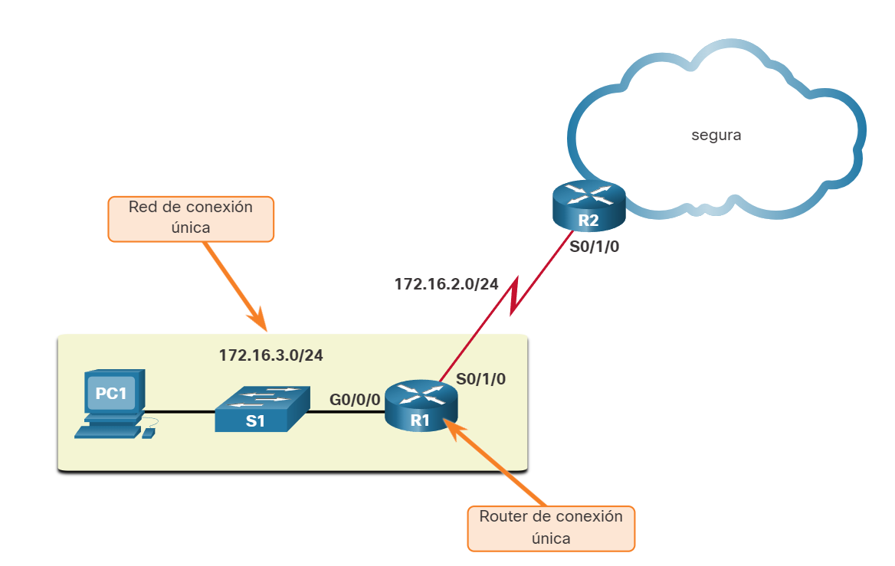
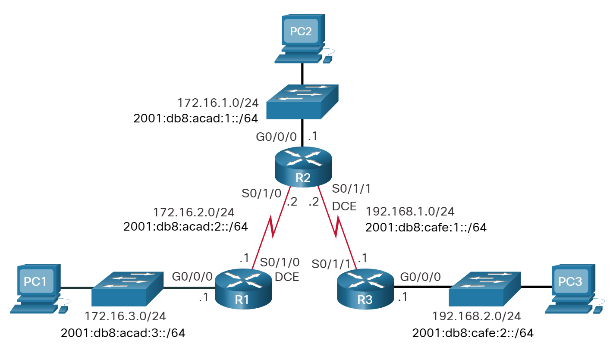
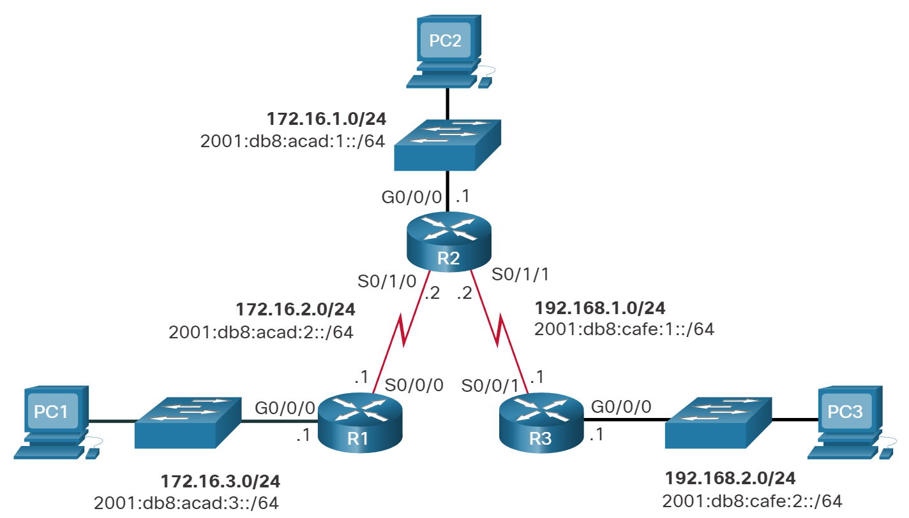
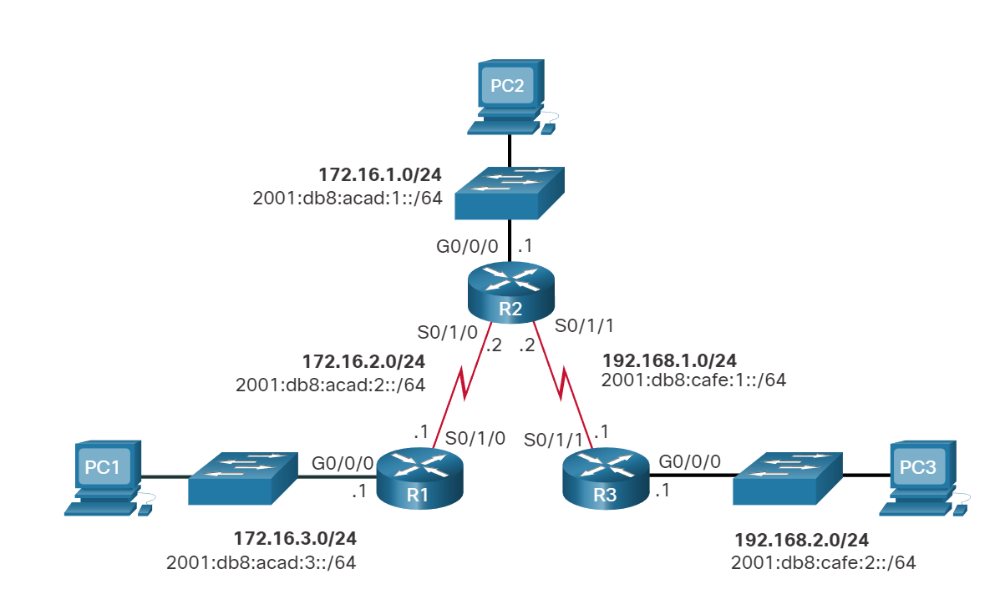

# Rutas IP estáticas

## Ruta estática por defecto
<br><br>
En este tema le enseña cómo configurar una ruta predeterminada para IPv4 e IPv6. También explica las situaciones en las que una ruta predeterminada es una buena opción. Una ruta predeterminada es una ruta estática que coincide con todos los paquetes. En lugar de almacenar rutas para todas las redes en Internet, los routers pueden almacenar una única ruta predeterminada que represente cualquier red que no esté en la tabla de routing.
<br><br>
Los routers suelen utilizar rutas predeterminadas configuradas de forma local, o bien, descubiertas por otro router, mediante un protocolo de routing dinámico. Una ruta predeterminada no requiere de ningún bit para que coincida entre la ruta predeterminada y la dirección IP destino. Una ruta predeterminada se utiliza cuando ninguna otra ruta de la tabla de routing coincide con la dirección IP de destino del paquete. Es decir, si no existe una coincidencia más específica, entonces se utiliza la ruta predeterminada como el gateway de último recurso.
<br><br>
Las rutas estáticas predeterminadas se utilizan comúnmente al conectar un router perimetral a una red de proveedor de servicios, o un router stub (un router con solo un router vecino ascendente).
<br><br>
La figura muestra un escenario de ruta estática predeterminado típico.
<br><br>


### Ruta estática predeterminada IPv4

La sintaxis del comando para una ruta estática predeterminada IPv4 es similar a cualquier otra ruta estática, con la excepción de que la dirección de red es 0.0.0.0 y la máscara de subred es 0.0.0.0. 0.0.0.0 0.0.0.0 en la ruta coincidirá con cualquier dirección de red.
<br><br>
**Nota:** Una ruta estática predeterminada IPv4 suele llamarse “ruta de cuádruple cero”.
<br><br>
La sintaxis del comando básico de una ruta estática predeterminada IPv4 es la siguiente:
<br><br>
`Router(config)# ip route 0.0.0.0 0.0.0.0 {ip-address | exit-intf}`

### Ruta estática predeterminada IPv6

La sintaxis del comando para una ruta estática predeterminada IPv4 es similar a la sintaxis del comando de cualquier otra ruta estática, excepto que ipv6-prefix/prefix-length es ::/0, que coincide con todas las rutas.
<br><br>
La sintaxis del comando básico de una ruta estática predeterminada IPv6 es la siguiente:
`Router(config)# ipv6 route ::/0 {ipv6-address | exit-intf}` 
<br><br>

## Configuración de una ruta estática predeterminada
<br><br>
En la figura, R1 puede configurarse con tres rutas estáticas para alcanzar todas las redes remotas en la topología de ejemplo. Sin embargo, el R1 es un router de rutas internas, ya que está conectado únicamente al R2. Por lo tanto, sería más eficaz configurar una sola ruta estática predeterminada.
<br><br>

<br><br>
El ejemplo muestra una ruta estática predeterminada IPv4 configurada en R1. Con la configuración del ejemplo, cualquier paquete que no coincida con entradas más específicas de la ruta se reenvía a 172.16.2.2.
<br><br>
`R1(config)# ip route 0.0.0.0 0.0.0.0 172.16.2.2`

<br><br>
Una ruta estática predeterminada IPv6 se configura de manera similar. Con esta configuración, cualquier paquete que no coincida con entradas más específicas de la ruta IPv6 se reenvía a R2 al 2001:db8:acad:2::2
<br><br>
`R1(config)# ipv6 route ::/0 2001:db8:acad:2::2`
<br><br>
## Verificar una ruta estática predeterminada
<br><br>


### Verificar Ruta estática predeterminada IPv4

La salida del comando show ip route static de R1 muestra el contenido de las rutas estáticas en la tabla de routing. Vea el asterisco (*) Al lado de la ruta con el código "S". Como se muestra en la tabla de códigos en la salida del comando show ip route , el asterisco indica que la ruta estática es una ruta predeterminada candidata, razón por la cual se selecciona como gateway de último recurso.


```bash
R1# show ip route static
Codes: L - local, C - connected, S - static, R - RIP, M - mobile, B - BGP 
D - EIGRP, EX - EIGRP external, O - OSPF, IA - OSPF inter area 
N1 - OSPF NSSA external type 1, N2 - OSPF NSSA external type 2 
E1 - OSPF external type 1, E2 - OSPF external type 2 
i - IS-IS, su - IS-IS summary, L1 - IS-IS level-1, L2 - IS-IS level-2 
ia - IS-IS inter area, * - candidate default, U - per-user static route 
o - ODR, P - periodic downloaded static route, H - NHRP, l - LISP 
+ - replicated route, % - next hop override 

Gateway of last resort is 172.16.2.2 to network 0.0.0.0

S* 0.0.0.0/0 [1/0] via 172.16.2.2 

R1#
```


### Verificar Ruta estática predeterminada IPv6

Este ejemplo muestra el show ipv6 route static resultado del comando para mostrar el contenido de la tabla de routing.

```bash
R1# show ipv6 route static
IPv6 Routing Table - default - 8 entries
Codes: C - Connected, L - Local, S - Static, U - Per-user Static route
       B - BGP, R - RIP, H - NHRP, I1 - ISIS L1
       I2 - ISIS L2, IA - ISIS interarea, IS - ISIS summary, D - EIGRP
       EX - EIGRP external, ND - ND Default, NDp - ND Prefix, DCE - Destination
       NDr - Redirect, RL - RPL, O - OSPF Intra, OI - OSPF Inter
       OE1 - OSPF ext 1, OE2 - OSPF ext 2, ON1 - OSPF NSSA ext 1
       ON2 - OSPF NSSA ext 2, la - LISP alt, lr - LISP site-registrations
       ld - LISP dyn-eid, lA - LISP away, le - LISP extranet-policy
       a - Application
S   ::/0 [1/0]
     via 2001:DB8:ACAD:2::2
R1#
```

Observe que la configuración de ruta estática predeterminada utiliza la máscara /0 para las rutas predeterminadas IPv4 y el prefijo: :/0 para las rutas predeterminadas IPv6. Recuerde que la longitud de la máscara subnet IPv4 y el prefijo de IPv6 en una tabla de routing determina cuántos bits deben coincidir entre la dirección IP de destino del paquete y la ruta en la tabla de routing. Un prefijo /0 mask or ::/0 indica que no se requiere que ninguno de los bits coincida. Mientras no exista una coincidencia más específica, la ruta estática predeterminada coincide con todos los paquetes.


### Verificador de sintaxis- Configurar rutas estáticas

Configure y verifique rutas estáticas predeterminadas en función de los requisitos especificados.
<br><br>
