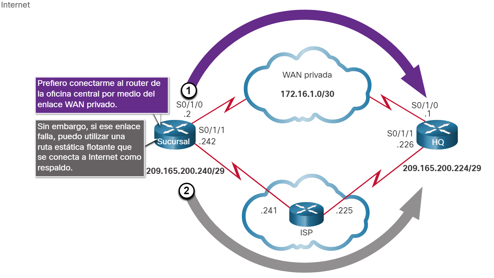
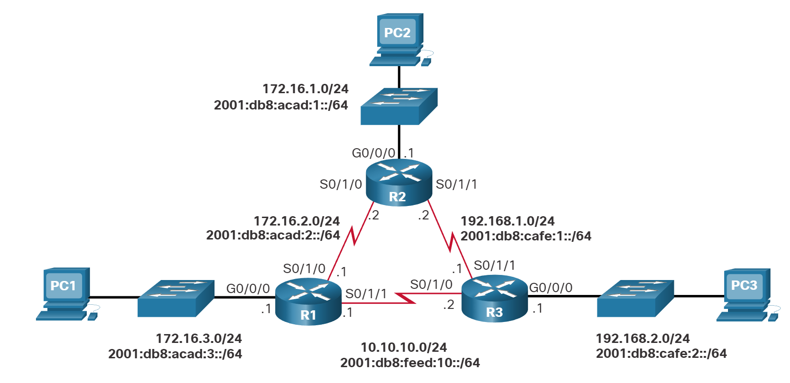
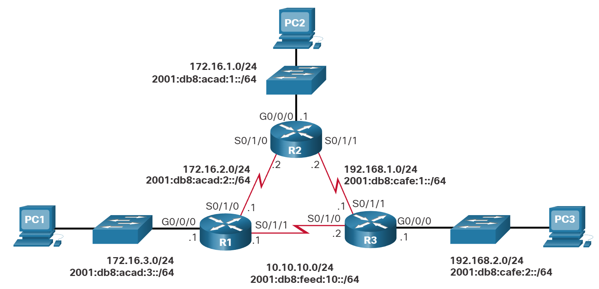

# Rutas IP estáticas

## Rutas estáticas flotantes
<br><br>
Aqui aprenderá a configurar rutas estáticas flotantes IPv4 e IPv6 y cuándo utilizarlas.
<br><br>
Otro tipo de ruta estática es una ruta estática flotante. Las rutas estáticas flotantes son rutas estáticas que se utilizan para proporcionar una ruta de respaldo a una ruta estática o dinámica principal, en el caso de una falla del enlace. La ruta estática flotante se utiliza únicamente cuando la ruta principal no está disponible.
<br><br>
Para lograrlo, la ruta estática flotante se configura con una distancia administrativa mayor que la ruta principal. La distancia administrativa representa la confiabilidad de una ruta. Si existen varias rutas al destino, el router elegirá la que tenga una menor distancia administrativa.
<br><br>
Por ejemplo, suponga que un administrador desea crear una ruta estática flotante como respaldo de una ruta descubierta por EIGRP. La ruta estática flotante se debe configurar con una distancia administrativa mayor que el EIGRP. El EIGRP tiene una distancia administrativa de 90. Si la ruta estática flotante se configura con una distancia administrativa de 95, se prefiere la ruta dinámica descubierta por el EIGRP a la ruta estática flotante. Si se pierde la ruta descubierta por el EIGRP, en su lugar se utiliza la ruta estática flotante.
<br><br>
En la imagen, el router de la sucursal generalmente reenvía todo el tráfico al router de la oficina central (HQ) mediante el enlace WAN privado. En este ejemplo, los routers intercambian información de la ruta utilizando el EIGRP. Una ruta estática flotante, con una distancia administrativa de 91 o superior, se puede configurar para que funcione como ruta de respaldo. Si el enlace WAN privado falla y la ruta EIGRP desaparece de la tabla de routing, el router selecciona la ruta estática flotante como la mejor ruta para alcanzar la LAN de la oficina central.
<br><br>

<br><br>
1. Se prefiere una ruta aprendida a través del enrutamiento dinámico
2. Si una ruta dinámica se pierde, la ruta estática flotante se utilizará

 <br><br>
De manera predeterminada, las rutas estáticas tienen una distancia administrativa de 1, lo que las hace preferibles a las rutas descubiertas mediante protocolos de routing dinámico. Por ejemplo, las distancias administrativas de algunos protocolos de routing dinámico comunes son las siguientes:
<br><br>
* EIGRP = 90
* OSPF = 110
* IS-IS = 115
<br><br>
La distancia administrativa de una ruta estática se puede aumentar para hacer que la ruta sea menos deseable que la ruta de otra ruta estática o una ruta descubierta mediante un protocolo de routing dinámico. De esta manera, la ruta estática “flota” y no se utiliza cuando está activa la ruta con la mejor distancia administrativa. Sin embargo, si se pierde la ruta de preferencia, la ruta estática flotante puede tomar el control, y se puede enviar el tráfico a través de esta ruta alternativa.

## Configure las Rutas Estáticas Flotantes IPv4 y IPv6
<br><br>
Las rutas estáticas flotantes IP se configuran mediante el distance argumento para especificar una distancia administrativa. Si no se configura ninguna distancia administrativa, se utiliza el valor predeterminado (1).
<br><br>
Consulte la topología en la figura y los comandos ip route y ipv6 route emitidos en R1. En esta situación, la ruta predeterminada preferida desde R1 es a R2. La conexión al R3 se debe utilizar solo para respaldo.

```bash
R1(config)# ip route 0.0.0.0 0.0.0.0 172.16.2.2
R1(config)# ip route 0.0.0.0 0.0.0.0 10.10.10.2 5
R1(config)# ipv6 route ::/0 2001:db8:acad:2::2
R1(config)# ipv6 route ::/0 2001:db8:feed:10::2 5
```

El R1 se configura con las rutas estáticas predeterminadas IPv4 e IPv6 apuntando al R2. Debido a que no está configurada ninguna distancia administrativa, se utiliza el valor predeterminado (1) para esta ruta estática. El R1 también se configura con las rutas estáticas flotantes predeterminadas IPv6 que apuntan al R3 con una distancia administrativa de 5. Este valor es mayor que el valor predeterminado de 1 y, por lo tanto, esta ruta flota y no está presente en la tabla de routing, a menos que falle la ruta preferida.
<br><br>
show ip route y show ipv6 route verifican que la ruta predeterminada al R2 esté instalada en la tabla de routing. Observe que la ruta estática flotante de IPv4 a R3 no está presente en la tabla de routing.

```bash
R1# show ip route static | begin Gateway
Gateway of last resort is 172.16.2.2 to network 0.0.0.0
S*   0.0.0.0/0 [1/0] via 172.16.2.2
R1# show ipv6 route static | begin S : 
S   ::/0 [1/0]
     via 2001:DB8:ACAD:2::2
R1#
```

Utilice el comando show run para comprobar que las rutas estáticas flotantes están en la configuración. Por ejemplo, el siguiente comando verifica que ambas rutas estáticas predeterminadas IPv6 estén en la configuración en ejecución.

```bash
R1# show run | include ipv6 route
ipv6 route ::/0 2001:db8:feed:10::2 5
ipv6 route ::/0 2001:db8:acad:2::2
R1#
```

### Pruebe la ruta estática flotante

En la imagen, ¿qué ocurriría si el R2 falla?



Para simular esta falla, se desactivan ambas interfaces seriales del R2, como se muestra en la configuración.


```bash
R2(config)# interface s0/1/0
R2(config-if)# shut
*Sep 18 23:36:27.000: %LINK-5-CHANGED: Interface Serial0/1/0, changed state to administratively down
*Sep 18 23:36:28.000: %LINEPROTO-5-UPDOWN: Line protocol on Interface Serial0/1/0, changed state to down
R2(config-if)# interface s0/1/1
R2(config-if)# shut
*Sep 18 23:36:41.598: %LINK-5-CHANGED: Interface Serial0/1/1, changed state to administratively down
*Sep 18 23:36:42.598: %LINEPROTO-5-UPDOWN: Line protocol on Interface Serial0/1/1, changed state to down
```

Observe que R1 genera mensajes automáticamente indicando que la interfaz serial a R2 está caída.

```bash
R1#
*Sep 18 23:35:48.810: %LINK-3-UPDOWN: Interface Serial0/1/0, changed state to down
R1#
*Sep 18 23:35:49.811: %LINEPROTO-5-UPDOWN: Line protocol on Interface Serial0/1/0, changed state to down
R1#
Una mirada a las tablas de enrutamiento IP de R1 verifica que las rutas estáticas flotantes predeterminadas están ahora instaladas como rutas predeterminadas y apuntan a R3 como enrutador de salto siguiente.

R1# show ip route static | begin Gateway
Gateway of last resort is 10.10.10.2 to network 0.0.0.0
S*    0.0.0.0/0 [5/0] via 10.10.10.2
R1# show ipv6 route static | begin :: 
S   ::/0 [5/0] 
     via 2001:DB8:FEED:10::2
R1#
```

### Verificador de sintaxis - Configurar rutas estáticas flotantes
Configure y verifique rutas estáticas flotantes en función de los requisitos especificados.
<br><br>
