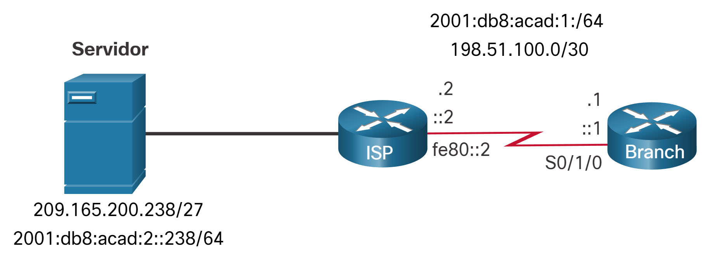
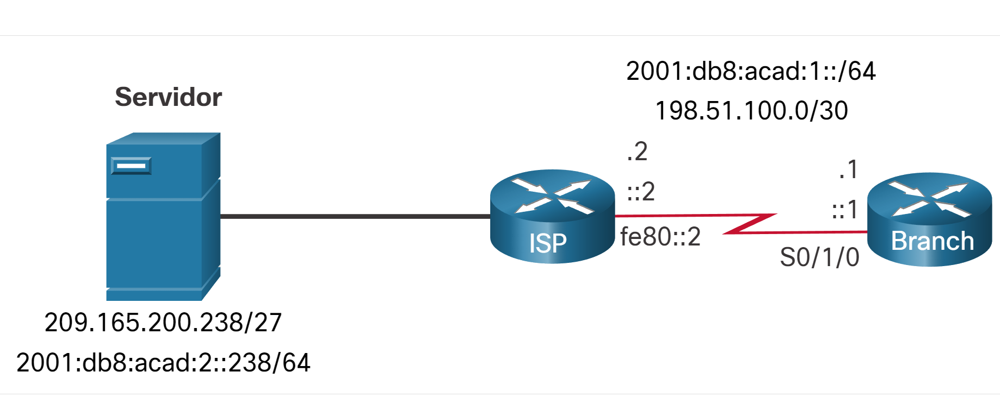

# Configuración de rutas de host estáticas

## Rutas del host
<br><br>
En este tema se muestra cómo configurar una ruta de host estática IPv4 e IPv6 y cuándo utilizarlas.
<br><br>
Una ruta de host es una dirección IPv4 con una máscara de 32 bits o una dirección IPv6 con una máscara de 128 bits. A continuación se muestra tres maneras de agregar una ruta de host a una tabla de routing:
<br><br>
Se instala automáticamente cuando se configura una dirección IP en el router (como se muestra en las figuras)
Configurarla como una ruta de host estático
Obtener la ruta de host automáticamente a través de otros métodos (se analiza en cursos posteriores)

## Rutas de host instaladas automáticamente
<br><br>
El IOS de Cisco instala automáticamente una ruta de host, también conocida como ruta de host local, cuando se configura una dirección de interfaz en el router. Una ruta host permite un proceso más eficiente para los paquetes que se dirigen al router mismo, en lugar del envío de paquetes. Esto es una suma a la ruta conectada, designada con una C en la tabla de routing para la dirección de red de la interfaz.
<br><br>
Cuando una interfaz activa en un router se configura con una dirección IP, se agrega automáticamente una ruta de host local a la tabla de routing. Las rutas locales se marcan con L en el resultado de la tabla de routing.
<br><br>
Consulte la topología de referencia en la ilustración.
<br><br>

<br><br>
Las direcciones IP asignadas a la interfaz Branch Serial0/1/0 son 198.51.100.1/30 y 2001:db8:acad:1::1/64. Las rutas locales para la interfaz son instaladas por el IOS en la tabla de routing del IPv4 e IPv6, como se muestra en el ejemplo.

```bash
Branch# show ip route | begin Gateway
Gateway of last resort is not set
      198.51.100.0/24 is variably subnetted, 2 subnets, 2 masks
C        198.51.100.0/30 is directly connected, Serial0/1/0
L        198.51.100.1/32 is directly connected, Serial0/1/0
Branch# show ipv6 route | begin :: 
C   2001:DB8:ACAD:1::/64 [0/0]
     via Serial0/1/0, directly connected
L   2001:DB8:ACAD:1::1/128 [0/0]
     via Serial0/1/0, receive
L   FF00::/8 [0/0]
     via Null0, recei
```

### Ruta estática de host

Una ruta de host puede ser una ruta estática configurada manualmente para dirigir el tráfico a un dispositivo de destino específico, como un servidor de autenticación. La ruta estática utiliza una dirección IP de destino y una máscara 255.255.255.255 (/32) para las rutas de host IPv4 y una longitud de prefijo /128 para las rutas de host IPv6.
<br><br>
El gráfico muestra una topología de dos routers. A la izquierda está el router ISP conectado por un cable serie al enrutador Branch de la derecha. El ISP tiene una conexión a un dispositivo llamado Servidor en el lado izquierdo. El servidor tiene una dirección IPv4 de 209.165.200.238/27 y una dirección IPv6 de 2001:db8:acad:2: :238/64. El enlace serie entre los dos routers tiene una dirección IPv6 de 2001:db8:acad:1: :/64 y una dirección IPv4 de 198.51.100.0/30. El router ISP tiene las direcciones IP de .2,: :2 y fe80: :2 asignadas a su interfaz. El router Branch tiene asignadas las direcciones IP de .1,: :1 y fe80: :1.
<br><br>


### Configuración de rutas de host estáticas
El ejemplo muestra la configuración de la ruta de host estática IPv4 e IPv6 en el router Branch para acceder al servidor.

```bash
Branch(config)# ip route 209.165.200.238 255.255.255.255 198.51.100.2
Branch(config)# ipv6 route 2001:db8:acad:2::238/128 2001:db8:acad:1::2
Branch(config)# exit
Branch#

```
### Verificar rutas de host estáticas
Una revisión de las tablas de rutas IPv4 e IPv6 verifica que las rutas estén activas.

```bash
Branch# show ip route | begin Gateway
Gateway of last resort is not set
      198.51.100.0/24 is variably subnetted, 2 subnets, 2 masks
C        198.51.100.0/30 is directly connected, Serial0/1/0
L        198.51.100.1/32 is directly connected, Serial0/1/0
      209.165.200.0/32 is subnetted, 1 subnets
S        209.165.200.238 [1/0] via 198.51.100.2
Branch# show ipv6 route
(Output omitted)
C   2001:DB8:ACAD:1::/64 [0/0]
     via Serial0/1/0, directly connected
L   2001:DB8:ACAD:1::1/128 [0/0]
     via Serial0/1/0, receive
S   2001:DB8:ACAD:2::238/128 [1/0]
     via 2001:DB8:ACAD:1::2
Branch#
```

### Configurar rutas de host estáticas IPV6 con Link-Local de siguiente salto
Para rutas estáticas IPv6, la dirección del siguiente salto puede ser la dirección link-local del router adyacente. Sin embargo, debe especificar un tipo de interfaz y un número de interfaz cuando usa una dirección link-local como siguiente salto, como se muestra en el ejemplo. En primer lugar, se elimina la ruta de host estática IPv6 original y, a continuación, se configura una ruta completamente especificada con la dirección IPv6 del servidor y la dirección local del vínculo IPv6 del router ISP.
```bash
Branch(config)# no ipv6 route 2001:db8:acad:2::238/128 2001:db8:acad:1::2
Branch(config)# ipv6 route 2001:db8:acad:2::238/128 serial 0/1/0 fe80::2
Branch# show ipv6 route | begin ::
C   2001:DB8:ACAD:1::/64 [0/0]
     via Serial0/1/0, directly connected
L   2001:DB8:ACAD:1::1/128 [0/0]
     via Serial0/1/0, receive
S   2001:DB8:ACAD:2::238/128 [1/0]
     via FE80::2, Serial0/1/0
Branch#
```