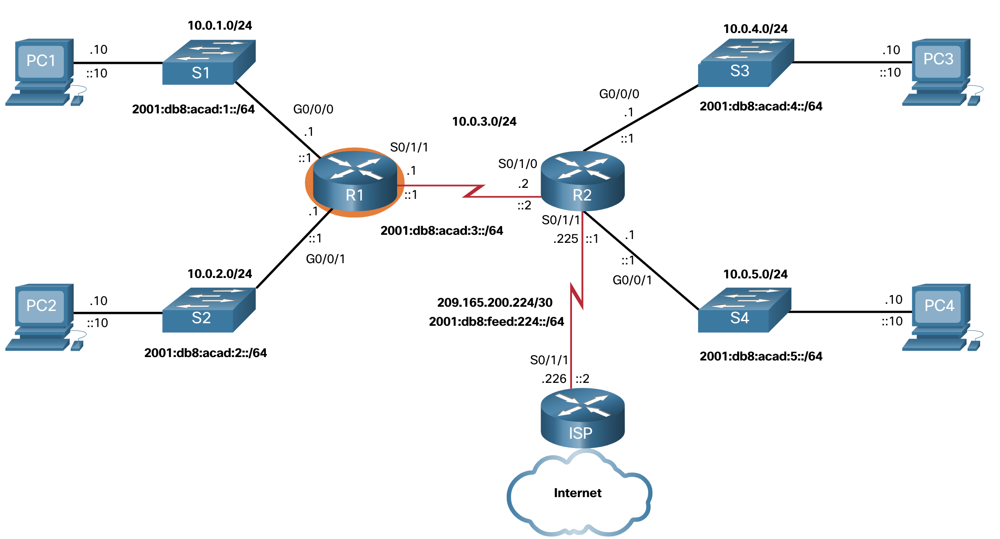
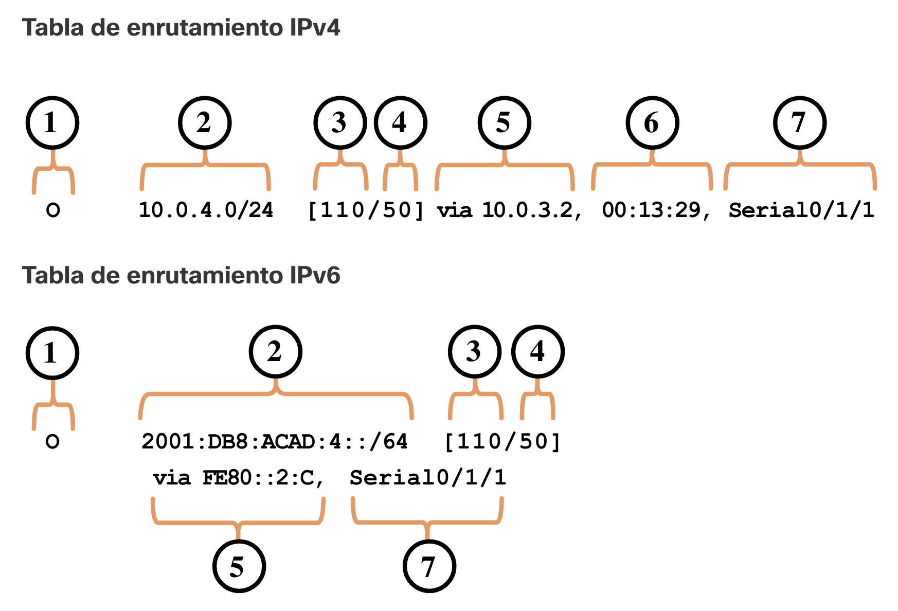
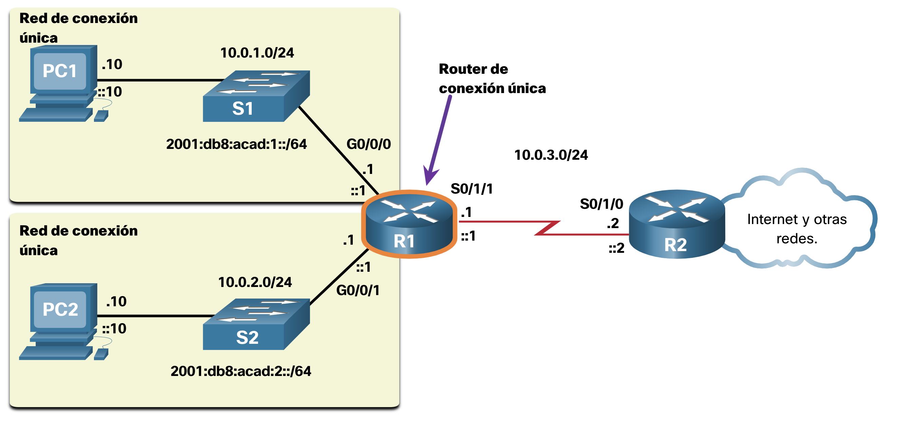
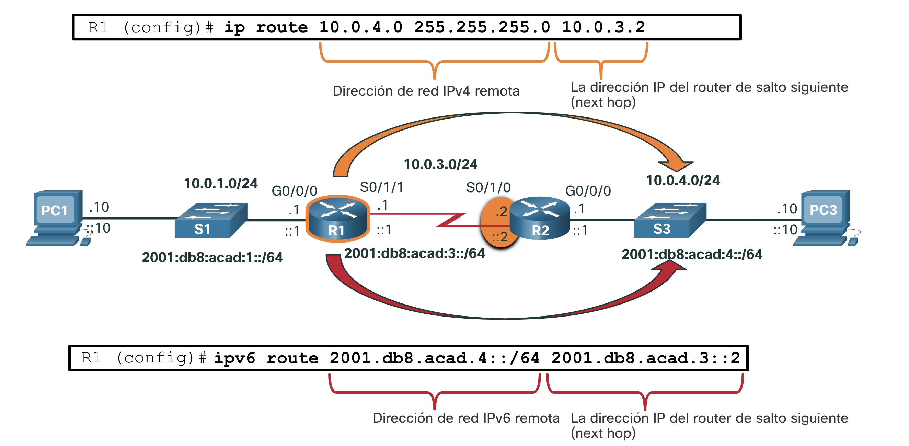
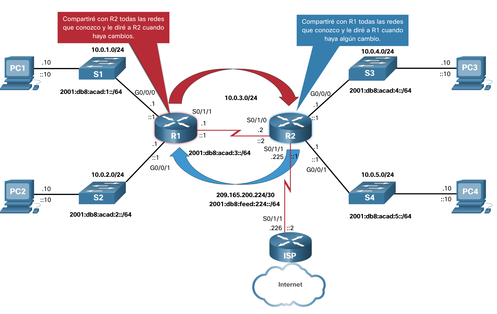
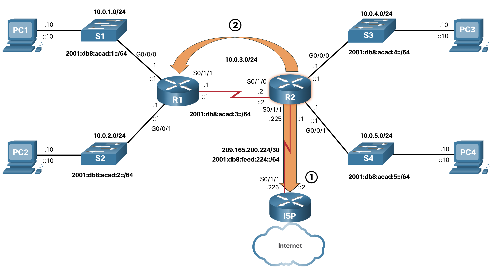

# Tabla de routing IP

## Origen de la ruta
¿Cómo sabe un router dónde puede enviar paquetes? Crea una tabla de enrutamiento basada en la red en la que se encuentra.

Una tabla de enrutamiento contiene una lista de rutas a redes conocidas (prefijos y longitudes de prefijo). La fuente de esta información se deriva de lo siguiente:

1. Redes conectadas directamente
2. Rutas estáticas
3. Protocolos de enrutamiento dinámico

En la figura, R1 y R2 están utilizando el protocolo de enrutamiento dinámico OSPF para compartir información de enrutamiento. Además, R2 se configura con una ruta estática predeterminada al ISP.



### 1. Tabla del Routing del R1

```bash
R1# show ip route
Codes: L - local, C - connected, S - static, R - RIP, M - mobile, B - BGP
       D - EIGRP, EX - EIGRP external, O - OSPF, IA - OSPF inter area
       N1 - OSPF NSSA external type 1, N2 - OSPF NSSA external type 2
       E1 - OSPF external type 1, E2 - OSPF external type 2
       i - IS-IS, su - IS-IS summary, L1 - IS-IS level-1, L2 - IS-IS level-2
       ia - IS-IS inter area, * - candidate default, U - per-user static route
       o - ODR, P - periodic downloaded static route, H - NHRP, l - LISP
       a - application route
       + - replicated route, % - next hop override, p - overrides from PfR
Gateway of last resort is 10.0.3.2 to network 0.0.0.0
O*E2 0.0.0.0/0 [110/1] via 10.0.3.2, 00:51:34, Serial0/1/1
      10.0.0.0/8 is variably subnetted, 8 subnets, 2 masks
C 10.0.1.0/24 está conectado directamente, GigabiteThernet0/0/0
L 10.0.1.1/32 está conectado directamente, GigabiteThernet0/0/0
C 10.0.2.0/24 está conectado directamente, GigabiteThernet0/0/1
L 10.0.2.1/32 está conectado directamente, GigabiteThernet0/0/1
C 10.0.3.0/24 está conectado directamente, Serial0/1/1
L 10.0.3.1/32 está conectado directamente, Serial0/1/1
O 10.0.4.0/24 [110/50] a 10.0.3.2, 00:24:22, Serial0/1/1
O 10.0.5.0/24 [110/50] a 10.0.3.2, 00:24:15, Serial0/1/1
R1#
```

### 2. Tabla del Routing del R1

```bash
R2# show ip route
Codes: L - local, C - connected, S - static, R - RIP, M - mobile, B - BGP
       D - EIGRP, EX - EIGRP external, O - OSPF, IA - OSPF inter area
       N1 - OSPF NSSA external type 1, N2 - OSPF NSSA external type 2
       E1 - OSPF external type 1, E2 - OSPF external type 2
       i - IS-IS, su - IS-IS summary, L1 - IS-IS level-1, L2 - IS-IS level-2
       ia - IS-IS inter area, * - candidate default, U - per-user static route
       o - ODR, P - periodic downloaded static route, H - NHRP, l - LISP
       a - application route
       + - replicated route, % - next hop override, p - overrides from PfR
Gateway of last resort is 209.165.200.226 to network 0.0.0.0
S* 0.0.0.0/0 [1/0] a través de 209.165.200.226
     10.0.0.0/8 is variably subnetted, 8 subnets, 2 masks
O 10.0.1.0/24 [110/65] a 10.0.3.1, 00:31:38, Serial0/1/0
O 10.0.2.0/24 [110/65] a 10.0.3.1, 00:31:38, Serial0/1/0
C 10.0.3.0/24 está conectado directamente, Serial0/1/0
L 10.0.3.2/32 está conectado directamente, Serial0/1/0
C 10.0.4.0/24 está conectado directamente, GigabiteThernet0/0/0
L 10.0.4.1/32 está conectado directamente, GigabiteThernet0/0/0
C 10.0.5.0/24 está conectado directamente, GigabiteThernet0/0/1
L 10.0.5.1/32 está conectado directamente, GigabiteThernet0/0/1
     209.165.200.0/24 is variably subnetted, 2 subnets, 2 masks
C 209.165.200.224/30está directamente conectado, Serial0/1/1
L 209.165.200.225/32 está conectado directamente, Serie0 / 1/1
R2#
```

En las tablas de enrutamiento para R1 y R2, observe que los orígenes de cada ruta se identifican mediante un código. El código identifica la forma en que se descubrió la ruta. Por ejemplo, los códigos frecuentes incluyen lo siguiente:

- `L` - Identifica la dirección asignada a la interfaz de un router. Esto permite que el router determine de forma eficaz si recibe un paquete para la interfaz o para reenviar.
- `C` - Identifica una red conectada directamente.
- `S` - Identifica una ruta estática creada para llegar a una red específica.
- `O` - Identifica una red que se descubre de forma dinámica de otro router con el protocolo de routing OSPF.
- `*` - la ruta es candidata para una ruta predeterminada.

## Principios de la tabla de enrutamiento
Existen tres principios de tabla de enrutamiento como se describe en la tabla. Estos son problemas que se abordan mediante la configuración adecuada de protocolos de enrutamiento dinámico o rutas estáticas en todos los enrutadores entre los dispositivos de origen y destino.

|Principios de la tabla de enrutamiento	|Ejemplo|
|--|--|
|Cada router toma su decisión por sí solo, basándose en la información que tiene en su propia tabla de enrutamiento.	| R1 sólo puede reenviar paquetes utilizando su propia tabla de enrutamiento. <br> R1 no sabe qué rutas están en las tablas de enrutamiento de otros (por ejemplo, R2).|
|La información de una tabla de enrutamiento de un enrutador no necesariamente coincide con la tabla de enrutamiento de otro enrutador.	|Solo porque R1 tiene ruta en su tabla de enrutamiento a una red en el internet a través de R2, eso no significa que R2 sepa sobre eso mismo red.|
|La información de enrutamiento sobre una ruta no proporciona enrutamiento de retorno al secundario.|R1 recibe un paquete con la dirección IP de destino de PC1 y la la dirección IP de origen de PC3. Solo porque R1 sabe reenviar el paquete fuera de su interfaz G0/0/0, no significa necesariamente que sepa cómo reenviar paquetes procedentes de PC1 a la red remota de PC3.|

### Entradas de la tabla de routing
Como administrador de redes, es imprescindible saber cómo interpretar el contenido de las tablas de routing IPv4 e IPv6. En la ilustración, se muestra una entrada de la tabla de routing IPv4 en el R1 para la ruta a la red remota 10.0.4.0/24 y 2001:db8:acad:4::/64. Ambas rutas ruta se descubrieron de forma dinámica de otro router a través del protocolo de routing OSPF.



## Redes conectadas directamente
<br><br>
Para que un router pueda aprender acerca de las redes remotas, debe tener al menos una interfaz activa configurada con una dirección IP y una máscara de subred (longitud de prefijo). Esto se conoce como una red conectada directamente o una ruta conectada directamente. Los routers agregan una ruta conectada directamente cuando una interfaz se configura con una dirección IP y se activa.
<br><br>
Una red conectada directamente se indica mediante un código de estado de C en la tabla de enrutamiento. La ruta contiene un prefijo de red y una longitud de prefijo.
<br><br>
La tabla de enrutamiento también contiene una ruta local para cada una de sus redes conectadas directamente, indicada por el código de estado de L. Esta es la dirección IP que se asigna a la interfaz en esa red conectada directamente. Para las rutas locales IPv4, la longitud del prefijo es /32 y para las rutas locales IPv6 la longitud del prefijo es /128. Esto significa que la dirección IP de destino del paquete debe coincidir con todos los bits de la ruta local para que esta ruta sea una coincidencia. El propósito de la ruta local es permitir que el router determine de forma eficaz si recibe un paquete para la interfaz o para reenviar.
<br><br>
Las redes conectadas directamente y las rutas locales se muestran en el siguiente resultado.

```bash
R1# show ip route
Codes: L - local, C - connected, S - static, R - RIP, M - mobile, B - BGP
(Output omitted)     
C        10.0.1.0/24 is directly connected, GigabitEthernet0/0/0
L        10.0.1.1/32 is directly connected, GigabitEthernet0/0/0
R1# 
R1# show ipv6 route
IPv6 Routing Table - default - 10 entries
Codes: C - Connected, L - Local, S - Static, U - Per-user Static route
(Output omitted)      
       
C   2001:DB8:ACAD:1::/64 [0/0]
     via GigabitEthernet0/0/0, directly connected
L   2001:DB8:ACAD:1::1/128 [0/0]
     via GigabitEthernet0/0/0, receive
R1#
```

## Rutas estáticas
<br><br>
Después de configurar las interfaces conectadas directamente y de agregarlas a la tabla de routing, se puede implementar el routing estático o dinámico.
<br><br>
Las rutas estáticas se configuran de forma manual. Estas definen una ruta explícita entre dos dispositivos de red. A diferencia de los protocolos de routing dinámico, las rutas estáticas no se actualizan automáticamente y se deben reconfigurar de forma manual si se modifica la topología de la red. Los beneficios de utilizar rutas estáticas incluyen la mejora de la seguridad y la eficacia de los recursos. Las rutas estáticas consumen menos ancho de banda que los protocolos de routing dinámico, y no se usa ningún ciclo de CPU para calcular y comunicar las rutas. La principal desventaja de usar rutas estáticas es que no se vuelven a configurar de manera automática si se modifica la topología de la red.
<br><br>
El routing estático tiene tres usos principales:
<br><br>
- Facilita el mantenimiento de la tabla de routing en redes más pequeñas en las cuales no está previsto que crezcan significativamente.
Utiliza una única ruta predeterminada para representar una ruta hacia cualquier red que no tenga una coincidencia más específica con otra ruta en la tabla de routing. Las rutas predeterminadas se utilizan para enviar tráfico a cualquier destino que esté más allá del próximo router ascendente.
Enruta trafico de y hacia redes internas. Una red de rutas internas es aquella a la cual se accede a través un de una única ruta y cuyo router tiene solo un vecino.
<br><br>
La figura muestra un ejemplo de red superpuesta. En dicha ilustración, observe que cualquier red conectada al R1 solo tiene una manera de alcanzar otros destinos, ya sean redes conectadas al R2 o destinos más allá del R2. Esto significa que las redes 10.0.1.0/24 y 10.0.2.0/24 son redes stub y R1 es un router stub.


<br><br>
En este ejemplo, se puede configurar una ruta estática en R2 para llegar a las redes R1. Además, como el R1 tiene solo una forma de enviar tráfico no local, se puede configurar una ruta estática predeterminada en el R1 para señalar al R2 como el siguiente salto para todas las otras redes.

## Rutas estáticas en la tabla de enrutamiento IP
<br><br>
Para demostrar el enrutamiento estático, la topología de la figura se simplifica para mostrar sólo una LAN conectada a cada enrutador. La figura muestra las rutas estáticas IPv4 e IPv6 configuradas en R1 para alcanzar las redes 10.0.4.0/24 y 2001:db8:acad:4: :/64 en R2. Los comandos de configuración son sólo para demostración y se describen en otro módulo.


<br><br>
La salida muestra las entradas de enrutamiento estático IPv4 e IPv6 en R1 que pueden alcanzar las redes 10.0.4.0/24 y 2001:db8:acad:4: :/64 en R2. Observe que ambas entradas de enrutamiento utilizan el código de estado de S indicar que la ruta fue aprendida por una ruta estática. Ambas entradas también incluyen la dirección IP del router siguiente salto, a través de ip-address. El static parámetro al final del comando muestra sólo rutas estáticas.
<br><br>

```bash
R1# show ip route static
Codes: L - local, C - connected, S - static, R - RIP, M - mobile, B - BGP
(output omitted)
       
      10.0.0.0/8 is variably subnetted, 8 subnets, 2 masks
S        10.0.4.0/24 [1/0] via 10.0.3.2
R1# show ipv6 route static
IPv6 Routing Table - default - 8 entries
Codes: C - Connected, L - Local, S - Static, U - Per-user Static route
(output omitted)
       
S   2001:DB8:ACAD:4::/64 [1/0]
     via 2001:DB8:ACAD:3::2 
```

## Protocolos de routing dinámico
<br><br>
Los routers usan protocolos de enrutamiento dinámico para compartir información sobre el estado y la posibilidad de conexión de redes remotas. Los protocolos de routing dinámico realizan diversas actividades, como la detección de redes y el mantenimiento de las tablas de routing.
<br><br>
Las ventajas importantes de los protocolos de enrutamiento dinámico son la capacidad de seleccionar una mejor ruta y la capacidad de descubrir automáticamente una nueva mejor ruta cuando se produce un cambio en la topología.
<br><br>
El descubrimiento de redes es la capacidad de un protocolo de enrutamiento de compartir información sobre las redes que conoce con otros routers que también están usando el mismo protocolo de enrutamiento. En lugar de depender de las rutas estáticas configuradas manualmente hacia redes remotas en cada router, los protocolos de routing dinámico permiten que los routers descubran estas redes de forma automática a través de otros routers. Estas redes y la mejor ruta hacia cada una se agregan a la tabla de routing del router y se identifican como redes descubiertas por un protocolo de routing dinámico específico.
<br><br>
La figura muestra los routers R1 y R2 que utilizan un protocolo de enrutamiento común para compartir información de red.
<br><br>

<br><br>

### Rutas dinámicas en la tabla de enrutamiento IP
En un ejemplo anterior se usaban rutas estáticas a las redes 10.0.4.0/24 y 2001:db8:acad:4: :/64. Estas rutas estáticas ya no están configuradas y ahora OSPF se utiliza para aprender dinámicamente todas las redes conectadas a R1 y R2. Los siguientes ejemplos muestran las entradas de enrutamiento OSPF IPv4 e IPv6 en R1 que pueden llegar a estas redes en R2. Observe que ambas entradas de enrutamiento utilizan el código de estado de O para indicar que la ruta fue aprendida por el protocolo de enrutamiento OSPF. Ambas entradas también incluyen la dirección IP del router de salto siguiente, a través de ip-address.
<br><br>

**Nota:** Los protocolos de enrutamiento IPv6 utilizan la dirección de vínculo local del router de siguiente salto.
<br><br>

**Nota:** La configuración de enrutamiento OSPF para IPv4 e IPv6 está fuera del alcance de este curso

```bash
R1# show ip route
Codes: L - local, C - connected, S - static, R - RIP, M - mobile, B - BGP
       D - EIGRP, EX - EIGRP external, O - OSPF, IA - OSPF inter area 
(output omitted for brevity)
O        10.0.4.0/24 [110/50] via 10.0.3.2, 00:24:22, Serial0/1/1
O        10.0.5.0/24 [110/50] via 10.0.3.2, 00:24:15, Serial0/1/1
R1# show ipv6 route
IPv6 Routing Table - default - 10 entries
(Output omitted)
       NDr - Redirect, RL - RPL, O - OSPF Intra, OI - OSPF Inter
O   2001:DB8:ACAD:4::/64 [110/50]
     via FE80::2:C, Serial0/1/1
O   2001:DB8:ACAD:5::/64 [110/50]
     via FE80::2:C, Serial0/1/1
```

## Ruta predeterminada
<br><br>
Las rutas predeterminadas son similares a un gateway predeterminado en un host. La ruta predeterminada especifica un enrutador de salto siguiente que se utilizará cuando la tabla de enrutamiento no contiene una ruta específica que coincida con la dirección IP de destino.
<br><br>
Una ruta predeterminada puede ser una ruta estática o aprenderse automáticamente de un protocolo de enrutamiento dinámico. Una ruta predeterminada tiene una entrada de ruta IPv4 de 0.0.0.0/0 o una entrada de ruta IPv6 de: :/0. Esto significa que cero o ningún bit deben coincidir entre la dirección IP de destino y la ruta predeterminada.
<br><br>
La mayoría de los routers empresariales tienen una ruta predeterminada en su tabla de enrutamiento. Esto es para reducir el número de rutas en una tabla de enrutamiento.
<br><br>
Un router, como un router doméstico o de oficina pequeña que solo tiene una LAN, puede llegar a todas sus redes remotas a través de una ruta predeterminada. Esto es útil cuando el router solo tiene redes conectadas directamente y un punto de salida a un enrutador proveedor de servicios.
<br><br>
En la figura, los routers R1 y R2 utilizan OSPF para compartir información de enrutamiento sobre sus propias redes (10.0.x.x/24 y 2001:db8:acad:x: :/64 redes). R2 tiene una ruta estática predeterminada al router ISP. R2 reenviará al router ISP cualquier paquete con una dirección IP de destino que no coincida específicamente con una de las redes de su tabla de enrutamiento. Esto incluiría todos los paquetes destinados a Internet.
<br><br>



1. R2 tiene una ruta estatica predeterminada al enrutador ISP
2. R2 a R1 anuncia la ruta predeterminada mediante el protocolo de enrutamiento dinámico OSPF. Hay una flecha que muestra la ruta al ISP.
<br><br>
R2 ha compartido su ruta predeterminada con R1 usando OSPF. R1 ahora tendrá una ruta predeterminada en su tabla de enrutamiento que aprendió dinámicamente de OSPF. R1 también reenviará a R2 cualquier paquete con una dirección IP de destino que no coincida específicamente con una de las redes de su tabla de enrutamiento.
<br><br>
Los ejemplos siguientes muestran las entradas de la tabla de enrutamiento IPv4 e IPv6 para las rutas estáticas predeterminadas configuradas en R2.

```bash
R2# show ip route
(Output omitted)
S*    0.0.0.0/0 [1/0] via 209.165.200.226  
R2# 
R2# show ipv6 route
(Output omitted)
S   ::/0 [1/0]
     via 2001:DB8:FEED:224::2
R2#
```
## Estructura de una tabla de enrutamiento IPv4
<br><br>
IPv4 se estandarizó a principios de la década de 1980 utilizando la arquitectura de direccionamiento de clase ahora obsoleta. La tabla de enrutamiento IPv4 se organiza utilizando esta misma estructura de clase. En la show ip route salida, observe que algunas entradas de ruta se dejan justificadas mientras que otras están sangradas. Esto se basa en la forma en que el proceso de enrutamiento busca en la tabla de enrutamiento IPv4 la coincidencia más larga. Todo esto fue debido a un discurso de clase. Aunque el proceso de búsqueda ya no utiliza clases, la estructura de la tabla de enrutamiento IPv4 sigue conservándose en este formato.

<br><br>

```bash
Router# show ip route
(Output omitted)
     192.168.1.0/24 is variably subnetted, 2 subnets, 2 masks
C       192.168.1.0/24 is directly connected, GigabitEthernet0/0
L       192.168.1.1/32 is directly connected, GigabitEthernet0/0
O    192.168.2.0/24 [110/65] via 192.168.12.2, 00:32:33, Serial0/0/0
O    192.168.3.0/24 [110/65] via 192.168.13.2, 00:31:48, Serial0/0/1
     192.168.12.0/24 is variably subnetted, 2 subnets, 2 masks
C       192.168.12.0/30 is directly connected, Serial0/0/0
L       192.168.12.1/32 is directly connected, Serial0/0/0
     192.168.13.0/24 is variably subnetted, 2 subnets, 2 masks
C       192.168.13.0/30 is directly connected, Serial0/0/1
L       192.168.13.1/32 is directly connected, Serial0/0/1
     192.168.23.0/30 is subnetted, 1 subnets
O       192.168.23.0/30 [110/128] via 192.168.12.2, 00:31:38, Serial0/0/0
Router#
```
<br><br>
**Nota:** La tabla de enrutamiento IPv4 del ejemplo no procede de ningún router de la topología utilizada en este módulo.
<br><br>
Aunque los detalles de la estructura están fuera del alcance de este módulo, es útil reconocer la estructura de la tabla. Una entrada sangría se conoce como ruta secundaria. Una entrada de ruta se sangra si es la subred de una dirección con clase (red de clase A, B o C). Las redes conectadas directamente siempre tendrán sangría (rutas secundarias) porque la dirección local de la interfaz siempre se introduce en la tabla de enrutamiento como /32. La ruta secundaria incluirá el origen de la ruta y toda la información de reenvío, como la dirección de salto siguiente. La dirección de red con clase de esta subred se mostrará encima de la entrada de ruta, con menos sangría y sin código fuente. Esto se conoce como “ruta principal”.
<br><br>
**Nota:** Esto es solo una breve introducción a la estructura de una tabla de enrutamiento IPv4 y no cubre detalles ni detalles específicos de esta arquitectura.
<br><br>
El siguiente ejemplo muestra la tabla de enrutamiento IPv4 de R1 en la topología. Observe que todas las redes de la topología son subredes, que son rutas secundarias, de la red de clase A y de la ruta principal10.0.0.0/8.

```bash
R1# show ip route
(output omitted for brevity)
O*E2  0.0.0.0/0 [110/1] via 10.0.3.2, 00:51:34, Serial0/1/1
      10.0.0.0/8 is variably subnetted, 8 subnets, 2 masks
C        10.0.1.0/24 is directly connected, GigabitEthernet0/0/0
L        10.0.1.1/32 is directly connected, GigabitEthernet0/0/0
C        10.0.2.0/24 is directly connected, GigabitEthernet0/0/1
L        10.0.2.1/32 is directly connected, GigabitEthernet0/0/1
C        10.0.3.0/24 is directly connected, Serial0/1/1
L        10.0.3.1/32 is directly connected, Serial0/1/1
O        10.0.4.0/24 [110/50] via 10.0.3.2, 00:24:22, Serial0/1/1
O        10.0.5.0/24 [110/50] via 10.0.3.2, 00:24:15, Serial0/1/1
R1#
```
## Estructura de una tabla de enrutamiento IPv6
<br><br>
El concepto de direccionamiento con clase nunca formaba parte de IPv6, por lo que la estructura de una tabla de enrutamiento con IPv6 es muy simple. Cada entrada de ruta IPv6 está formateada y alineada de la misma manera.
<br><br>

```bash
R1# show ipv6 route
(output omitted for brevity)
OE2 ::/0 [110/1], tag 2
     via FE80::2:C, Serial0/0/1
C   2001:DB8:ACAD:1::/64 [0/0]
     via GigabitEthernet0/0/0, directly connected
L   2001:DB8:ACAD:1::1/128 [0/0]
     via GigabitEthernet0/0/0, receive
C   2001:DB8:ACAD:2::/64 [0/0]
     via GigabitEthernet0/0/1, directly connected
L   2001:DB8:ACAD:2::1/128 [0/0]
     via GigabitEthernet0/0/1, receive
C   2001:DB8:ACAD:3::/64 [0/0]
     via Serial0/1/1, directly connected
L   2001:DB8:ACAD:3::1/128 [0/0]
     via Serial0/1/1, receive
O   2001:DB8:ACAD:4::/64 [110/50]
     via FE80::2:C, Serial0/1/1
O   2001:DB8:ACAD:5::/64 [110/50]
     via FE80::2:C, Serial0/1/1
L   FF00::/8 [0/0]
     via Null0, receive
R1#
```

## Distancia administrativa
<br><br>
Una entrada de ruta para una dirección de red específica (longitud de prefijo y prefijo) sólo puede aparecer una vez en la tabla de enrutamiento. Sin embargo, es posible que la tabla de enrutamiento aprenda acerca de la misma dirección de red desde más de un origen de enrutamiento.
<br><br>
Excepto por circunstancias muy específicas, sólo se debe implementar un protocolo de enrutamiento dinámico en un router. Sin embargo, es posible configurar tanto OSPF como EIGRP en un router, y ambos protocolos de routing pueden descubrir la misma red de destino. Sin embargo, cada protocolo de routing puede decidir tomar una ruta diferente para llegar al destino según las métricas de ese protocolo de routing.
<br><br>
Esto plantea algunas preguntas, como las siguientes:
<br><br>

- ¿Cómo sabe el router qué fuente usar?
- ¿Qué ruta instalará el router en la tabla de routing? ¿La ruta aprendida de OSPF o la ruta aprendida de EIGRP?

<br><br>
El IOS de Cisco utiliza lo que se conoce como “distancia administrativa” (AD) para determinar la ruta que se debe instalar en la tabla de routing de IP. La AD representa la "confiabilidad" de la ruta. Cuanto menor es la AD, mayor es la confiabilidad de la ruta. Dado que EIGRP tiene un AD de 90 y OSPF tiene un AD de 110, la entrada de ruta EIGRP se instalaría en la tabla de enrutamiento.
<br><br>
**Nota:** AD no representa necesariamente qué protocolo de enrutamiento dinámico es el mejor .
<br><br>
Un ejemplo más común es un router que aprende la misma dirección de red de una ruta estática y un protocolo de enrutamiento dinámico, como OSPF. Por ejemplo, la AD de una ruta estática es 1, mientras que la AD de una ruta descubierta por OSPF es 110. El router elige la ruta con la AD más baja entre dos rutas diferentes al mismo destino. Cuando un router puede elegir entre una ruta estática y una ruta de OSPF, la ruta estática tiene prioridad.
<br><br>
**Nota:** Las redes conectadas directamente tienen el AD más bajo de 0. Sólo una red conectada directamente puede tener un AD de 0.
<br><br>
En la tabla, se muestran diferentes protocolos de routing y sus AD asociadas.

|Origen de la ruta	|Distancia administrativa|
|--|--|
|Conectado directamente	|0|
|Ruta estática	|1|
|Ruta resumida del protocolo EIGRP	|5|
|BGP externo	|20|
|EIGRP interno|	90|
|OSPF	|110|
|IS-IS|	115|
|RIP	|120|
|EIGRP externo|	170|
|BGP interno|	200|