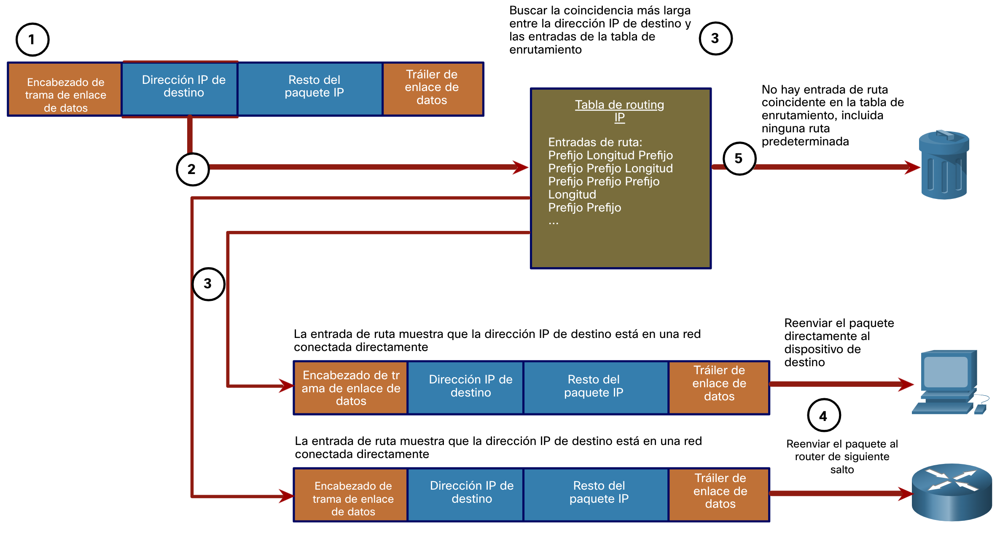
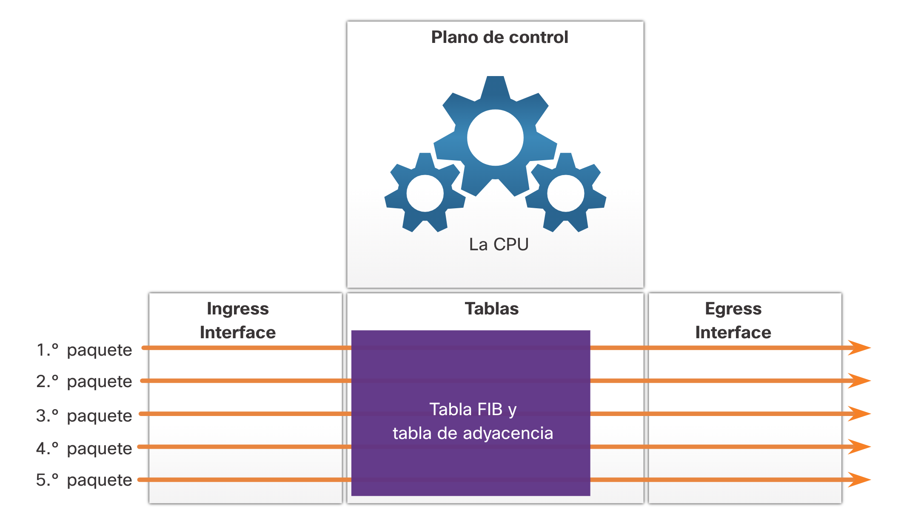

# Reenvío de paquetes

Proceso de decisión de reenvío de paquetes
Ahora que el router ha determinado la mejor ruta para un paquete en función de la coincidencia más larga, debe determinar cómo encapsular el paquete y reenviarlo hacia fuera la interfaz de salida correcta.

La figura muestra cómo un router determina primero la mejor ruta y, a continuación, reenvía el paquete. Hay 5 pasos representados con estos pasos:

1. La trama de enlace de datos con un paquete IP encapsulado llega a la interfaz de entrada.
2. El router examina la dirección IP de destino en el encabezado del paquete y consulta su tabla de enrutamiento IP.
3. El router encuentra el prefijo coincidente más largo en la tabla de enrutamiento.
4. El router encapsula el paquete en una nueva trama de enlace de datos y lo reenvía por la interfaz de salida. El destino podría ser un dispositivo conectado a la red o un router de siguiente salto.
5. Sin embargo, si no hay ninguna entrada de ruta coincidente, el paquete se elimina.

### 1. Reenvía el paquete a un dispositivo en una red conectada directamente
Si la entrada de ruta indica que la interfaz de salida es una red conectada directamente, esto significa que la dirección IP de destino del paquete pertenece a un dispositivo de la red conectada directamente. Por lo tanto, el paquete se puede reenviar directamente al dispositivo de destino. El dispositivo de destino suele ser un dispositivo final en una LAN Ethernet, lo que significa que el paquete debe estar encapsulado en una trama Ethernet.

Para encapsular el paquete en la trama Ethernet, el router necesita determinar la dirección MAC de destino asociada a la dirección IP de destino del paquete. El proceso varía según si el paquete es un paquete IPv4 o IPv6:

- **Paquete IPv4** - El router comprueba su tabla ARP para la dirección IPv4 de destino y una dirección MAC Ethernet asociada. Si no hay coincidencia, el router envía una solicitud ARP. El dispositivo de destino devolverá una respuesta ARP con su dirección MAC. El router ahora puede reenviar el paquete IPv4 en una trama Ethernet con la dirección MAC de destino adecuada.
- **PaqueteIPv6** - El router comprueba su caché vecino para la dirección IPv6 de destino y una dirección MAC Ethernet asociada. Si no hay coincidencia, el router envía un mensaje ICMPv6 Solicitud de vecino (ICMPv6 Neighbor Solicitation) (NS). El dispositivo de destino devolverá un mensaje ICMPv6 Neighbor Advertisement (NA) con su dirección MAC. El router ahora puede reenviar el paquete IPv6 en una trama Ethernet con la dirección MAC de destino adecuada.

### 2. Reenvía el paquete a un router de salto siguiente
Si la entrada de ruta indica que la dirección IP de destino está en una red remota, esto significa que la dirección IP de destino del paquete pertenece a un dispositivo de red que no está conectado directamente. Por lo tanto, el paquete debe ser reenviado a otro enrutador, específicamente a un router de siguiente salto. La dirección de salto siguiente se indica en la entrada de ruta.

Si el router de reenvío y el router de siguiente salto se encuentran en una red Ethernet, se producirá un proceso similar (ARP e ICMPv6 Neighbor Discovery) para determinar la dirección MAC de destino del paquete como se describió anteriormente. La diferencia es que el router buscará la dirección IP del router de salto siguiente en su tabla ARP o caché de vecino, en lugar de la dirección IP de destino del paquete.

**Nota:** Este proceso variará para otros tipos de redes de capa 2.

### 3. Descarta el paquete - No coincide en la tabla de enrutamiento
Si no hay ninguna coincidencia entre la dirección IP de destino y un prefijo en la tabla de enrutamiento, y si no hay una ruta predeterminada, se descartará el paquete.

### Reenvío de paquetes
Una responsabilidad principal de la función de switching es la de encapsular los paquetes en el tipo de marco de enlace de datos correcto para el enlace de datos de salida. Por ejemplo, el formato de marco de vínculo de datos para un vínculo serie podría ser el protocolo punto a punto (PPP), el protocolo de control de enlace de datos de alto nivel (HDLC) o algún otro protocolo de capa 2.

Mecanismos de reenvío de paquetes
Como se menciono anteriormente, la responsabilidad principal de la función de reenvío de paquetes es la de encapsular los paquetes en el tipo de marco de enlace de datos correcto para la interfaz de salida. Cuanto más eficientemente un router pueda realizar esta tarea, más rápido podrá reenviar paquetes por el router. Los routers admiten tres mecanismos de reenvío de paquetes:

- Switching de procesos
- Switching rápido
- Cisco Express Forwarding (CEF)

### 1. Conmutación de procesos (Process Switching)

Un mecanismo de reenvío de paquetes más antiguo que todavía está disponible para routers Cisco. Cuando un paquete llega a una interfaz, se reenvía al plano de control, donde la CPU hace coincidir la dirección de destino con una entrada de la tabla de routing y, a continuación, determina la interfaz de salida y reenvía el paquete. Es importante comprender que el router hace esto con cada paquete, incluso si el destino es el mismo para un flujo de paquetes. Este mecanismo de switching de procesos es muy lento y rara vez se implementa en las redes modernas. Compare esto con el switching rápido.

### 2. Conmutación rápida(Fast Switching)

La conmutación rápida es otro mecanismo de reenvío de paquetes más antiguo que fue el sucesor de la conmutación de procesos. Fast switching usa una memoria caché de switching rápido para almacenar la información de siguiente salto. Cuando un paquete llega a una interfaz, se reenvía al plano de control, donde la CPU busca una coincidencia en la caché de switching rápido. Si no encuentra ninguna, se aplica el switching de procesos al paquete, y este se reenvía a la interfaz de salida. La información de flujo del paquete también se almacena en la caché de switching rápido. Si otro paquete con el mismo destino llega a una interfaz, se vuelve a utilizar la información de siguiente salto de la caché sin intervención de la CPU.

Con el switching rápido, observe que el switching de procesos se aplica solo al primer paquete de un flujo, el cual se agrega a la caché de switching rápido. Los cuatro paquetes siguientes se procesan rápidamente según la información de la caché de switching rápido.

### 3. CEF

CEF es el mecanismo de reenvío de paquetes más reciente y predeterminado del IOS de Cisco. Al igual que el switching rápido, CEF arma una base de información de reenvío (FIB) y una tabla de adyacencia. Sin embargo, las entradas de la tabla no se activan por los paquetes como en el switching rápido, sino que se activan por los cambios, como cuando se modifica un elemento en la topología de la red. Por lo tanto, cuando se converge una red, la FIB y las tablas de adyacencia contienen toda la información que el router debe tener en cuenta al reenviar un paquete. Cisco Express Forwarding es el mecanismo de reenvío más rápido y la opción más utilizada en los routers Cisco y en los Multilayer Switches.

CEF crea la FIB y las tablas de adyacencia una vez que se converge la red. Los cinco paquetes se procesan rápidamente en el plano de datos.

