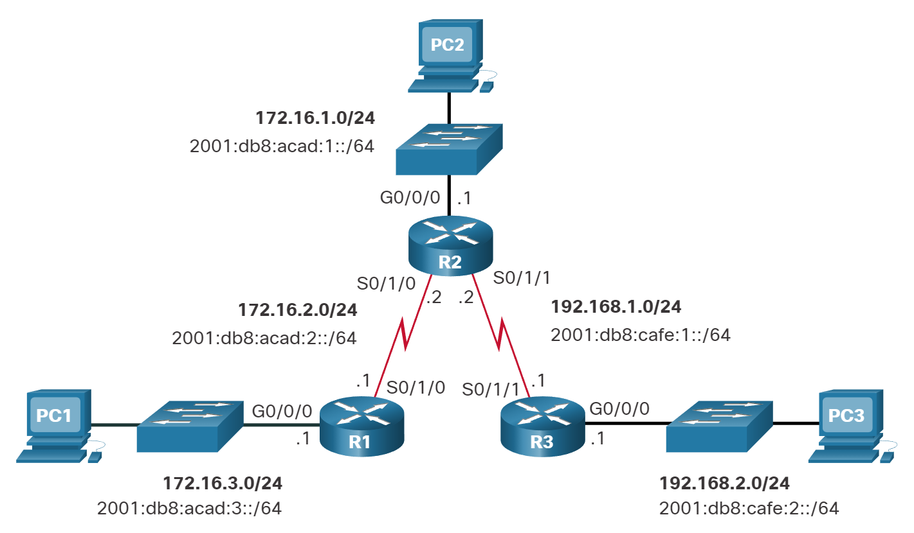

# Rutas IP estáticas

## Tipos de rutas estáticas
Las rutas estáticas se implementan comúnmente en una red. Esto es cierto incluso cuando hay un protocolo de enrutamiento dinámico configurado. Por ejemplo, una organización podría configurar una ruta estática predeterminada para el proveedor de servicios y anunciar esta ruta a otros routers corporativos mediante el protocolo de enrutamiento dinámico.

Las rutas estáticas se pueden configurar para IPv4 e IPv6. Ambos protocolos admiten los siguientes tipos de rutas estáticas:

* Ruta estática estándar
* Ruta estática predeterminada
* Ruta estática flotante
* Ruta estática resumida

Las rutas estáticas se configuran con el comando ip route y el de ipv6 route configuración global.

## Opciones de siguiente salto

El siguiente salto se puede identificar mediante una dirección IP, una interfaz de salida, o ambas cuando se está configurando una ruta estática. El modo en que se especifica el destino genera uno de los siguientes tres tipos de ruta:

Ruta del siguiente salto - Solo se especifica la dirección IP del siguiente salto
Ruta estática conectada directamente - Solo se especifica la interfaz de salida del router
Ruta estática totalmente especificada - Se especifican la dirección IP del siguiente salto y la interfaz de salida


### Comando de ruta estática IPv4
Las rutas estáticas IPv4 se configuran con el siguiente comando global:

```bash
Router(config)# ip route network-address subnet-mask { ip-address | exit-intf [ip-address]} [distance]
```

Nota: Se deben configurar los parámetros ip-address, exit-intf, o ip-address y exit-intf .

La tabla describe los ip route parámetros para el comando.

|Parámetro	|Descripción|
|--|--|
|`network-address` | Identifica la dirección de red IPv4 de destino de la red remota para agregar a la tabla de enrutamiento.|
|`subnet-mask `|Identifica la máscara de subred de la red remota.La máscara de subred puede modificarse para resumir un grupo de redes y crear una ruta estática resumida.|
|`ip-address` | Identifica la dirección IPv4 del router de siguiente salto. <br> Normalmente se utiliza con redes de difusión (es decir, Ethernet).<br> Podría crear una ruta estática recursiva donde el router realice una búsqueda adicional para encontrar la interfaz de salida.|
|`exit-intf` | Identifica la interfaz de salida para reenviar paquetes.Crea una ruta estática conectada directamente. <br>Suele utilizarse para conectarse en una configuración punto a punto.|
|`exit-intf ip-address` |Crea una ruta estática completamente especificada porque especifica la interfaz de salida y la dirección IPv4 de salto siguiente.|
|`distance`| Comando opcional que se puede utilizar para asignar un valor administrativo de distancia entre 1 y 255. <br>Suele utilizarse para configurar una ruta estática flotante al establecer una distancia administrativa mayor a la de una ruta dinámica predeterminada.|


### Comando de ruta estática IPv6
Las rutas estáticas IPv6 se configuran con el siguiente comando global:

```bash
Router(config)# ipv6 route ipv6-prefix/prefix-length {ipv6-address | exit-intf [ipv6-address]} [distance]
```

La mayoría de los parámetros son idénticos a la versión IPv4 del comando.

La tabla muestra los distintos parámetros del comando `ipv6 route` y sus descripciones.

|Parámetro	|Descripción|
|--|--|
|ipv6-prefix|Identifica la dirección de la red IPv6 de destino de la red remota para agregar a la tabla de enrutamiento.|
|/prefix-length|Identifica la longitud del prefijo de la red remota.|
|ipv6-address|
Identifica la dirección IPv6 del router de siguiente salto.<br>Normalmente se utiliza con redes de difusión (por ejemplo, Ethernet)<br>Podría crear una ruta estática recursiva donde el router realice una búsqueda adicional para encontrar la interfaz de salida.|
|exit-intf|Identifica la interfaz de salida para reenviar paquetes.<br>Crea una ruta estática conectada directamente.<br>Suele utilizarse para conectarse en una configuración punto a punto.|
|exit-intf ipv6-address|Crea una ruta estática completamente especificada porque especifica la salida y dirección IPv6 de salto siguiente.|
|distance|Comando opcional que se puede utilizar para asignar un valor administrativo de distancia entre 1 y 255.<br>Suele utilizarse para configurar una ruta estática flotante al establecer una distancia administrativa mayor que una ruta dinámica predeterminada.|


**Nota**: El ipv6 unicast-routing comando de configuración global debe configurarse para que habilite al router para que reenvíe paquetes IPv6.

## Topología Dual-Stack
En la figura, se ve una topología de red dual-stack. Actualmente, no hay rutas estáticas configuradas para IPv4 o IPv6.




### Iniciando tablas de enrutamiento IPv4

<div class="tab">
    <button class="tablinks" onclick="openTab(event, 'Tab1')">Tabla de routing<br/> IPv4 del R1</button>
    <button class="tablinks" onclick="openTab(event, 'Tab2')">Tabla de routing <br/>IPv4 del R2</button>
    <button class="tablinks" onclick="openTab(event, 'Tab3')">Tabla de routing <br/>IPv4 del R3</button>
    <button class="tablinks" onclick="openTab(event, 'Tab4')">R1 puede hacerle<br/> ping a R2</button>
    <button class="tablinks" onclick="openTab(event, 'Tab5')">R1 puede hacerle<br/> ping a LAN R3</button>
</div>

<div id="Tab1" class="tabcontent">
    <h3>Tabla de enrutamiento IPv4 del R1</h3>
    
    R1# show ip route | begin Gateway
    Gateway of last resort is not set
          172.16.0.0/16 is variably subnetted, 4 subnets, 2 masks
    C 172.16.2.0/24 is directly connected, Serial0/1/0
    L 172.16.2.1/32 is directly connected, Serial0/1/0
    C 172.16.3.0/24 is directly connected, GigabitEthernet0/0/0
    L 172.16.3.1/32 is directly connected, GigabitEthernet0/0/0
    R1#
    
</div>

<div id="Tab2" class="tabcontent">
    <h3>Tabla de enrutamiento IPv4 del R2</h3>
<code><pre>
R2# show ip route | begin Gateway
Gateway of last resort is not set
      172.16.0.0/16 is variably subnetted, 4 subnets, 2 masks
C 172.16.1.0/24 is directly connected, GigabitEthernet0/0/0
L 172.16.1.1/32 is directly connected, GigabitEthernet0/0/0
C 172.16.2.0/24 is directly connected, Serial0/1/0
L 172.16.2.2/32 is directly connected, Serial0/1/0
      192.168.1.0/24 is variably subnetted, 2 subnets, 2 masks
C 192.168.1.0/24 is directly connected, Serial0/1/1
L 192.168.1.2/32 is directly connected, Serial0/1/1
R2#
</code></pre>
</div>

<div id="Tab3" class="tabcontent">
    <h3>Tabla de enrutamiento IPv4 del R3</h3>

<code><pre>
    R3# show ip route | begin Gateway
    Gateway of last resort is not set
          192.168.1.0/24 is variably subnetted, 2 subnets, 2 masks
    C 192.168.1.0/24 está conectado directamente, Serial0/1/1
    L 192.168.1.1/32 is directly connected, Serial0/1/1
          192.168.2.0/24 is variably subnetted, 2 subnets, 2 masks
    C 192.168.2.0/24 is directly connected, GigabitEthernet0/0/0
    L 192.168.2.1/32 is directly connected, GigabitEthernet0/0/0
    R3#
</code></pre>
</div>

<div id="Tab4" class="tabcontent">
    <h3>R1 puede hacerle ping a R2</h3>
    <p>
    Ninguno de los routers tiene conocimiento de las redes que están fuera de las interfaces conectadas directamente. Esto significa que cada router solo puede llegar a redes conectadas directamente, como se demuestra en las siguientes pruebas de ping.</p>
    <p>  Un ping de R1 a la interfaz serial 0/1/0 de R2 debe tener éxito porque es una red conectada directamente.</p>
    

    R1# ping 172.16.2.2
    Type escape sequence to abort.
    Sending 5, 100-byte ICMP Echos to 172.16.2.2, timeout is 2 seconds:
    !!!!!

</div>

<div id="Tab5" class="tabcontent">
    <h3>R1 puede hacerle ping a LAN R3</h3>
    <p>Sin embargo, un ping del R1 a la LAN del R3 debe fallar porque R1 no tiene una entrada en su tabla de routing para la red LAN del R3.</p>
<pre><code>
R1# ping 192.168.2.1
Type escape sequence to abort.
Sending 5, 100-byte ICMP Echos to 192.168.2.1, timeout is 2 seconds:
.....
Success rate is 0 percent (0/5)
</code></pre>
</div>


### Inicio de tablas de enrutamiento de IPv6


<div class="tab">
    <button class="tablinks" onclick="openTab(event, 'Tab2_1')">Tabla de routing<br/> IPv6 del R1</button>
    <button class="tablinks" onclick="openTab(event, 'Tab2_2')">Tabla de routing <br/>IPv6 del R2</button>
    <button class="tablinks" onclick="openTab(event, 'Tab2_3')">Tabla de routing <br/>IPv6 del R3</button>
    <button class="tablinks" onclick="openTab(event, 'Tab2_4')">R1 puede hacerle<br/> ping a R2</button>
    <button class="tablinks" onclick="openTab(event, 'Tab2_5')">R1 puede hacerle<br/> ping a LAN R3</button>
</div>

<div id="Tab2_1" class="tabcontent">
    <h3>Tabla de enrutamiento IPv6 del R1</h3>
    
R1# show ipv6 route | begin C
C 2001:DB8:ACAD:2::/64 [0/0]
     a través de Serial0/1/0, conectado directamente
L 2001:DB8:ACAD:2::1/128 [0/0]
     a través de Serial0/1/0, recibir
C 2001:DB8:ACAD:3: :/64 [0/0]
     a través de GigabiteThernet0/0/0, conectado directamente
L 2001:DB8:ACAD:3: :1/128 [0/0]
     a través de GigabiteThernet0/0/0, recibir
L FF00::/8 [0/0]
     via Null0, receive
R1#
</div>

<div id="Tab2_2" class="tabcontent">
    <h3>Tabla de enrutamiento IPv6 del R2</h3>
<code><pre>
R2# show ipv6 route | begin C 
C 2001:DB8:ACAD:1::/64 [0/0]
     a través de GigabiteThernet0/0/0, conectado directamente
L 2001:DB8:ACAD:1::1/128 [0/0]
     a través de GigabiteThernet0/0/0, recibir
C 2001:DB8:ACAD:2::/64 [0/0]
     a través de Serial0/1/0, conectado directamente
L 2001:DB8:ACAD:2::2/128 [0/0]
     a través de Serial0/1/0, recibir
C 2001:DB8:CAFE:1: :/64 [0/0]
     via Serial0/1/1, directly connected
L 2001:DB8:CAFE:1: :2/128 [0/0]
     via Serial0/1/1, receive
L FF00::/8 [0/0]
     via Null0, receive
R2#
</code></pre>
</div>

<div id="Tab2_3" class="tabcontent">
    <h3>Tabla de enrutamiento IPv6 del R3</h3>

<code><pre>
R3# show ipv6 route | begin C 
C 2001:DB8:CAFE:1::/64 [0/0]
     via Serial0/1/1, conectado directamente
L 2001:DB8:CAFE:1: :1/128 [0/0]
     via Serial0/1/1, receive
C 2001:DB8:CAFE:2: :/64 [0/0]
     a través de GigabiteThernet0/0/0, conectado directamente
L 2001:DB8:CAFE:2: :1/128 [0/0]
     a través de GigabiteThernet0/0/0, recibir
L FF00::/8 [0/0]
     via Null0, receive
R3#
</code></pre>
</div>

<div id="Tab2_4" class="tabcontent">
    <h3>R1 puede hacerle ping a R2</h3>
    <p>Ninguno de los routers tiene conocimiento de las redes que están fuera de las interfaces conectadas directamente.</p>
    <p> Un ping de R1 a la interfaz serial 0/1/0 en R2 debería tener éxito.</p>
    

R1# ping 2001:db8:acad:2: :2
Type escape sequence to abort.
Sending 5, 100-byte ICMP Echos to 2001:DB8:ACAD:2::2, timeout is 2 seconds:
!!!!!
Success rate is 100 percent (5/5), round-trip min/avg/max = 2/2/3 ms

</div>

<div id="Tab2_5" class="tabcontent">
    <h3>R1 no puede hacerle ping a LAN R3</h3>
    <p>Sin embargo, a ping a la LAN R3 no tiene éxito. Esto se debe a que el R1 no tiene una entrada en su tabla de routing para esa red.</p>
<pre><code>
R1# ping 2001:DB8:Cafe:2: :1
Type escape sequence to abort.
Sending 5, 100-byte ICMP Echos to 2001:DB8:CAFE:2::1, timeout is 2 seconds:
% No valid route for destination
Success rate is 0 percent (0/1)
</code></pre>
</div>
