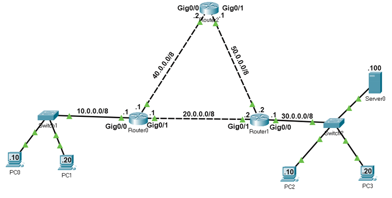
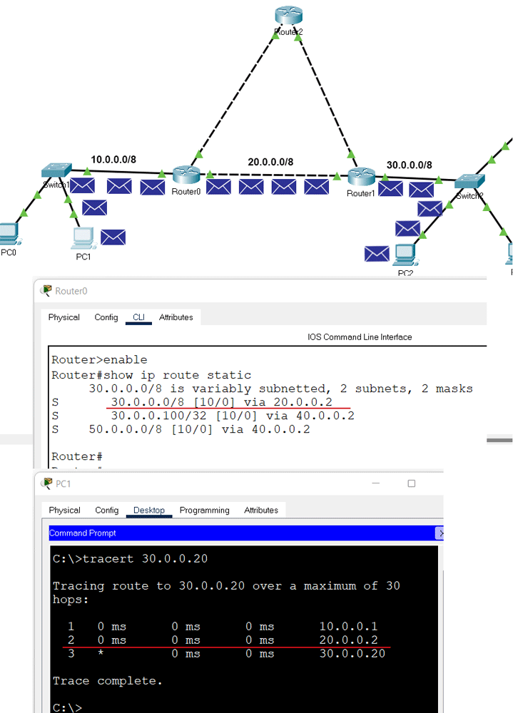
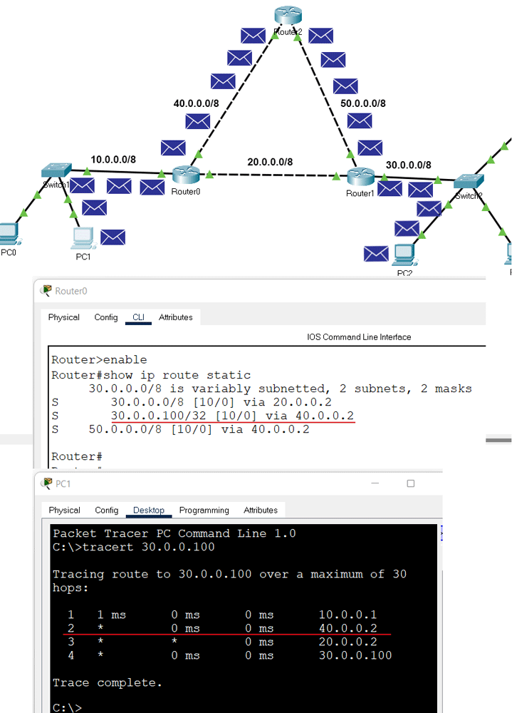

# Guía de configuración de enrutamiento estático

Este tutorial explica cómo configurar el enrutamiento estático en enrutadores. Se aplica el crear y administrar rutas estáticas en enrutadores a través de un ejemplo de rastreador de paquetes.

Las rutas estáticas son las rutas que agrega manualmente a la tabla de enrutamiento del enrutador. El proceso de agregar rutas estáticas a la tabla de enrutamiento se conoce como enrutamiento estático. Tomemos un ejemplo de seguimiento de paquetes para comprender cómo utilizar el enrutamiento estático para crear y agregar una ruta estática a la tabla de enrutamiento.

## Montar un laboratorio de práctica
Crea un laboratorio de seguimiento de paquetes como se muestra en la imagen o descargue laboratorio creado previamente y abrelo en Packet Tracer [`Click HERE`](./labs/01-static-routing-example-network.pkt).
<br/><br/>

<br/><br/>
En esta práctica de laboratorio, cada red tiene dos rutas para llegar. Configuraremos una ruta como ruta principal y otra ruta como ruta de respaldo. Si el ancho de banda del enlace de todas las rutas es el mismo, utilizamos la ruta que tiene la menor cantidad de enrutadores como ruta principal. Si el ancho de banda del enlace y la cantidad de enrutadores son iguales, podemos usar cualquier ruta como ruta principal y otra ruta como ruta de respaldo.
<br/><br/>
Si especificamos dos rutas para el mismo destino, el enrutador selecciona automáticamente la mejor ruta para el destino y agrega la ruta a la tabla de enrutamiento. Si desea seleccionar manualmente una ruta que el enrutador debe agregar a la tabla de enrutamiento, debe establecer el valor AD de la ruta más bajo que otras rutas. Por ejemplo, si utiliza los siguientes comandos para crear dos rutas estáticas para la red 30.0.0/8, la ruta colocará la primera ruta en la tabla de enrutamiento.

```bash
#ip route 30.0.0.0 255.0.0.0 20.0.0.2 10
#ip route 30.0.0.0 255.0.0.0 40.0.0.2 20
```

Si la primera ruta falla, el enrutador agrega automáticamente la segunda ruta a la tabla de enrutamiento.

## Crear, agregar y verificar rutas estáticas
Los enrutadores aprenden automáticamente sus redes conectadas. Sólo necesitamos agregar rutas para las redes que no están disponibles en las interfaces del enrutador. Por ejemplo, las redes 10.0.0.0/8, 20.0.0.0/8 y 40.0.0.0/8 están conectadas directamente al Router0. Por lo tanto, no necesitamos configurar rutas para estas redes. La red 30.0.0.0/8 y la red 50.0.0.0/8 no están disponibles en el Router0. Tenemos que crear y agregar rutas solo para estas redes.

La siguiente tabla enumera las redes conectadas de cada enrutador.

|Router	|Redes disponibles en interfaces locales	|Redes disponibles en las interfaces de otros enrutadores|
|--|--|
|Router0	|10.0.0.0/8, 20.0.0.0/8, 40.0.0.0/8	|30.0.0.0/8, 50.0.0.0/8|
|Router1	|20.0.0.0/8, 30.0.0.0/8, 50.0.0.0/8	|10.0.0.0/8, 40.0.0.0/8|
|Router2	|40.0.0.0/8, 50.0.0.0/8	10.0.0.0/8, |20.0.0.0/8, 30.0.0.0/8|

Creemos rutas estáticas en cada enrutador para redes que no están disponibles en el enrutador.

## Requisitos del Router0
* Cree dos rutas para la red 30.0.0.0/8 y configure la primera ruta (a través de -Router1) como ruta principal y la segunda ruta (a través de-Router2) como ruta de respaldo.
* Cree dos rutas para el host 30.0.0.100/8 y configure la primera ruta (a través de -Router2) como ruta principal y la segunda ruta (a través de-Router1) como ruta de respaldo.
*Cree dos rutas para la red 50.0.0.0/8 y configure la primera ruta (a través de -Router2) como ruta principal y la segunda ruta (a través de-Router1) como ruta de respaldo.
* Verifique que el enrutador agregue solo rutas principales a la tabla de enrutamiento.

## Configuración del Router0
Acceda al indicador CLI de Router0 y ejecute los siguientes comandos.

```bash
Router>enable
Router#configure terminal
Enter configuration commands, one per line. End with CNTL/Z.
Router(config)#ip route 30.0.0.0 255.0.0.0 20.0.0.2 10
Router(config)#ip route 30.0.0.0 255.0.0.0 40.0.0.2 20
Router(config)#ip route 30.0.0.100 255.255.255.255 40.0.0.2 10
Router(config)#ip route 30.0.0.100 255.255.255.255 20.0.0.2 20
Router(config)#ip route 50.0.0.0 255.0.0.0 40.0.0.2 10
Router(config)#ip route 50.0.0.0 255.0.0.0 20.0.0.2 20
Router(config)#exit
Router#show ip route static
30.0.0.0/8 is variably subnetted, 2 subnets, 2 masks
S 30.0.0.0/8 [10/0] via 20.0.0.2
S 30.0.0.100/32 [10/0] via 40.0.0.2
S 50.0.0.0/8 [10/0] via 40.0.0.2
Router#
```


## Requisitos del Router 1
* Cree dos rutas para la red 10.0.0.0/8 y configure la primera ruta (a través de -Router0) como ruta principal y la segunda ruta (a través de-Router1) como ruta de respaldo.
* Cree dos rutas para la red 40.0.0.0/8 y configure la primera ruta (a través de -Router0) como ruta principal y la segunda ruta (a través de-Router2) como ruta de respaldo.
* Verifique que el enrutador agregue solo rutas principales a la tabla de enrutamiento.

### Configuración del Router 1

```bash
Router>enable
Router#configure terminal
Enter configuration commands, one per line. End with CNTL/Z.
Router(config)#ip route 10.0.0.0 255.0.0.0 20.0.0.1 10
Router(config)#ip route 10.0.0.0 255.0.0.0 50.0.0.1 20
Router(config)#ip route 40.0.0.0 255.0.0.0 20.0.0.1 10
Router(config)#ip route 40.0.0.0 255.0.0.0 50.0.0.1 20
Router(config)#exit
Router#show ip route static
S 10.0.0.0/8 [10/0] via 20.0.0.1
S 40.0.0.0/8 [10/0] via 20.0.0.1
Router#
```

## Requisitos del router 2
Cree rutas estáticas para la red 10.0.0.0/8 y la red 30.0.0.0/8 y verifique que el enrutador agregue ambas rutas a la tabla de enrutamiento.

### Configuración del Router2

```bash
Router>enable
Router#configure terminal
Enter configuration commands, one per line. End with CNTL/Z.
Router(config)#ip route 10.0.0.0 255.0.0.0 40.0.0.1
Router(config)#ip route 30.0.0.0 255.0.0.0 50.0.0.2
Router(config)#exit
Router#show ip route static
S 10.0.0.0/8 [1/0] via 40.0.0.1
S 30.0.0.0/8 [1/0] via 50.0.0.2
Router#
```

## Verificación del enrutamiento estático

En Router0, configuramos dos rutas para la red 30.0.0.0/8. Estas rutas son a través del Router1 y del Router2. Establecemos la primera ruta (vía-Router1) como ruta principal y la segunda ruta como ruta de respaldo. Podemos verificar esta configuración de dos maneras.

Enviando solicitudes de ping a una PC de la red 30.0.0.0/8 y rastreando la ruta que toman para llegar a la red 30.0.0.0/8. Para esto, puede usar el comando 'tracert' en una PC de la red 10.0.0.0/8. El comando 'tracert' envía solicitudes de ping al host de destino y rastrea la ruta que toman para llegar al destino.

Enumerando las entradas de la tabla de enrutamiento en Router0. Dado que un enrutador usa la tabla de enrutamiento para reenviar paquetes de datos, puede consultar la tabla de enrutamiento para determinar la ruta que usa el enrutador para reenviar paquetes de datos para cada destino.

La siguiente imagen muestra las pruebas anteriores



También configuramos una ruta de host estática separada para el host 30.0.0.100/8. El enrutador debe utilizar esta ruta para reenviar paquetes de datos al host 30.0.0.100/8. Para verificar esto, puede realizar la misma prueba para el host 30.0.0.100/8.

La siguiente imagen muestra esta prueba.



## Eliminar una ruta estática
Para eliminar una ruta estática, siga los siguientes pasos.

* Utilice el comando '`show ip route static`' para imprimir todas las rutas estáticas.
Anota la ruta que deseas eliminar.
* Utilice el comando '`no ip route`' para eliminar la ruta.
Si tiene una ruta de respaldo, la ruta de respaldo se convierte en la ruta principal cuando elimina la ruta principal.

En nuestro ejemplo, tenemos una ruta de respaldo y una ruta principal para el host 30.0.0.100/8. 

